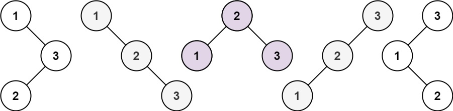

# 动态规划算法总结

## 摘要
遇到一个问题，它具有某种状态，并且，该状态可以由上一个子问题的状态转移而来，我们可以考虑采用动态规划解决。此外，动态规划还能解决以下经典问题：  
1. 背包问题
2. 打家劫舍问题
3. 股票问题
4. 子序列、子串问题

下面，正式开始总结动规！

## 一、动态规划解题步骤

一般来说，使用动态规划遵从四个步骤：
1. 确定dp数组、dp数组下标的含义
2. 根据问题，得到状态转移方程
3. 根据状态转移方程，确定dp数组的初始化方式
4. 根据状态转移方程，确定dp数组的遍历顺序

在确定dp数组、dp数组下标的含义时，一定要根据题的意思来确定，并在解题过程中始终清楚其含义，这是后面三个步骤的基础！  
状态转移方程的确定，可以在草稿本上多画画，多演算  
dp数组的初始化，要根据状态转移方程来，找到dp数组的边缘是由谁推过来的，并依据题意，结合dp数组的含义来初始化  
dp数组的遍历方式，也是根据递推关系，明确谁是谁推过来的，实在不清楚，可以画一个2x2的表，例如：
~~~C++
dp[i][j] = dp[i + 1][j - 1] + 2
~~~
当得出这个状态转移方程，可能无法快速知道遍历顺序，这时，画一个图：  
  

其中，红色实线代表了递推方向，红色虚线就是遍历顺序，即：**从下向上，从左到右遍历**  
相信这样，你一定能快速地确定遍历顺序了~

## 二、动态规划基础题

### 1. [使用最小花费爬楼梯](https://leetcode.cn/problems/min-cost-climbing-stairs/)

给你一个整数数组 cost ，其中 cost[i] 是从楼梯第 i 个台阶向上爬需要支付的费用。一旦你支付此费用，即可选择向上爬一个或者两个台阶。

你可以选择从下标为 0 或下标为 1 的台阶开始爬楼梯。

请你计算并返回达到楼梯顶部的最低花费。

**分析：**   
1. 确定dp数组、dp数组下标的含义：
   
   dp[i]表示到达第 i 个台阶所需的最小费用
   
2. 确定状态转移方程：
   
    由于一次只能爬一阶或两阶，因此，dp[i]可以由前一阶台阶转移而来，也可以由前两阶转移而来，因此，状态转移方程为：
    ~~~C++
    dp[i] = std::min(dp[i - 1] + cost[i - 1], dp[i - 2] + cost[i - 2]);
    ~~~
3. 确定初始化方式：  

    从临界状态分析：
    ~~~C++
    dp[2] = std::min(dp[1] + cost[1], dp[0] + cost[0]);
    ~~~
    很明显，dp[1]，dp[0]都应初始化为0，这样才能保证dp[2]的正确性。  
    
    从dp数组含义分析：  
    
    由于题中说到 **“你可以选择从下标为 0 或下标为 1 的台阶开始爬楼梯。”** 因此，我们爬到第0阶和第一阶都是不收费的。所以，dp[1]，dp[0]都应初始化为0。
    
4. 确定遍历顺序：
   
   从状态转移方程可以看出，dp[i]是由左边的dp[i - 1]、dp[i - 2]推出的，因此，应该从左到右遍历。

分析完毕，代码如下：
~~~C++
class Solution {
public:
    int minCostClimbingStairs(vector<int>& cost) {
        int n = cost.size();
        std::vector<int> dp(n + 1,0); //dp[i]代表到 第i阶 所需要的最小花费
        for(int i = 2; i <= n; i++)
        {
            dp[i] = std::min(dp[i - 1] + cost[i - 1], dp[i - 2] + cost[i - 2]);
        }
        return dp[n];
    }
};
~~~

### 2. [不同路径 II](https://leetcode.cn/problems/unique-paths-ii/)

一个机器人位于一个 m x n 网格的左上角 （起始点在下图中标记为 “Start” ）。

机器人每次只能向下或者向右移动一步。机器人试图达到网格的右下角（在下图中标记为 “Finish”）。

现在考虑网格中有障碍物。那么从左上角到右下角将会有多少条不同的路径？

网格中的障碍物和空位置分别用 1 和 0 来表示。

**分析：**  
1. 确定dp数组、dp数组下标的含义：
   
   此题涉及到路径、坐标，所以，我们应该使用一个二维数组来做dp数组，因此，dp[i][j]代表：机器人到下标为（i，j) 的路径数。
2. 确定状态转移方程：
   
   **“机器人每次只能向下或者向右移动一步”**，这句话确定了机器人的移动方式，因此，状态转移方程为：

    ~~~C++
    dp[i][j] = dp[i - 1][j] + dp[i][j - 1];
    ~~~

3. 确定初始化方式：
   
   结合状态转移方程，我们应该初始化dp[0][i]、dp[i][0]。  
   那该初始化为什么呢？dp[0][0] = 1这是肯定的，因为到初始位置只有一种方式。  
   由于机器人每次只能向下或者向右移动一步，因此，dp[0][i]只能从dp[0][i - 1]转移来，也就是只有一种方式，所以，初始化为1，同理，dp[i][0]也应该初始化为1。  
    不难写出以下代码：
    ~~~C++
    int m = obstacleGrid.size(), n = obstacleGrid[0].size();
    //由于不清楚到各点的路径数，因此先全部初始化为0，默认不可到达
    std::vector<std::vector<int>> dp(m, std::vector<int>(n,0));
    for(int i = 0; i < n && obstacleGrid[0][i] != 1; i++) dp[0][i] = 1;
    for(int i = 0; i < m && obstacleGrid[i][0] != 1; i++) dp[i][0] = 1;
    ~~~
    注意：for循环中 **obstacleGrid[0][i] != 1** 这句话也很重要，如果遇到障碍物，那么后续的点一定不可到达，因此退出循环。

4. 确定遍历顺序：
   
   从状态转移方程可以看出，dp[i][j] 是由左边的 dp[i][j - 1] 和上面的 dp[i - 1][j] 转移而来，因此应该从上到下，从左到右遍历。

分析完毕，代码如下：  

~~~C++
class Solution {
public:
    int uniquePathsWithObstacles(vector<vector<int>>& obstacleGrid) {
        int m = obstacleGrid.size(), n = obstacleGrid[0].size();
        std::vector<std::vector<int>> dp(m,std::vector<int>(n,0));
        for(int i = 0; i < n && obstacleGrid[0][i] != 1; i++) dp[0][i] = 1;
        for(int i = 0; i < m && obstacleGrid[i][0] != 1; i++) dp[i][0] = 1;
        for(int i = 1; i < m; i++)
        {
            for(int j = 1; j < n; j++)
            {
                if(obstacleGrid[i][j] == 1) continue; //遇到障碍表面该点不可到达，直接跳过
                dp[i][j] = dp[i - 1][j] + dp[i][j - 1];
            }
        } 
        return dp[m - 1][n - 1];
    }
};
~~~

### 3. [整数拆分](https://leetcode.cn/problems/integer-break/description/)

给定一个正整数 n ，将其拆分为 k 个 正整数 的和（ k >= 2 ），并使这些整数的乘积最大化。

返回你可以获得的**最大**乘积 。

**分析：**

u1s1，这道题感觉不太好想到如何用动规来实现，理解动规的精髓是关键！

**将问题拆分成若干个子问题，这个子问题可以利用上一个子问题的结果来计算。**

因此，这道题我们可以依次计算从 1 ~ m 所有数，将其拆分为 k 个 正整数 的和（ k >= 2 ），并使这些整数的乘积最大，将其保存到dp数组中，给下一个数（m + 1）来使用。  
话不多说，直接开整！

1. 确定dp数组及下标的含义：  
   
   根据上面的分析，我们可以利用dp[i]来保存：分拆数字 i，可以得到的最大乘积。

2. 确定状态转移方程：
   
    如何得到dp[i]呢？其实可以从 1 遍历 j ，然后有两种渠道得到dp[i].  
    * j * (i - j) 直接相乘
    * j * dp[i - j]，相当于是拆分(i - j)  
  
    为什么不拆分j呢？  
    * j * (i - j) 直接相乘，相当于将 i 拆成两个数
    * j * dp[i - j]，相当于是拆分(i - j)，最终等价于将 i 拆成两个及以上的数
    
    如果拆分j，即：dp[j] * dp[i - j]，相当于将 i 拆成四个及以上的数，这是不一定符合题意的。

    因此，最终状态转移方程为：
    ~~~C++
    dp[i] = std::max(dp[i],std::max(j * dp[i - j],j * (i - j)));
    ~~~

3. 确定遍历顺序：

    从状态转移方程，可以看出：dp[i] 是由左边的 dp[i - j] 转移而来，因此，应该从左到右遍历：
    ~~~C++
    for(int i = 3; i <= n; i++)
    {
        for(int j = 1; j < i; j++) 
        {
            dp[i] = std::max(dp[i],std::max(j * dp[i - j],j * (i - j)));
        }
    }
    return dp[n];
    ~~~
    为什么不从i = 0 或者 i = 1 或者 i = 2 开始遍历呢？

    结合dp数组的定义！
    
    dp[0]、dp[1]是没有意义的！

    而dp[2]又不能从dp[1]转移过来（因为dp[1]没有意义），所以，从 i = 3 开始遍历

4. 确定初始化方式 

    细心的你一定发现，这次我先确定遍历顺序，再确定初始化方式。其实，这两个步骤没有严格顺序。结合状态转移方程以及遍历顺序可知：dp[2]一定要初始化。那初始化为什么呢？

    再次结合dp数组的定义！

    dp[2]：将 2 拆分成 k 个数，这 k 个数乘积的最大值。因此，不难想到：dp[2] = 1（2 = 1 x 1）。

分析完毕，代码如下：
~~~C++
class Solution {
public:
    int integerBreak(int n) {
        std::vector<int> dp(n + 1, 0); //dp[i]表示：将i拆成k个正整数的和，这k个数乘积的最大值
        dp[2] = 1;
        for(int i = 3; i <= n; i++)
        {
            for(int j = 1; j < i; j++) 
            {
                dp[i] = std::max(dp[i],std::max(j * dp[i - j],j * (i - j)));
            }
        }
        return dp[n];
    }
};
~~~
**优化：** 

上述代码中，可以优化 j 的遍历过程，即：
~~~C++
for(int j = 1; j <= i / 2; j++) //没必要遍历到i，k个数越接近越好
~~~
因为拆分一个数 i 使之乘积最大，那么一定是拆分成m个近似相同的子数相乘才是最大的。例如 6 拆成 3 * 3， 10 拆成 3 * 3 * 4。

这里不再证明：“因为拆分一个数 i 使之乘积最大，那么一定是拆分成m个近似相同的子数相乘才是最大的。”

### 4. [不同的二叉搜索树](https://leetcode.cn/problems/unique-binary-search-trees/)

给你一个整数 n ，求恰由 n 个节点组成且节点值从 1 到 n 互不相同的 二叉搜索树 有多少种？返回满足题意的二叉搜索树的种数。

**示例：**

**输入：** n = 3  
**输出：** 5

**分析：**

首先，明确什么是二叉搜索树：左孩子比根节点小，右孩子比根节点大的树。

因此，我们可以任意选择 1 ~ n 内的一个数 m 作为根节点，然后让 1 ~ m - 1 的数做它的左子树，让 m + 1 ~ n 的数做它的右子树。

那怎么用动规解决呢？

事实上，由相同节点数构成的二叉搜索树的种类数是完全相同的，只是节点数值不同  
我们可以用一个dp数组保存：有 i 个节点构成的二叉搜索树的种数。

整体步骤如下：

1. 确定dp数组及下标的含义：

    dp[i]：i 个节点构成的二叉搜索树的种数。

2. 确定状态转移方程：
   
    假设此时选 i（i < n） 个节点构成二叉搜索树，那么：
    * 1 为根节点，则 1 左边有 0 个节点，右边有 i - 1 个节点，dp[i] += dp[0] * dp[i - 1]；
    * 2 为根节点，则 2 左边有 1 个节点，右边有 j - 2 个节点，dp[i] += dp[1] * dp[i - 2]；
    * 3 为根节点，则 3 左边有 2 个节点，右边有 j - 3 个节点，dp[i] += dp[2] * dp[i - 3]；
    * ......
    * i 为根节点，则 j 左边有 j - 1 个节点，右边有 0 个节点，dp[i] += dp[i - 1] * dp[0]；
    
    因此，不难得到状态转移方程：
    ~~~C++
    for(int j = 1; j < i; j++)
    {
        dp[i] += dp[j - 1] * dp[i - j];
    }
    ~~~

3. 确定初始化方式：

    * 由 0 个节点组成的二叉搜索树只有一种可能，就是空树，所以dp[0] = 1;
    * 由 1 个节点组成的二叉搜索树只有一种可能，就是它本身构成的树，所以dp[1] = 1;

4. 确定遍历顺序：

    由状态转移方程不难得到：从左向右遍历

分析完毕，代码如下：
~~~C++
class Solution {
public:
    int numTrees(int n) {
        std::vector<int> dp(n + 1,0);
        dp[0] = 1;
        dp[1] = 1;
        for(int i = 2; i <= n; i++)
        {
            for(int j = 1; j < i; j++)
            {
                dp[i] += dp[j - 1] * dp[i - j];
            }
        }
        return dp[n];
    }
};
~~~
此题总结：弄明白如何定义dp数组，如何确定状态转移方程是一大难点，u1s1，应该算困难题了hhhh

## 三、背包问题

背包分为：

1. 0-1背包：有 n 件物品和一个最多能背重量为 w 的背包。第i件物品的重量是 weight[i]，得到的价值是 value[i] 。每件物品只能用一次，求解将哪些物品装入背包里物品价值总和最大。 
2. 完全背包：与 0-1 背包唯一的不同在于每件物品可以使用无限次
3. 多重背包：与 0-1 背包唯一的不同在于每件物品可能有多件
4. 分组背包

下面将依次介绍 0-1背包、完全背包、多重背包

### Ⅰ：0-1背包

根据上面对0-1背包的定义，可以发现，每件物品只有两个状态：取或者不取。因此，可以利用回溯法列举出所有可能的情况，取物品价值总和最大即可。

然而，使用回溯法的时间复杂度是指数级的，因此，考虑使用动态规划优化。

**分析：**

1. 确定dp数组及下标的含义：dp[i][j]：选择物品0 ~ i ，放进容量为 j 的背包所能获得的物品价值的最大值。
2. 确定递推公式：对于任意一件物品，存在两种情况：
   
    * 不放物品 i ：也就是背包容量为 j 时，不放物品 i 获得的最大值，所以， dp[i][j] = dp[i - 1][j];
    * 放物品 i ：也就是背包容量为 j - weight[i] 时，不放物品 i 获得的最大值 + 物品 i 的价值，所以， dp[i][j] = dp[i - 1][j - weight[i]] + value[i]

    因此，状态转移方程如下：
    ~~~C++
    dp[i][j] = std::max(dp[i - 1][j], dp[i - 1][j - weight[i]] + value[i])
    ~~~

3. 确定如何初始化：为了后续操作方便，我们添加一个物品，它的价值为0，重量也为0。当背包容量为 0 时，所获最大价值一定为 0 ；当物品价值为 0 时，无论背包体积为多少，所获最大价值一定为 0 ，因此，有如下初始化：
    ~~~C++
    std::vector<std::vector<int>> dp(n + 1, std::vector<int>(weight + 1)); 
    for(int i = 0; i <= n; i++) dp[i][0] = 0;
    for(int j = 0; j <= weight; j++) dp[0][j] = 0;
    ~~~

    那么，其他下标应该初始化为什么呢？由状态转移方程，可以发现：dp[i][j] 是由其上方和左上方转移而来，因此，初不初始化都可以，反正会被覆盖。

    

4. 确定遍历顺序：正如前面提到的：dp[i][j] 是由其正上方和左上方转移而来，因此应该从上到下遍历。

    那么，应该先遍历物品还是先遍历背包容量呢？

    根据前面提到的：**dp[i][j] 是由其正上方和左上方转移而来**，因此，当遍历到 dp[i][j] 时，无论先遍历物品，先遍历背包，其正上方和左上方的dp数组都已经被填充，因此，先遍历物品，先遍历背包都是可以的，都不会影响dp数组的推导（实在不理解可以画两个图看看）

    但个人觉得先遍历物品会比较好理解。

    注意：先遍历物品时，遍历背包容量从左到右、从右到左都可以；但是，**先遍历背包容量，遍历物品时就不能从右到左了**，因为 dp[i][j] 的左上方没有被填充

最终，代码如下：
~~~C++
int main(void)
{
    int n, weight;
    std::cin >> n >> weight;
    std::vector<std::vector<int>> knapSack(n, std::vector<int>(2)); //背包
    for(int i = 0; i < n; i++)
    {
        //体积，价值
        std::cin >> knapSack[i][0] >> knapSack[i][1];
    }
    std::vector<std::vector<int>> dp(n + 1, std::vector<int>(weight + 1, 0)); //初始化
    //遍历物品
    for(int i = 1; i <= n; i++)
    {
        //遍历背包容量
        for(int j = knapSack[i - 1][0]; j <= weight; j++)
        {
            dp[i][j] = std::max(dp[i - 1][j], dp[i - 1][j - knapSack[i - 1][0]] + knapSack[i - 1][1]);
        }
    }
    std::cout << dp[n][weight];
}
~~~

**优化：**

注意到状态转移方程仅仅依赖于上一层，也就是dp[i - 1]，因此，若将 dp[i - 1] 拷贝到 dp[i] 上，状态转移方程完全可以是：
~~~C++
dp[i][j] = std::max(dp[i][j], dp[i][j - weight[i]] + value[i]);
~~~
因此，我们干脆就直接用一个一维数组代替原来的二维数组，也就是**滚动数组**
1. 确定dp数组及下标的含义：
    
    dp[i]：背包容量为 i 时，所能装下物品的最大值。

2. 确定状态转移方程：
    ~~~C++
    dp[j] = std::max(dp[j], dp[j - weight[i]] + value[i]);
    ~~~
    这里 std::max 里面的 dp[j] 其实相当于 dp[i - 1][j]，也就是不装物品 i ，且背包容量为 j 时获得的最大价值；dp[j - weight[i]] 相当于 dp[i - 1][j - weight[i]]，也就是背包容量为 j - weight[i] 时，不放物品 i 获得的最大值 + 物品 i 的价值

3. 确定初始化方式：
    根据状态转移方程和dp数组的定义，可知：dp[0] 是一定要初始化的，为 0 

4. 确定遍历方式：

    与二维dp不同的是，此处必须**先遍历物品，再遍历背包容量**，并且**从上到下，从右到左**！

    为什么呢？

    如果先遍历背包容量，再遍历物品，会**导致每个背包容量只放了一个物品！**

    确定了先遍历物品，再遍历背包容量后，为什么又要从右到左遍历背包容量呢？

    如果从左到右遍历背包容量，会**导致同一个物品被放入背包多次！**
    ~~~
    例如：物品0的重量weight[0] = 1，价值value[0] = 15

    如果正序遍历
    
    dp[1] = dp[1 - weight[0]] + value[0] = 15
    
    dp[2] = dp[2 - weight[0]] + value[0] = 30
    
    此时dp[2]就已经是30了，意味着物品0，被放入了两次，所以不能正序遍历。
    
    为什么倒序遍历，就可以保证物品只放入一次呢？
    
    倒序就是先算dp[2]
    
    dp[2] = dp[2 - weight[0]] + value[0] = 15 （dp数组已经都初始化为0）
    
    dp[1] = dp[1 - weight[0]] + value[0] = 15
    
    所以从后往前循环，每次取得状态不会和之前取得状态重合，这样每种物品就只取一次了。
    ~~~
    从另一个角度思考，由原来的二维dp的状态转移方程可知：dp[i][j] 是由其正上方和左上方转移而来，如果从左往右遍历背包容量，会导致上一层的 dp[i - 1] 被新值所覆盖，后续的 dp[i] 就不能再利用上一层的数据了

    这一部分不好理解，可以在本子上画图辅助思考。

    **但背包问题的遍历顺序十分重要！** 到后面的完全背包以及涉及到的排列组合问题都与遍历顺序息息相关。

    分析完毕，代码如下：
    ~~~C++
    int main(void)
    {
        int n, weight;
        std::cin >> n >> weight;
        std::vector<std::vector<int>> knapSack(n, std::vector<int>(2));
        for(int i = 0; i < n; i++)
        {
            //体积，价值
            std::cin >> knapSack[i][0] >> knapSack[i][1];
        }
        std::vector<int> dp(weight + 1, 0); //
        //遍历物品
        for(int i = 0; i < n; i++)
        {
            //遍历背包容量（从右到左）
            for(int j = weight; j >= knapSack[i][0]; j--)
            {
                dp[j] = std::max(dp[j], dp[j - knapSack[i][0]] + knapSack[i][1]);
            }
        }
        std::cout << dp[weight];
    }
    ~~~

### 0-1背包例题

#### 1. [目标和](https://leetcode.cn/problems/target-sum/)

给你一个整数数组 nums 和一个整数 target 。

向数组中的每个整数前添加 '+' 或 '-' ，然后串联起所有整数，可以构造一个 表达式 ：

* 例如，nums = [2, 1] ，可以在 2 之前添加 '+' ，在 1 之前添加 '-' ，然后串联起来得到表达式 "+2-1" 。
  
返回可以通过上述方法构造的、运算结果等于 target 的不同 表达式 的数目。

**分析：**

拿到这道题，首先要想到如何将其转化为0-1背包问题。

我们可以将nums分成两部分：left，right

left中的数前都添加 '+'，right中的数前都添加'-'。

易得：  
~~~
left + right = sum（nums所有元素的和）
left - right = target
~~~ 
所以，left = (target + sum) / 2。
因此，现在的问题就是，在nums数组中 **组合** m 个数，这 m 个数的和为  left。

转化为 0-1 背包：nums中每个元素都是物品，且价值、重量均为 num[i]，问**填满容量为left的背包有多少种方式**。

注意到 *left = (target + sum) / 2*，可能你会想：向下取整会不会对结果有影响。的确，若 target + sum % 2 != 0，是没有解的（例如 sum 是 5，target 是 2 的话其实就是无解的），此外，如果 sum < target，也是没有解的。因此，一开始我们可以加上如下判断：
~~~C++
if(abs(target) > sum) return 0;
if((sum + target) % 2 != 0) return 0;
~~~

现在开始动规分析：

1. 确定dp数组及下标的含义：dp[i] 填满容量为 i 的背包有几种方式
2. 确定状态转移方程：

    假设 nums = {1,2,3,4,5}，现在求dp[5]，则：

    * 已经有一个 1 （nums[0]），那装满容量为 5 的背包有 dp[4] 方式
    * 已经有一个 2 （nums[1]），那装满容量为 5 的背包有 dp[3] 方式
    * 已经有一个 3 （nums[2]），那装满容量为 5 的背包有 dp[2] 方式
    * 已经有一个 4 （nums[3]），那装满容量为 5 的背包有 dp[1] 方式
    * 已经有一个 5 （nums[4]），那装满容量为 5 的背包有 dp[0] 方式

    因此，状态转移方程为：
    ~~~C++
    dp[j] += dp[j - nums[i]];
    ~~~
    这个方程很重要！在解决后续的排列组合问题也要用到。

3. 确定初始化方式：由状态转移方程可知：dp[0]需要被初始化，结合dp数组定义可知：填满容量为 0 的背包有仅有 1 种方式，也就是不装，因此，dp[0] = 1；
4. 确定遍历顺序：结合前文提到的，先遍历物品，再遍历背包，且从上到下，从右到左。

分析完毕，代码如下：
~~~C++
class Solution {
    int knapSack(std::vector<int> &items, int weight)
    {
        int n = items.size();
        std::vector<int> dp(weight + 1, 0);
        dp[0] = 1;
        for(int i = 0; i < n; i++)
        {
            for(int j = weight; j >= items[i]; j--)
            {
                dp[j] += dp[j - items[i]];
            }
        }
        return dp[weight];
    }
public:
    int findTargetSumWays(vector<int>& nums, int target) {
        int sum = std::accumulate(nums.begin(), nums.end(), 0);
        if(abs(target) > sum) return 0;
        if((sum + target) % 2 != 0) return 0;
        int newtarget = (sum + target) / 2;
        return knapSack(nums, newtarget);
    }
};
~~~

#### 2. [一和零](https://leetcode.cn/problems/ones-and-zeroes/)

给你一个二进制字符串数组 strs 和两个整数 m 和 n 。

请你找出并返回 strs 的最大子集的长度，该子集中 **最多** 有 m 个 0 和 n 个 1 。

如果 x 的所有元素也是 y 的元素，集合 x 是集合 y 的 **子集** 。

**示例：**

**输入：** strs = ["10", "0001", "111001", "1", "0"], m = 5, n = 3

**输出：** 4

**分析：**

此题最大的不同就是物品的重量由两个维度决定，也就是 每个字符串中 0 的个数和 1 的个数，想清楚这一点，就可以轻松用 0-1 背包解决

正式开始分析动规！

1. 确定dp数组及下标的含义

    dp[i][j]：容量为（i，j）的背包能装的物品数的最大值

2. 确定状态转移方程：

    不难想到，dp[i][j] 可以由：不装该物品 dp[i][j] 和装该物品 dp[i - weightZero][j - weightOne] + 1 转移而来，因此，状态转移方程为：
    ~~~C++
    dp[i][j] = std::max(dp[i][j], dp[i - weightZero][j - weightOne] + 1);
    ~~~

3. 确定初始化方式：与上一题一致：dp[0][0] = 1; 
4. 确定遍历顺序：结合前文提到的，先遍历物品，再遍历背包，且从上到下，从右到左。

分析完毕，代码如下：
~~~C++
/*由两个维度决定背包容量的0-1背包*/
class Solution {
public:
    int findMaxForm(vector<string>& strs, int m, int n) {
        //dp[i][j]：有i个0，j个1的子集中元素数量的最大个数
        std::vector<std::vector<int>> dp(m + 1, std::vector<int>(n + 1, 0)); 
        //遍历物品
        for(auto &item : strs)
        {
            //统计物品重量
            int weightZero = 0, weightOne = 0;
            for(auto &ch : item)
            {
                if(ch == '0') weightZero++;
                else weightOne++;
            }
            //遍历背包容量（从右到左）
            for(int i = m; i >= weightZero; i--)
            {
                for(int j = n; j >= weightOne; j--)
                {
                    dp[i][j] = std::max(dp[i][j], dp[i - weightZero][j - weightOne] + 1);
                }
            }
        }
        return dp[m][n];
    }
};
~~~

### Ⅱ：完全背包

完全背包和01背包问题唯一不同的地方就是，每种物品有无限件。

回顾 0-1 背包（滚动数组版）的遍历，0-1 背包**先遍历物品，再遍历背包容量**，并且，遍历背包容量**从右到左**遍历。

为什么从右到左遍历？

前文已经提到：为了防止同一物品被添加多次。

而此处，完全背包每种物品有无限件，也就是可以重复选择，因此，在遍历背包容量时，只需**从左到右**即可。

并且，由于遍历背包容量时，必须从左到右，也就是说，遍历到 dp[i] 时，下标 i 之前的dp数组都已经经过计算，因此**在完全背包中，求最大价值，对于一维dp数组来说，其实两个for循环嵌套顺序是无所谓的！**

最终，代码如下：
~~~C++
int main(void)
{
    int n, weight;
    std::cin >> n >> weight;
    std::vector<std::vector<int>> knapSack(n, std::vector<int>(2));
    for(int i = 0; i < n; i++)
    {
        //体积，价值
        std::cin >> knapSack[i][0] >> knapSack[i][1];
    }
    std::vector<int> dp(weight + 1, 0);
    //遍历物品
    for(int i = 0; i < n; i++)
    {
        //遍历背包容量（从左到右）
        for(int j = knapSack[i][0]; j <= weight; j++)
        {
            dp[j] = std::max(dp[j], dp[j - knapSack[i][0]] + knapSack[i][1]);
        }
    }
    std::cout << dp[weight];
}
~~~

值得注意的是，前面提到的完全背包是求容量为 weight 的背包能装的物品的最大价值，也就是**纯完全背包问题**，两个for循环嵌套顺序是无所谓的（原因已经提到）。然而，在**求装满容量为 i 的背包有多少种方式**时，情况就有所不同了。在这里先提一下：

* 求组合数：先遍历物品，再遍历背包
* 求排列数：先遍历背包，再遍历物品

后文会结合例题来分别介绍。

### 完全背包例题

#### 1. [零钱兑换Ⅱ](https://leetcode.cn/problems/coin-change-ii/)

给你一个整数数组 coins 表示不同面额的硬币，另给一个整数 amount 表示总金额。

请你计算并返回可以凑成总金额的硬币 **组合数** 。如果任何硬币组合都无法凑出总金额，返回 0 。

假设每一种面额的硬币有无限个。 

题目数据保证结果符合 32 位带符号整数。

**分析：**

注意题中提到的是 **组合数**，例如：coins = {1，2，2，3}，amount = 5，那么{1，2，2}，{2，1，2}都能组成amount，但是从组合数的定义上来说，二者是完全一样的，因此，这只能算一种情况。

动规分析如下：

1. 确定dp数组下标及含义：

    dp[i]：装满容量为 i 的背包有 dp[i] 种方式

2. 确定状态转移方程：

    前文提到的[目标和](https://leetcode.cn/problems/target-sum/)与这道题都是求装满背包的方式数，因此，状态转移方程是一致的
    ~~~C++
    dp[j] += dp[j - coins[i]];
    ~~~

3. 确定初始化方式：

    从状态转移方程可以看出：dp[0] 是一定要初始化的，只有这样，后面的dp数组才能正确地由它转移而来，初始化为什么呢？

    *dp[0]：装满容量为 0 的背包有 dp[0] 种方式*

    不难看出，只有一种方式，也就是不装物品，这样就能装满容量为 0 的背包，因此，dp[0] = 1；

    其他下标的dp都应该初始化为 0 ，这样才不会影响累加

4. 确定遍历顺序：

    在分析完全背包的遍历方式时，我提到了：**求组合数：先遍历物品，再遍历背包**

    为什么要这样做？

    假设coins[0] = 1; coins[1] = 5;  

    先遍历背包，再遍历物品，即：
    ~~~C++
    //遍历背包容量（从左到右）
    for(int i = 1; i <= amount; i++)
    {
        //遍历物品
        for(int j = 0; j < n; j++)
        {
            if(i - coins[j]) dp[i] += dp[i - coins[j]];
        }
    }
    ~~~
    
    可以看出，在遍历每一个背包容量时，coins[0]，coins[1] 都参与了各个背包容量的计算，那么得到的结果就是{1，5}、{5，1}这两种，显然，这是 **排列数** ，与我们要求的组合数是恰恰相反的

    先遍历物品，再遍历背包，即：
    ~~~C++
    //遍历物品
    for(int i = 0; i < n; i++)
    {
        //遍历背包容量（从左到右）
        for(int j = coins[i]; j <= amount; j++)
        {
            dp[j] += dp[j - coins[i]];
        }
    }
    ~~~

    可以看出，coins[0] 先参与计算，coins[1] 后参与计算，这样能保证最终的结果只有{1，5}，也就是 **组合数**！

分析完毕，代码如下：
~~~C++
/*完全背包--求组合数*/
class Solution {
public:
    int change(int amount, vector<int>& coins) {
        std::vector<int> dp(amount + 1, 0); //dp[i]：装满容量为i的背包的方法数
        dp[0] = 1;
        //遍历物品
        for(int i = 0; i < n; i++)
        {
            //遍历背包容量（从左到右）
            for(int j = coins[i]; j <= amount; j++)
            {
                dp[j] += dp[j - coins[i]];
            }
        }
        return dp[amount];
    }
};
~~~

#### 2. [组合总和 Ⅳ](https://leetcode.cn/problems/combination-sum-iv/description/)

给你一个由 不同 整数组成的数组 nums ，和一个目标整数 target 。请你从 nums 中找出并返回总和为 target 的元素组合的个数。

请注意，**顺序不同的序列被视作不同的组合。**

题目数据保证答案符合 32 位整数范围。

**分析：**

注意到题中说到的：**顺序不同的序列被视作不同的组合。** 因此，这道题实际上是求排列数。

1. 确定dp数组及下标的含义：

    dp[i]：装满容量为 target 的背包的方法数为 dp[i]

2. 确定状态转移方程：

    ~~~C++
    dp[j] += dp[j - nums[i]]
    ~~~
3. 确定初始化方式：

    dp[0] = 1；其余均初始化为 0 

4. 确定遍历顺序：

    根据前面[零钱兑换Ⅱ](https://leetcode.cn/problems/coin-change-ii/)的分析，此题求排列数，先遍历背包容量，再遍历物品，且从左到右。

分析完毕，代码如下：
~~~C++
/*完全背包--求排列数：遍历顺序改变：先遍历背包容量，再遍历物品*/
class Solution {
public:
    int combinationSum4(vector<int>& nums, int target) {
        std::vector<int> dp(target + 1, 0);
        dp[0] = 1;
        for(int i = 0; i <= target; i++)
        {
            for(int j = 0; j < nums.size(); j++)
            {
                if(nums[j] <= i && dp[i] < INT32_MAX - dp[i - nums[j]]) dp[i] += dp[i - nums[j]]; //防止溢出
            }
        }
        return dp[target];
    }
};
~~~

此外，如果求的不是个数，而是把排列都列出来的话，**只能使用回溯算法**爆搜。

#### 3. [零钱兑换](https://leetcode.cn/problems/coin-change/)

给你一个整数数组 coins ，表示不同面额的硬币；以及一个整数 amount ，表示总金额。

计算并返回可以凑成总金额所需的 **最少** 的硬币个数 。如果没有任何一种硬币组合能组成总金额，返回 -1 。

你可以认为每种硬币的数量是**无限的**。

**分析：**

此题要求凑成总金额所需的 **最少** 的硬币个数，并且每种硬币的数量是**无限的**，因此，可以想到是完全背包问题。

1. 确定dp数组及下标的含义

    dp[i]：凑成金额为 i 所需的 **最少** 的硬币个数。

2. 确定状态转移方程

    凑成总金额为 j - coins[i] 的最少个数为 dp[j - coins[i]]，对于当前已经有coins[i]，要凑成总金额为 j ，只需要加一个硬币即可。并且，dp[j] 要取最小的，因此，状态转移方程为：
    ~~~C++
    dp[j] = std::min(dp[j], dp[j - coins[i]] + 1);
    ~~~

3. 确定初始化方式：

    首先，dp[0] = 0，这是毫无疑问的。考虑到状态转移方程的特性，其他下标应当初始化为一个很大的值，以防止 dp[j] 被自己的初始值覆盖。因此，初始化代码如下：
    ~~~C++
    std::vector<int> dp(amount + 1, INT32_MAX); //由于coins未知，凑成金额为i的最少硬币数也是未知的，所以初始化为无效值
    dp[0] = 0;
    ~~~

4. 确定遍历顺序：

    此题要求凑成总金额所需的 **最少** 的硬币个数，其本质上就是一个普通的完全背包问题，因此先遍历物品还是先遍历背包都是ok的。由于是完全背包，因此应该从左到右遍历。

分析完毕，代码如下：
~~~C++
/*普普通通的完全背包*/
class Solution {
public:
    int coinChange(vector<int>& coins, int amount) {
        int n = coins.size();
        //dp[i]：凑成金额为i的最少硬币数
        std::vector<int> dp(amount + 1, INT32_MAX); //由于coins未知，凑成金额为i的最少硬币数也是未知的，所以初始化为无效值
        dp[0] = 0;
        for(int i = 0; i < n; i++)
        {
            for(int j = coins[i]; j <= amount; j++)
            {
                if(dp[j - coins[i]] == INT32_MAX) continue; // 防止溢出
                dp[j] = std::min(dp[j], dp[j - coins[i]] + 1);
            }
        }
        return dp[amount] == INT32_MAX ? -1 : dp[amount];
    }
};
~~~

### Ⅲ：多重背包

现在有一个容量为 V 的背包和 N 个物品，其中每种物品的价值为 value[i]，体积为 weight[i]，**数量为 k**，问：如何将物品放入背包，使获得的价值最大。

实质上，多重背包与 0-1 背包是十分相似的，因为多重背包可以转换为 0-1背包！

例如：背包容量为 10

|      |价值|体积|数量|
|:----:|:----:|:----:|:----:|
|物品0|2|3|2|
|物品1|3|4|1|
|物品2|4|5|3|

等价于：

|      |价值|体积|数量|
|:----:|:----:|:----:|:----:|
|物品0|2|3|1|
|物品1|2|3|1|
|物品2|3|4|1|
|物品3|4|5|1|
|物品4|4|5|1|
|物品5|4|5|1|

因此，实现代码整体上与0-1背包也是十分相似的，只是遍历背包容量时多考虑一下放几个物品

代码如下：
~~~C++
int main(void)
{
    int n, weight;
    std::cin >> n >> weight;
    std::vector<std::vector<int>> mutiKnapSack(n, std::vector<int>(3));
    for(int i = 0; i < n; i++)
    {
        //体积，价值，数量
        std::cin >> mutiKnapSack[i][0] >> mutiKnapSack[i][1] >> mutiKnapSack[i][2];
    }
    std::vector<int> dp(weight + 1, 0);
    //遍历物品
    for(int i = 0; i < n; i++)
    {
        //遍历背包容量
        for(int j = weight; j >= mutiKnapSack[i][0]; j--)
        {
            for(int k = 1; k <= mutiKnapSack[i][2]; k++)
            {
                //考虑放几件物品
                if(j - k * mutiKnapSack[i][0] < 0) break;
                dp[j] = std::max(dp[j], dp[j - k * mutiKnapSack[i][0]] + k * mutiKnapSack[i][1]);
            }
        }
    }
    std::cout << dp[weight];
}
~~~

## 四、背包问题总结

### Ⅰ：背包类型
背包主要分为 0-1 背包、完全背包、多重背包、混合背包

### Ⅱ：问题类型
1. 求获得的最大价值 
2. 求装满背包的方法数
3. 求装满背包所需要的物品最小个数
4. ......

其中，求装满背包的方法数又包括了组合问题、排列问题

### Ⅲ：背包的初始化
在初始化背包时，一般要初始背包容量为 0 的特殊情况。此外，求 **最值问题** 还应当注意其他下标应该初始化为较大的值还是较小的值，避免在进行状态转移的时候被自己的初始值所覆盖

### Ⅳ：背包的遍历
这个可以说是背包问题中最难理解的部分。

1. 在最开始的 0-1 背包中，我们使用二维dp数组，从上到下，从左到右（或者从右到左）遍历。优化后采用一维dp数组，此时，从上到下，**从右到左**遍历，并且**要先遍历物品再遍历背包**；
2. 后来的完全背包，我们采用一维dp数组，并从上到下，**从左到右**遍历；
3. 再后来，完全背包求**组合数**，**先遍历物品，再遍历背包**，并**从左到右**遍历；
4. 最后，完全背包求**排列数**，**先遍历背包，再遍历物品**，并**从右到左**遍历。

总之，背包的遍历是最难理解但又必须理解的部分，在确定遍历方式时，**不要背上面的模板**，而是要结合之前自己定义的**dp数组的定义**，以及**状态转移方程**，来确定遍历方式。

## 五、打家劫舍问题

### 1. [打家劫舍](https://leetcode.cn/problems/house-robber/)

你是一个专业的小偷，计划偷窃沿街的房屋。每间房内都藏有一定的现金，影响你偷窃的唯一制约因素就是相邻的房屋装有相互连通的防盗系统，如果**两间相邻的房屋**在同一晚上被小偷闯入，系统会自动报警。

给定一个代表每个房屋存放金额的非负整数数组，计算你 不触动警报装置的情况下 ，一夜之内能够偷窃到的**最高金额**。

**分析：**

对于每一个房间，有两个状态：偷或者不偷。

而对单个房间，其偷或者不偷还取决于前面两个房间偷不偷，因此，我们发现：当前状态是可以由前面的状态转移过来的，因此，考虑使用动规。

1. 确定dp数组及下标的含义：

    dp[i]：小偷到第 i 个房间时所能获得的最大金额

2. 确定状态转移方程：

    到第 i 个房间，我们可以选择偷，也可以选择不偷。那么，有：
    * 偷：dp[i] = dp[i - 2] + nums[i];
    * 不偷：dp[i] = dp[i - 1];

    因此，状态转移方程为：
    ~~~C++
    dp[i] = std::max(dp[i - 1], dp[i - 2] + nums[i]);
    ~~~

3. 确定初始化方式：

    由状态转移方程，看出：边界数据dp[2] = std::max(dp[1], dp[0] + nums[2]);

    因此，需要初始化dp[0] = nums[0]，**dp[1] = std::max(nums[0], nums[1]);**

 4. 确定遍历顺序：
    
    由状态转移方程，易知：dp[i] 是由左边的dp[i - 1]、dp[i - 2]转移而来，因此从左到右遍历。

分析完毕，代码如下：
~~~C++
class Solution {
public:
    int rob(vector<int>& nums) {
        int n = nums.size();
        if(n == 1) return nums[0];
        std::vector<int> dp(n, 0); //偷到第i间房间时累计获得的最大金额
        dp[0] = nums[0], dp[1] = std::max(nums[0], nums[1]);
        for(int i = 2; i < n; i++)
        {
            dp[i] = std::max(dp[i - 1], dp[i - 2] + nums[i]);
        }
        return dp[n - 1];
    }
};
~~~

### 2. [打家劫舍Ⅱ](https://leetcode.cn/problems/house-robber-ii/)

你是一个专业的小偷，计划偷窃沿街的房屋，每间房内都藏有一定的现金。这个地方所有的房屋都 **围成一圈** ，这意味着**第一个房屋和最后一个房屋是紧挨着的**。同时，相邻的房屋装有相互连通的防盗系统，如果两间相邻的房屋在同一晚上被小偷闯入，系统会自动报警 。

给定一个代表每个房屋存放金额的非负整数数组，计算你 在不触动警报装置的情况下 ，今晚能够偷窃到的最高金额。

**分析：**

与[打家劫舍](https://leetcode.cn/problems/house-robber/)不同的是：房屋围成了环。因此，我们需要单独**考虑**偷第一间房和最后一间房。

注意到上面的**考虑**：**考虑**偷第一间是不一定要偷第一间的，因为我想要的只是获得最多的钱，同样地，**考虑**偷最后一间也是不一定要偷最后一间的，因此，最终代码如下：
~~~C++
class Solution {
public:
    int rob(vector<int>& nums) {
        int n = nums.size();
        if(n == 1) return nums[0];
        std::vector<int> dp(n, 0); //偷到第i间房间时累计获得的最大金额
        dp[0] = nums[0], dp[1] = std::max(nums[0], nums[1]);
        //“考虑”偷第一间
        for(int i = 2; i < n - 1; i++)
        {
            dp[i] = std::max(dp[i - 1], dp[i - 2] + nums[i]);
        }
        int temp = dp[n - 2];
        std::fill(dp.begin(), dp.end(), 0);
        dp[1] = nums[1];
        //“考虑”偷最后一间
        for(int i = 2; i < n; i++)
        {
            dp[i] = std::max(dp[i - 1], dp[i - 2] + nums[i]);
        }
        return std::max(temp, dp[n - 1]);
    }
};
~~~

### 3. [打家劫舍Ⅲ](https://leetcode.cn/problems/house-robber-iii/)

小偷又发现了一个新的可行窃的地区。这个地区只有一个入口，我们称之为 root 。

除了 root 之外，每栋房子有且只有一个“父”房子与之相连。一番侦察之后，聪明的小偷意识到“这个地方的所有房屋的排列类似于一棵二叉树”。 如果 **两个直接相连的房子在同一天晚上被打劫** ，房屋将自动报警。

给定二叉树的 root 。返回 **在不触动警报的情况下** ，小偷能够盗取的**最高金额** 。

**示例：**

**输入:** root = [3,2,3,null,3,null,1]  
**输出:** 7   
**解释:** 小偷一晚能够盗取的最高金额 3 + 3 + 1 = 7  

**分析：**

此题涉及到 **树形dp**，需要结合二叉树的遍历以及dp来解决，如何定义dp数组，以及遍历二叉树是一大难点。

对于此题来说，每一个节点也有两种状态：

* 偷当前节点；
* 不偷当前节点，而是偷左右孩子

结合二叉树的遍历，解题步骤如下：

1. 确定dp数组下标及含义

    我们需要记录一个节点偷与不偷这两个状态所对应获得的最大利润，因此，需要一个dp数组，dp[0]：偷当前节点获得的最大金额，dp[1]：不偷当前节点获得的最大金额

2. 确定递归函数的参数以及返回值

    由于我们需要知道一个节点偷与不偷这两个状态所对应获得的最大利润，因此，需要返回该节点左右孩子对应的dp数组，以此判断当前节点是偷还是不偷，代码如下：
    ~~~C++
    std::vector<int> dfs(TreeNode* root)
    ~~~

3. 确定状态转移方程：

    我们先来记录一下左右孩子的情况：
    ~~~C++
    std::vector<int> left = dfs(root->left);
    std::vector<int> right = dfs(root->right);
    ~~~
    然后，对于当前节点的两个状态：
    * 偷当前节点：
        ~~~C++
        dp[0] = root->val + left[1] + right[1];
        ~~~
    * 不偷当前节点：
        ~~~C++
        dp[1] = std::max(left[0], left[1]) + std::max(right[0], right[1]);
        ~~~
    可以看出，此题的状态转移方程与以往有较大形式上的差异。

4. 确定初始化方式：
    对于空节点，其偷与不偷，dp数组的值都为 0 ，因此，dp[0]、dp[1]都应初始化为 0 。

5. 确定递归出口：

   遇到空节点，直接返回dp数组。

6. 确定遍历方式：
    由“确定状态转移方程”这一步可知：二叉树应采用后续遍历：先记录左右孩子情况，再处理根节点。

分析完毕，代码如下：
~~~C++
class Solution {
    std::vector<int> dfs(TreeNode* root)
    {
        std::vector<int> dp(2, 0); //dp[0]：偷当前节点获得的最大金额，dp[1]：不偷当前节点...
        if(root)
        {
            std::vector<int> left = dfs(root->left);
            std::vector<int> right = dfs(root->right);
            //偷根节点，只能偷左孩子的左孩子、右孩子的右孩子
            dp[0] = root->val + left[1] + right[1];
            //不偷根节点，“考虑”偷左右孩子，怎么大怎么来
            dp[1] = std::max(left[0], left[1]) + std::max(right[0], right[1]);
        }
        return dp;
    }
public:
    int rob(TreeNode* root) {
        auto res = dfs(root);
        return std::max(res[0],res[1]); //看看偷根节点大还是不偷大
    }
};
~~~

## 六、股票问题

股票问题最重要的是**考虑好每天可能具有的状态**，以及各个状态之间是如何相互转移的。  
考虑好如何使自己获得的利润一直处于最大值  

### 1. [买卖股票的最佳时机](https://leetcode.cn/problems/best-time-to-buy-and-sell-stock/)

给定一个数组 prices ，它的第 i 个元素 prices[i] 表示一支给定股票第 i 天的价格。

你只能选择 **某一天** 买入这只股票，并选择在 **未来的某一个不同的日子** 卖出该股票。设计一个算法来计算你所能获取的最大利润。

返回你可以从这笔交易中获取的最大利润。如果你不能获取任何利润，返回 0 。

**分析：**

此题一共只能买卖**一次**股票，对于每一天，有两种状态：
* 今天买入（持有）
* 今天卖出（不持有）

我们只需要考虑今天的状态是如何由上一天转移而来的就可以了。

1. 确定dp数组下标及含义：

    * dp[i][0]：第 i 天持有股票所获得的最大利润
    * dp[i][1]：第 i 天不持有股票所获得的最大利润

2. 确定状态转移方程：

    * 今天**持有**可以由今天不买入（也就是昨天持有股票）和今天买入转移而来，由于我们需要最大利润，因此，状态转移方程：
        ~~~C++
        //dp[i - 1][0]：昨天持有股票获得的最大利润
        dp[i][0] = std::max(dp[i - 1][0], 0 - price[i]);
        ~~~
    * 今天**不持有**可以由昨天卖出（也就是今天不卖出）和今天卖出转移而来，由于我们需要最大利润，因此，状态转移方程：
        ~~~C++
        dp[i][1] = std::max(dp[i - 1][1], dp[i - 1][0] + price[i]);
        ~~~

3. 确定初始化方式：

    由状态转移方程可以看出：dp[1][0] 需要由 dp[0][0] 转移而来、dp[1][1] 需要由 dp[0][1] 转移而来。结合dp数组的定义，不难想到：
    ~~~c++
    dp[0][0] = price[0] * (-1);
    dp[0][1] = 0;
    ~~~

4. 确定遍历顺序：从左到右

分析完毕，代码如下：
~~~C++
class Solution {
public:
    int maxProfit(vector<int>& prices) {
        int n = prices.size();
        //dp[i][0]：第i天持有股票获得的最大利润
        //dp[i][1]：第i天不持有股票获得的最大利润
        std::vector<std::vector<int>> dp(n, std::vector<int>(2, 0))
        dp[0][0] = prices[0] * (-1);
        for(int i = 1; i < n; i++)
        {
            dp[i][0] = std::max(dp[i - 1][0], 0 - price[i]);
            dp[i][1] = std::max(dp[i - 1][1], dp[i - 1][0] + price[i]);
        }
        return dp[n - 1][1]; //最终一定是不持有股票的利润最大
    }
};
~~~

上述代码的空间复杂度为 $O(n)$，有没有方法优化呢？

当然有！

注意到 dp[i] 仅仅由 dp[i - 1] 转移而来，因此，我们只需要每次循环结束时记录下 dp[i - 1] 就ok了

代码如下：
~~~C++
int maxProfit(std::vector<int>& prices)
{
    int n = prices.size();
    //dp[0]：当前状态为持有获得的最大利润
    //dp[1]：当前状态为不持有获得的最大利润
    int dp[2] = {0};
    dp[0] -= prices[0];
    for(int i = 1; i < n; i++)
    {
        int temp = dp[0];
        dp[0] = std::max(dp[0], prices[i] * (-1));
        dp[1] = std::max(dp[1], temp + prices[i]);
    }
    return dp[1];
}
~~~

### 2. [买卖股票的最佳时期Ⅱ](https://leetcode.cn/problems/best-time-to-buy-and-sell-stock-ii/)

给你一个整数数组 prices ，其中 prices[i] 表示某支股票第 i 天的价格。

在每一天，你可以决定是否购买和/或出售股票。你在任何时候 **最多** 只能持有 **一股** 股票。你也可以先购买，然后在 **同一天** 出售。

返回 你能获得的 **最大** 利润 。

**分析：**

与上一道题不同的是，可以**无限次**买卖股票，因此，除了状态转移方程有所区别以外，其他都是一样的。

* 确定状态转移方程：

    由于可以无限次购买股票，因此，如果今天状态为**持有**的话，可以由**两个**状态转移而来：

    * 上一天状态为持有
    * **上一天状态为卖出**，这是与第一题不同的地方。因为上一题只能买卖一次！

    所以，状态转移方程：
    ~~~C++
    //当前状态为持有
    dp[i][0] = std::max(dp[i - 1][0], dp[i - 1][1] - price[i]);
    ~~~

分析完毕，代码如下：
~~~C++
class Solution {
public:
    int maxProfit(vector<int>& prices) {
        int n = prices.size();
        //dp[i][0]：第i天持有股票获得的最大利润
        //dp[i][1]：第i天不持有股票获得的最大利润
        std::vector<std::vector<int>> dp(n, std::vector<int>(2, 0))
        dp[0][0] = prices[0] * (-1);
        for(int i = 1; i < n; i++)
        {
            //当前状态为持有
            dp[i][0] = std::max(dp[i - 1][0], dp[i - 1][1] - price[i]);
            //当前状态为卖出
            dp[i][1] = std::max(dp[i - 1][1], dp[i - 1][0] + price[i]);
        }
        return dp[n - 1][1]; //最终一定是不持有股票的利润最大
    }
};
~~~

同样地，这道题也可以优化，代码如下：
~~~C++
int maxProfit(std::vector<int>& prices)
{
    int n = prices.size();
    //dp[0]：当前状态为持有获得的最大利润
    //dp[1]：当前状态为不持有获得的最大利润
    int dp[2] = {0};
    dp[0] -= prices[0];
    for(int i = 1; i < n; i++)
    {
        int temp = dp[0];
        dp[0] = std::max(dp[0], dp[1] - prices[i]); // 注意与上一题不同的地方
        dp[1] = std::max(dp[1], temp + prices[i]);
    }
    return dp[1];
}
~~~

### 3. [买卖股票的最佳时机 III](https://leetcode.cn/problems/best-time-to-buy-and-sell-stock-iii/)

给定一个数组，它的第 i 个元素是一支给定的股票在第 i 天的价格。

设计一个算法来计算你所能获取的最大利润。你最多可以完成 **两笔** 交易。

**注意**：你不能同时参与多笔交易（你必须在再次购买前出售掉之前的股票）。

**分析：**

此题限制了只能进行两次交易，我们先来分析一下每天可能具有的状态：

0. 第一次持有股票
1. 第一次不持有股票
2. 第二次持有股票
3. 第二次不持有股票

其中：
* 0 可以由 0、今天第一次买入 转移而来；
* 1 可以由 0、1 转移而来；
* 2 可以由 1、2 转移而来；
* 3 可以由 2、3 转移而来

确定了状态以及状态与状态之间如何相互转移后，此题就迎刃而解了

1. 确定dp数组下标及含义：

    * dp[i][0]：第 i 天、第一次持有股票所获得的最大利润
    * dp[i][1]：第 i 天、第一次不持有股票所获得的最大利润
    * dp[i][2]：第 i 天、第二次持有股票所获得的最大利润
    * dp[i][3]：第 i 天、第二次不持有股票所获得的最大利润

2. 确定状态转移方程：

    由之前分析，不难得到：
    ~~~C++ 
    dp[i][0] = std::max(dp[i - 1][0], 0 - price[i]); //0 - price[i]：第 i 天前未买入股票的利润（0） - 第 i 天股票价格
    dp[i][1] = std::max(dp[i - 1][1], dp[i - 1][0] + price[i]);
    dp[i][2] = std::max(dp[i - 1][2], dp[i - 1][1] - price[i]);
    dp[i][3] = std::max(dp[i - 1][3], dp[i - 1][2] + price[i]);
    ~~~
3. 确定初始化方式：

    由状态转移方程：dp[0][0]、dp[1][0]、dp[2][0]、dp[3][0]是要初始化的。

    初始化成什么呢？
    
    结合dp数组定义发现：

    * dp[0][0]：第 0 天、第一次持有股票获得的最大利润。由于第 0 天之前不可能持有，因此，第 0 天状态为持有的最大利润为 -prices[0]
    * dp[0][1] = 0
    * dp[0][2]：第 0 天、**第二次**持有股票获得的最大利润。我们简单理解为：第 0 天买入后卖出再买入，这样就是第二次持有股票了。因此，dp[0][2] = -prices[0]
    * dp[0][3] = 0

4. 确定遍历方式：从左到右

分析完毕，代码如下：
~~~C++
int maxProfit(vector<int>& prices) {
    int n = prices.size();
    std::vector<std::vector<int>> dp(n, std::vector<int>(4, 0));
    dp[0][0] -= prices[0];
    dp[0][2] -= prices[0]; //相当于第0天买入卖出再买入
    for(int i = 1; i < n; i++)
    {
        dp[i][0] = std::max(dp[i - 1][0], prices[i] * (-1));
        dp[i][1] = std::max(dp[i - 1][1], dp[i - 1][0] + prices[i]);
        dp[i][2] = std::max(dp[i - 1][2], dp[i - 1][1] - prices[i]);
        dp[i][3] = std::max(dp[i - 1][3], dp[i - 1][2] + prices[i]);
    }   
    return dp[n - 1][3];             
}
~~~

当然，我们依然可以将其优化为空间复杂度为 $O(1)$ 的算法：
~~~C++
int maxProfit(std::vector<int>& prices)
{
    int n = prices.size();
    //dp[0][0]：无实际意义，方便操作
    //dp[1][0]：第一次状态为持有获得的最大利润
    //dp[1][1]：第一次状态为不持有获得的最大利润
    //dp[2][0]：第二次状态为持有获得的最大利润
    //dp[2][1]：第二次状态为不持有获得的最大利润
    int dp[3][2] = {0};
    dp[1][0] = dp[2][0] = prices[0] * (-1);
    for(int i = 1; i < n; i++)
    {
        int temp = dp[1][0]; //保存上一天第一次持有获得的最大利润
        dp[1][0] = std::max(dp[1][0], 0 - prices[i]);
        dp[1][1] = std::max(dp[1][1], temp + prices[i]);
        temp = dp[2][0];    //保存上一天第二次持有获得的最大利润
        dp[2][0] = std::max(dp[2][0], dp[1][1] - prices[i]);
        dp[2][1] = std::max(dp[2][1], temp + prices[i]);
    }
    return dp[2][1];
}
~~~

上述代码也是利用了**滚动数组**的思想进行优化。我们还会在下一题使用到这个优化方式。

### 4. [买卖股票的最佳时期Ⅳ](https://leetcode.cn/problems/best-time-to-buy-and-sell-stock-iv/description/)

给定一个整数数组 prices ，它的第 i 个元素 prices[i] 是一支给定的股票在第 i 天的价格。

设计一个算法来计算你所能获取的最大利润。**你最多可以完成 k 笔交易**。

注意：你不能同时参与多笔交易（你必须在再次购买前出售掉之前的股票）。

**分析：**

与上一道题不同的是，这次我们可以进行 k 次交易了。

仍然分析每天的状态：

0. 第一次持有股票
1. 第一次不持有股票
2. 第二次持有股票
3. 第二次不持有股票

    ......  
    第 k 次持有股票  
    第 k 次不持有股票

为了方便操作，我们对每天状态分个类：持有、不持有

1. 确定dp数组下标及含义：

    这里，我们用一个三维dp数组：
    
    *dp[天数][交易次数][交易状态(0：持有，1：不持有)]*

2. 确定状态转移方程：

    仍然对持有与不持有两个情况单独分析：

    * 第 i 天第 j 次持有股票：由第 i - 1 天，第 j 次持有股票、第 i 天第 j - 1 次不持有股票转移而来，因此，状态转移方程：
        ~~~C++
        dp[i][j][0] = std::max(dp[i - 1][j][0], dp[i][j - 1][1] - prices[i]);
        ~~~
    * 第 i 天第 j 次不持有股票：由第 i - 1 天，第 j 次不持有股票、第 i 天**第 j 次**持有股票转移而来，因此，状态转移方程：
        ~~~C++
        dp[i][j][1] = std::max(dp[i - 1][j][1], dp[i][j][0] + prices[i]);
        ~~~

3. 确定初始化方式：

    由状态转移方程发现：dp[0]是需要初始化的。
    
    我们可以类比[买卖股票的最佳时机 III](https://leetcode.cn/problems/best-time-to-buy-and-sell-stock-iii/)，推理出：

    * 为了递推方便，**将交易次数初始化为 k + 1**，即包含第 0 次交易，虽然没有实际上的意义，但是可以简化递推的过程
    * 初始化第 0 天所有交易次数的持有利润为 -prices[0]；
    * 初始化第 0 天所有交易次数的不持有利润为 0

4. 确定遍历方式：

    从左到右，交易次数从小到大遍历

分析完毕，上代码：
~~~C++
int maxProfit(int k, vector<int>& prices) {
    int n = prices.size();
    //dp[天数][交易次数][交易状态(0：持有，1：不持有)]
    //注意初始化为k + 1次交易（包含第0次交易）
    std::vector<std::vector<std::vector<int>>> dp(n,std::vector<std::vector<int>>(k + 1,std::vector<int>(2, 0)));
    //初始化所有第0天持有的利润为-prices[0]
    for(int i = 0; i <= k; i++)
    {
        dp[0][i][0] -= prices[0];
    }
    for(int i = 1; i < n; i++)
    {
        for(int j = 1; j <= k; j++)
        {
            //第j次持有可由 上一天第j次持有（即这次不买入）和上一天第j - 1次卖出后再买入 转移而来
            dp[i][j][0] = std::max(dp[i - 1][j][0], dp[i - 1][j - 1][1] - prices[i]);
            //第j次卖出可由 上一天第j次卖出（即这次不卖出）和上一天第j次持有再卖出 转移而来
            dp[i][j][1] = std::max(dp[i - 1][j][1], dp[i - 1][j][0] + prices[i]);
        }
    }
    return dp[n - 1][k][1];
}
~~~
空间复杂度：$O(2 * n * k)$

**优化：**

注意到 dp[i] 仅仅依靠 dp[i - 1] 转移，因此，我们可以利用滚动数组的思想对其优化   
~~~C++
int maxProfit(int k, std::vector<int>& prices)
{
    int n = prices.size();
    //dp[0][0]：无实际意义，方便操作
    //dp[j][0]：第j次状态为持有获得的最大利润
    //dp[j][1]：第j次状态为不持有获得的最大利润
    int dp[k + 1][2];
    for(int i = 0; i <= k; i++) dp[i][0] = dp[i][1] = 0;
    //初始化所有第0天持有的利润为-prices[0]
    for(int i = 0; i <= k; i++) dp[i][0] = prices[0] * (-1);
    for(int i = 1; i < n; i++)
    {
        for(int j = 1; j <= k; j++)
        {
            int temp = dp[j][0]; //保存上一天第j次持有所获利润
            dp[j][0] = std::max(dp[j][0], dp[j - 1][1] - prices[i]); //更新今天的第j次持有利润
            dp[j][1] = std::max(dp[j][1], temp + prices[i]);
        }
    }
    return dp[k][1];
}
~~~
空间复杂度：$O(2 * k)$

### 5. [最佳买卖股票时机含冷冻期](https://leetcode.cn/problems/best-time-to-buy-and-sell-stock-with-cooldown/)

给定一个整数数组prices，其中第  prices[i] 表示第 i 天的股票价格 。​

设计一个算法计算出最大利润。在满足以下约束条件下，你可以尽可能地完成更多的交易（多次买卖一支股票）:

* 卖出股票后，你无法在第二天买入股票 (即冷冻期为 1 天)。

注意：你不能同时参与多笔交易（你必须在再次购买前出售掉之前的股票）。

**分析：**

我们仍然分析每天可能具有的状态：

* 持有股票
* 不持有股票
* 不持有股票且处于冷冻期

根据每天具有的状态，分析如何使用动规：

1. 确定dp数组下标及含义：

   * dp[i][0]：第 i 天持有股票所获最大利润
   * dp[i][1]：第 i 天不持有股票所获最大利润
   * dp[i][2]：第 i 天不持有股票且处于冷冻期所获最大利润

2. 确定状态转移方程：

   * dp[i][0]：可以由第 i - 1 天持有股票、第 i - 1 天不持有股票且处于冷冻期转移而来
   * dp[i][1]：可以由第 i - 1 天不持有股票、第 i - 1 天持有股票转移而来
   * dp[i][2]：可以由第 i - 1 天持有股票转移而来

    因此，不难得到状态转移方程：
    ~~~C++
    dp[i][0] = std::max(dp[i - 1][0], dp[i - 1][2] - prices[i]);
    dp[i][1] = std::max(dp[i - 1][1], dp[i - 1][0] + prices[i]);
    dp[i][2] = dp[i - 1][1];
    ~~~

3. 确定初始化方式：

    由状态转移方程，不难想到：应该初始化 dp[0][0]、dp[0][1]、dp[0][2]。

    结合dp数组及下标定义，可知：
    ~~~C++
    dp[0][0] = prices[0] * (-1);
    dp[0][1] = dp[0][2] = 0;
    ~~~

4. 确定遍历方式：从左到右

分析完毕，代码如下：
~~~C++
int maxProfit(std::vector<int> &prices)
{
    int n = prices.size();
    std::vector<std::vector<int>> dp(n, std::vector<int>(3, 0));
    dp[0][0] -= prices[0];
    for(int i = 1; i < n; i++)
    {
        dp[i][0] = std::max(dp[i - 1][0], dp[i - 1][2] - prices[i]);
        dp[i][1] = std::max(dp[i - 1][1], dp[i - 1][0] + prices[i]);
        dp[i][2] = dp[i - 1][1];
    }
    return dp[n - 1][1];
}
~~~    
    
### 6. [买卖股票的最佳时机含手续费](https://leetcode.cn/problems/best-time-to-buy-and-sell-stock-with-transaction-fee/)

给定一个整数数组 prices，其中 prices[i] 表示第 i 天的股票价格；整数 fee 代表了交易股票的手续费用。

你可以 **无限次** 地完成交易，但是你 **每笔交易都需要付手续费**。如果你已经购买了一个股票，在卖出它之前你就不能再继续购买股票了。

返回获得利润的最大值。

注意：这里的一笔交易指买入持有并卖出股票的整个过程，每笔交易你只需要为支付 **一次** 手续费

**分析：**

此题与[买卖股票的最佳时期Ⅱ](https://leetcode.cn/problems/best-time-to-buy-and-sell-stock-ii/)高度相似，只是加入了手续费。我们假设卖出时支付手续费，则状态转移方程：
~~~C++
//持有
dp[i][0] = std::max(dp[i - 1][0], dp[i - 1][1] - prices[i]);
//不持有
dp[i][1] = std::max(dp[i - 1][1], dp[i - 1][0] + prices[i] - fee);
~~~
分析完毕，代码如下：
~~~C++
int maxProfit(vector<int>& prices, int fee)
{
    int n = prices.size();
    //dp[i][0]：第i天持有股票获得的最大利润
    //dp[i][1]：第i天不持有股票获得的最大利润
    std::vector<std::vector<int>> dp(n, std::vector<int>(2, 0))
    dp[0][0] = prices[0] * (-1);
    for(int i = 1; i < n; i++)
    {
        //当前状态为持有
        dp[i][0] = std::max(dp[i - 1][0], dp[i - 1][1] - price[i]);
        //当前状态为卖出
        dp[i][1] = std::max(dp[i - 1][1], dp[i - 1][0] + price[i] - fee);
    }
    return dp[n - 1][1]; //最终一定是不持有股票的利润最大
}
~~~

优化如下：
~~~C++
int maxProfit(vector<int>& prices, int fee)
{
    int n = prices.size();
    //dp[0]：当前状态为持有获得的最大利润
    //dp[1]：当前状态为不持有获得的最大利润
    int dp[2] = {0};
    dp[0] -= prices[0];
    for(int i = 1; i < n; i++)
    {
        int temp = dp[0];
        dp[0] = std::max(dp[0], dp[1] - prices[i]);
        dp[1] = std::max(dp[1], temp + prices[i] - fee);
    }
    return dp[1];
}
~~~

### 股票问题总结

股票问题最重要的是考虑好每天可能具有的状态，以及各个状态之间是如何相互转移的。  
考虑好如何使自己获得的利润一直处于最大值  
下面给出股票问题的模板：  
~~~C++
int maxProfit(int k, std::vector<int>& prices)
{
    int n = prices.size();
    //dp[0][0]：无实际意义，方便操作
    //dp[j][0]：第j次状态为持有获得的最大利润
    //dp[j][1]：第j次状态为不持有获得的最大利润
    int dp[k + 1][2];
    for(int i = 0; i <= k; i++) dp[i][0] = dp[i][1] = 0;
    //初始化所有第0天持有的利润为-prices[0]
    for(int i = 0; i <= k; i++) dp[i][0] = prices[0] * (-1);
    for(int i = 1; i < n; i++)
    {
        for(int j = 1; j <= k; j++)
        {
            int temp = dp[j][0]; //保存上一天第j次持有所获利润
            dp[j][0] = std::max(dp[j][0], dp[j - 1][1] - prices[i]); //更新今天的第j次持有利润
            dp[j][1] = std::max(dp[j][1], temp + prices[i]);
        }
    }
    return dp[k][1];
}
~~~

其中，k为允许交易的次数，最大为 prices.size()次  

实际上，这个模板就是[买卖股票的最佳时期Ⅳ](https://leetcode.cn/problems/best-time-to-buy-and-sell-stock-iv/description/)这道题的答案。

dp[j][0]记录了 第j次 状态为持有 获得的最大利润，dp[j][1]记录了 第j次 状态为不持有 获得的最大利润。  
上述数组实质上是滚动数组，具体可结合“[买卖股票的最佳时期Ⅳ](https://leetcode.cn/problems/best-time-to-buy-and-sell-stock-iv/description/)”的三维数组版来理解为什么是滚动数组。**利用滚动数组，可以将部分股票问题的空间复杂度降低一个数量级！**    
注意初始化数组大小为 **k + 1** ，因为需要保存 **第0次** 交易对应的利润。  
若具有冷冻期，只需要加入一个状态记录冷冻前获得的最大利润，并且冷冻状态一定由卖出状态转移而来，买入操作只能由冷冻状态转移而来。  
若具有手续费，只需要假设是卖出还是买入给手续费，然后相应的进行状态转移即可

当然，我们做题的时候**不要拘泥于上面的模板**，而是要结合题意，**分析每一天可能具有的状态，以及状态间如何相互转移**，这样才能灵活运用。如果只是仅仅拘泥于模板，到时候题干稍微变化一点，就无从下手了

## 七、子序列、子串问题

部分子序列、子串问题也可以使用动规来解决，下面将介绍一些使用动规解决的经典问题。

### 1. [最长递增子序列](https://leetcode.cn/problems/longest-increasing-subsequence/description/)

给你一个整数数组 nums ，找到其中最长**严格递增**子序列的长度。

**子序列** 是由数组派生而来的序列，删除（或不删除）数组中的元素而不改变其余元素的顺序。例如，[3,6,2,7] 是数组 [0,**3**,1,**6**,**2**,2,**7**] 的子序列。

**进阶：**

你能将算法的时间复杂度降低到 O(n log(n)) 吗?

**分析：**

**方法一：**

1. 确定dp数组下标及含义：

    dp[i]：截止到下标为 i （包括i）的最长递增子序列的长度

    为什么一定要这样表示？

    因为每一步，我们需要比较 nums[i]、nums[j] 的大小，既然要求最长递增子序列，当然要比较尾部的元素，这样 dp[i] 才能由 dp[j] 转移而来。

2. 确定状态转移方程：

    如果nums[i] > nums[j]，说明 nums[i] 可以作为：以 nums[j] 结尾的最长递增子序列的**新结尾**，此时，dp[i] = dp[j] + 1。当然，我们不一定需要更新 dp[i] 的值，因为它可能比 dp[j] + 1 大。因此，状态转移方程为：
    ~~~C++
    if(nums[i] > nums[j]) dp[i] = std::max(dp[i], dp[j] + 1);
    ~~~

3. 确定初始化方式：

    可以想到，以任意元素结尾的递增子序列的最小值为 1 ，即元素本身，因此，有：
    ~~~C++
    std::vector<int> dp (n, 1);
    ~~~    

4. 确定遍历方式：

    由状态转移方程可以看出：nums[j] 一定在 nums[i] 的前面，而我们要先遍历 nums[i]，因此，遍历 nums[j] 时，需要**从右到左**遍历

分析完毕，代码如下：

~~~C++
int lengthOfLIS(vector<int>& nums) {
    int n = nums.size();
    std::vector<int> dp(n, 1); // dp[i]：截止到下标为i的最长递增子序列的长度
    int res = 1;
    for(int i = 1; i < n; i++)
    {
        for(int j = i - 1; j >= 0; j--)
        {
            if(nums[i] > nums[j])
            {
                dp[i] = std::max(dp[i], dp[j] + 1);
            }
        }
        //计算完dp[i]后要及时更新res的值，因为最终答案不一定是以nums[n - 1]结尾的子序列
        res = std::max(dp[i], res);
    }
    return res;
}
~~~
时间复杂度：$O(n^2)$

**方法二：**

题中提到：你能将算法的时间复杂度降低到 O(n log(n)) 吗?

看到 log(n) 一定要敏感起来，因为我们接触的算法中含有 log(n) 的不是很多

典型的就是**二分查找**

我们可以用一个dp数组保存 nums 中长度为 i 的递增子序列

1. 确定dp数组的下标及含义：

    dp[i]表示长度为i的LIS末尾的最小元素

2. 确定状态转移方程：
    
    很好想到的是：如果当前元素 nums[i] 大于dp数组末尾的元素，可以直接将其加入到dp数组的末尾，这样，dp数组的元素仍然是**严格递增**的。因此，有：
    ~~~C++
    if(nums[i] > dp.back()) dp.push_back(nums[i])
    ~~~

    那如果 nums[i] 小于等于 dp 数组末尾的元素呢？

    这里就要用到**二分查找**了！

    我们可以在dp数组中找到**第一个**大于等于 nums[i] 的元素，并直接将其替换为nums[i]，
    这样的dp数组仍然是严格单调递增的

    你可能会想：那我不添加 nums[i] 到dp数组中，dp数组不还是严格单增的🐎？

    的确，但请注意题中要求**最长递增子序列**！

    我们用 nums[i] 将 dp 数组中第一个大于等于 nums[i] 的元素替换掉，可以保证dp数组中的元素尽可能的小，以便我们后续添加更多元素。

    举个例子：
    
    nums = [10,9,2,5,3,7,101,18]

    如果我们不用nums[i]替换，最终的dp数组是这样的：{10,101}；
    
    用 nums[i] 替换后，dp数组是这样的：{2,3,7,18}

    不难发现，用 nums[i] 替换后的dp数组更长！

    因此，状态转移方程：
    ~~~C++
    else
    {
        dp[binSearch(dp,nums[i])] = nums[i]; //找到dp中第一个大于等于nums[i]的元素并替换为nums[i]
    }
    ~~~

3. 确定初始化方式：

    结合dp数组的定义，我们只需要将 nums[0] 先添加到dp数组，然后进行状态转移就可以了。

4. 确定遍历顺序：

    很明显，依次遍历 nums[i] 就可以了

分析完毕，代码如下：
~~~C++
class Solution {
    //二分查找--寻找左边界型
    int binSearch(std::vector<int> &nums, int target)
    {
        int res = 0;
        int l = 0, r = nums.size() - 1;
        while(l <= r)
        {
            int mid = l + (r - l) / 2;
            if(nums[mid] >= target)
            {
                res = mid;
                r = mid - 1;
            }
            else l = mid + 1;
        }
        return res;
    }
public:
    int lengthOfLIS(std::vector<int> &nums)
    {
        std::vector<int> dp = {nums[0]}; // dp[i]表示长度为i的LIS末尾的最小元素
        for(int i = 1; i < nums.size(); i++)
        {
            if(nums[i] > dp.back()) dp.push_back(nums[i]);
            else
            {
                // auto it = lower_bound(dp.begin(), dp.end(), nums[i]);
                // *it = nums[i];
                dp[binSearch(dp,nums[i])] = nums[i]; //找到dp中第一个大于等于nums[i]的元素并替换为nums[i]
            }
        }
        return dp.size();
    }
};
~~~

时间复杂度：$O(nlog(n))$

### 2. [最长公共子序列](https://leetcode.cn/problems/longest-common-subsequence/description/)

给定两个字符串 text1 和 text2，返回这两个字符串的最长 **公共子序列** 的长度。如果不存在 **公共子序列** ，返回 0 。

一个字符串的 **子序列** 是指这样一个新的字符串：它是由原字符串在不改变字符的相对顺序的情况下删除某些字符（也可以不删除任何字符）后组成的新字符串。

例如，"ace" 是 "abcde" 的子序列，但 "aec" 不是 "abcde" 的子序列。
两个字符串的 **公共子序列** 是这两个字符串所共同拥有的子序列。

**分析：**

1. 确定dp数组下标及含义

    dp[i][j]：以 text1[i - 1] 结尾的子串 与以 text2[j - 1] 结尾的子串 最长相等子序列的长度

    为什么不以 text1[i]、text2[j] 结尾呢？

    一句话：方便后续操作

2. 确定状态转移方程：

    仍然考虑两种情况：

    * 若 text1[i - 1] == text2[j - 1]：说明找到了一个公共元素，则 dp[i][j] 由 dp[i - 1][j - 1]（text1[i - 2] 结尾的子串 与以 text2[j - 2] 结尾的子串 最长相等子序列的长度） 转移而来；
    * text1[i - 1] != text2[j - 1]：说明当前两个元素不相等，我们只能退而求其次，取：以text1[0 ~ i - 2] 和 text2[0 ~ j - 1] 的最长公共子序列、以text1[0 ~ i - 1] 和 text2[0 ~ j - 2] 的最长公共子序列 长度的最大值。

    因此，状态转移方程如下：
    ~~~C++
    if(text1[i - 1] == text2[j - 1])
        dp[i][j] = dp[i - 1][j - 1] + 1;
    else dp[i][j] = std::max(dp[i - 1][j], dp[i][j - 1]);
    ~~~

3. 确定初始化方式：

    由于事先不知道会不会由相同的子序列，因此，dp数组中所有的值均初始化为 0

4. 确定遍历方式：
   
    由状态转移方程可以看出：dp[i][j] 可以由左上方的 dp[i - 1][j - 1]、左边的 dp[i][j - 1]、上边的 dp[i - 1][j] 转移而来，因此，从上到下、从左到右遍历。

分析完毕，代码如下：
~~~C++
int longestCommonSubsequence(string text1, string text2) {
    int n = text1.size(), m = text2.size();
    //dp[i][j]：以text1[i - 1]结尾的子串 与 以text2[j - 1]结尾的子串 最长相等子序列的长度
    std::vector<std::vector<int>> dp(n + 1, std::vector<int>(m + 1, 0));
    int res = 0;
    for(int i = 1; i <= n; i++)
    {
        for(int j = 1; j <= m; j++)
        {
            if(text1[i - 1] == text2[j - 1])
                dp[i][j] = dp[i - 1][j - 1] + 1;
            else dp[i][j] = std::max(dp[i - 1][j], dp[i][j - 1]);
        }
    }
    return dp[n][m];
}
~~~

**优化：** 在子序列、子串问题中，大部分都可以利用滚动数组优化空间复杂度，此题优化如下：
~~~C++
int longestCommonSubsequence(std::string &text1, std::string &text2)
{
    int n = text1.size(), m = text2.size();
    std::vector<std::vector<int>> dp(2, std::vector<int>(m + 1, 0));
    for(int i = 1; i <= n; i++)
    {
        for(int j = 1; j <= m; j++)
        {
            if(text1[i - 1] == text2[j - 1])
            {
                dp[1][j] = dp[0][j - 1] + 1;
            }
            else dp[1][j] = std::max(dp[1][j - 1], dp[0][j]);
        }
        dp[0] = dp[1];
    }
    return dp[1][m];
}
~~~

### 3. [最长重复子数组](https://leetcode.cn/problems/maximum-length-of-repeated-subarray/description/)

给两个整数数组 nums1 和 nums2 ，返回 两个数组中 公共的 、长度最长的子数组的长度 。

**示例：**

**输入：** nums1 = [1,2,3,2,1], nums2 = [3,2,1,4,7]

**输出：** 3

**解释：** 长度最长的公共子数组是 [3,2,1] 。

**分析：**

由示例可以看出：此题求的是最长相同子串问题，其与最长相同子序列问题最大的不同就是状态转移方程了，因此，此题就只分析状态转移方程

确定状态转移方程：

仍然分两种情况讨论：
* nums1[i - 1] == nums2[j - 1]：

    与子序列问题是一致的，代码如下：
    ~~~C++
    if(nums1[i - 1] == nums2[j - 1])
        dp[i][j] = dp[i - 1][j - 1] + 1;
    ~~~

* nums1[i - 1] != nums2[j - 1]：

    此处与子序列问题就有一点不同了，由于nums1[i - 1] != nums2[j - 1]，此时以 nums1[i - 1] 结尾的子串与以 nums2[j - 1] 结尾的子串已经不相同，因此，有:
    ~~~C++
    dp[i][j] = 0;
    ~~~

分析完毕，代码如下：
~~~C++
int findLength(vector<int>& nums1, vector<int>& nums2) 
{
    int n = nums1.size(), m = nums2.size();
    //dp[i][j]：以nums1[i - 1]结尾的子串 与 以nums2[j - 1]结尾的子串 最长相等子串的长度
    std::vector<std::vector<int>> dp(n + 1, std::vector<int>(m + 1, 0));
    int res = 0;
    for(int i = 1; i <= n; i++)
    {
        for(int j = 1; j <= m; j++)
        {
            if(nums1[i - 1] == nums2[j - 1])
                dp[i][j] = dp[i - 1][j - 1] + 1;
            else dp[i][j] = 0; //不写也行，因为一开始就初始化为 0 了
            res = std::max(res, dp[i][j]);
        }
    }
    return res;
}
~~~
使用滚动数组优化如下：
~~~C++
/*滚动数组*/
int findLength(vector<int>& nums1, vector<int>& nums2)
{
    int n = nums1.size(), m = nums2.size();
    std::vector<int> dp(m + 1, 0);
    int res = 0;
    for(int i = 1; i <= n; i++)
    {
        //从右到左遍历
        for(int j = m; j > 0; j--)
        {
            if(nums1[i - 1] == nums2[j - 1])
                dp[j] = dp[j - 1] + 1;
            else dp[j] = 0; //重要！！！不相等赋0，表示此时以nums1[i - 1]结尾的子串 与 以nums2[j - 1]结尾的子串 最长相等子串的长度为0（因为末尾元素值已经不相等）
            res = std::max(res, dp[j]);
        }
    }
    return res;
}
~~~

**注意：** 使用滚动数组时，内层 for 循环**从右到左**遍历，因为要利用上一层（左上）的值，当dp数组只有一个维度时，如果仍从左到右遍历，会导致上层dp数组的值被覆盖。

### 4. [不同的子序列](https://leetcode.cn/problems/distinct-subsequences/description/)

给定一个字符串 s 和一个字符串 t ，计算在 s 的子序列中 t 出现的个数。

字符串的一个 子序列 是指，通过删除一些（也可以不删除）字符且不干扰剩余字符相对位置所组成的新字符串。（例如，"ACE" 是 "ABCDE" 的一个子序列，而 "AEC" 不是）

题目数据保证答案符合 32 位带符号整数范围。

**分析：**

**注意：以下分析均交换了 s 和 t**

1. 确定dp数组及下标的含义：

    dp[i][j]：在 t[0 ~ i - 1]的子序列 中出现 s[0 ~ j - 1] 的**个数**

2. 确定状态转移方程：

    仍然分两种情况讨论：

    * s[i - 1] 与 t[j - 1] 相等：

        对该情况，又可以分为两种情况：
        
        * 用 s[i - 1] 与 t[j - 1] 匹配，则个数为 dp[i - 1][j - 1]
        * 不用 s[i - 1] 与 t[j - 1] 匹配，则个数为 dp[i][j - 1]（相当于删除 t[j - 1]）
    * s[i - 1] 与 t[j - 1] 不相等：

        不相等，就不能用 s[i - 1] 与 t[j - 1] 匹配，因此，个数为 dp[i][j - 1]（相当于删除 t[j - 1]）
  
    所以，状态转移方程：
    ~~~C++
    if(s[i - 1] == t[j - 1])
    {
        //dp[i - 1][j - 1]：让s[i - 1]与t[j - 1]匹配
        //dp[i][j - 1]：不让s[i - 1]与t[j - 1]匹配
        if(dp[i - 1][j - 1] > INT32_MAX - dp[i][j - 1]) continue; //防止溢出😊
        dp[i][j] = dp[i - 1][j - 1] + dp[i][j - 1]; 
    }
    //s[i - 1]与t[j - 1]不匹配，此处操作相当于删除t[j - 1] 
    else dp[i][j] = dp[i][j - 1]; 
    ~~~

    为什么s[i - 1] 与 t[j - 1] 相等时，还可以不用 s[i - 1] 与 t[j - 1] 匹配？

    举个例子：s = "bag", t = "bagg"

    当 s[2] == t[3] 时，我们有两种选择
    * 让 s[2] 与 t[3] 匹配，相当于用t[0]t[1]t[3]组成 s
    * 不让s[2] 与 t[3] 匹配，相当于用t[0]t[1]t[2]组成 s

    所以，s[i - 1] 与 t[j - 1] 相等时，仍可以不用 s[i - 1] 与 t[j - 1] 匹配

3. 确定初始化方式：

    由状态转移方程可知：dp[i][0]、dp[0][j] 是需要初始化的。

    如何初始化？

    结合dp数组定义！

    dp[i][0]：t[-1 ~ -1] 中包含 s[0 ~ i - 1] 的个数。很明显，-1是无效索引，应该初始化为 0；

    dp[0][j]：t[0 ~ j - 1] 中包含 s[-1 ~ -1] 的个数。很明显，-1是无效索引，可以把此时的 s 看成 ""，因此，初始化为 1 ；

4. 确定遍历方式：

    由状态转移方程可知：dp[i][j] 可由其左上方的 dp[i - 1][j - 1] 转移而来，也可以由左方的 dp[i][j - 1] 转移而来，因此，从上到下、从左到右遍历。

分析完毕，代码如下：
~~~C++
//dp[i][j]：以j-1为结尾的t子序列中出现以i-1结尾的s子序列的个数为dp[i][j]。
//     b a b g b a b (这是t串)
//   1 1 1 1 1 1 1 1 (t中以t[i]结尾的子串删去所有字符均可以与""匹配，故初始化为1)
// b 0 1 1 2 2 3 3 4
// a 0 0 1 1 1 1 4 4
// g 0 0 0 0 1 1 1 5
class Solution {
public:
    int numDistinct(string &s, string &t)
    {
        std::swap(s,t); //注意：此处我交换了s，t 只是做题习惯hhh，与前面的题一致了
        int n = s.size(), m = t.size();
        std::vector<std::vector<int>> dp(n + 1, std::vector<int>(m + 1, 0));
        for(int i = 0; i <= m; i++) dp[0][i] = 1;
        for(int i = 1; i <= n; i++)
        {
            for(int j = 1; j <= m; j++)
            {
                if(s[i - 1] == t[j - 1])
                {
                    //dp[i - 1][j - 1]：让s[i - 1]与t[j - 1]匹配
                    //dp[i][j - 1]：不让s[i - 1]与t[j - 1]匹配
                    if(dp[i - 1][j - 1] > INT32_MAX - dp[i][j - 1]) continue; //防止溢出
                    dp[i][j] = dp[i - 1][j - 1] + dp[i][j - 1]; 
                }
                //s[i - 1]与t[j - 1]不匹配，此处操作相当于删除t[j - 1] 
                else dp[i][j] = dp[i][j - 1]; 
            }
        }
        return dp[n][m];
    }
};
~~~

使用滚动数组优化如下：
~~~C++
int numDistinct(string &s, string &t) {
    std::swap(s,t);
    int n = s.size(), m = t.size();
    int dp[2][m + 1];
    for(int i = 0; i <= m; i++) dp[0][i] = 1;
    dp[0][0] = 1;dp[1][0] = 0;
    for(int i = 1; i <= n; i++)
    {
        for(int j = 1; j <= m; j++)
        {
            if(s[i - 1] == t[j - 1])
            {
                if(dp[0][j - 1] > INT32_MAX - dp[1][j - 1]) continue; //防止溢出
                dp[1][j] = dp[0][j - 1] + dp[1][j - 1];
            }
            else dp[1][j] = dp[1][j - 1]; //相当于删除s[j - 1]
        }
        for(int j = 0; j <= m; j++) dp[0][j] = dp[1][j];
    }
    return dp[1][m];
}
~~~

### 5. [编辑距离](https://leetcode.cn/problems/edit-distance/description/)

给你两个单词 word1 和 word2， 请返回将 word1 转换成 word2 所使用的最少操作数  。

你可以对一个单词进行如下三种操作：

* 插入一个字符
* 删除一个字符
* 替换一个字符

**分析：**

1. 确定dp数组下标及含义：

    dp[i][j]：将 word1[0 ~ i - 1] 转换为 word2[0 ~ j - 1] 所需的最少操作数

2. 确定状态转移方程：
    * 若 word1[i - 1] == word2[j - 1]

        不需要操作，由 dp[i - 1][j - 1] 转移即可，即dp[i][j] = dp[i - 1][j - 1]

    * 若 word1[i - 1] == word2[j - 1]
  
        我们针对三种操作分别讨论：
    
        * 插入一个字符
    
            事实上，word1插入一个字符，相当于word2删除一个字符。

            例如：word1 == "hell", word2 = "hello".

            我们在 word1 末尾插入一个 'o'，就可以使 word1 与 word2 相等；

            同样地，我们在 word2 末尾删除一个元素 'o'，也可以使 word1 与 word2 相等

            因此，二者所需的操作数是一样的。

            故：dp[i][j] 可由 dp[i][j - 1] 转移而来 
    
        * 删除一个字符
  
            dp[i][j] = dp[i - 1][j];

        * 替换一个字符

            回顾一下，当 word1[i - 1] == word2[j - 1] 时，dp[i][j] = dp[i - 1][j - 1]。而这里我们替换 word1[i - 1] 为 word2[j - 1] 所需的操作数为 1 ，因此，只需在 dp[i - 1][j - 1] 的基础上加 1 即可。

    最终，状态转移方程如下：
    ~~~C++
    if(word1[i - 1] == word2[j - 1]) dp[i][j] = dp[i - 1][j - 1]; //不操作
    else
    {
        //dp[i - 1][j]：相当于删除word1[i - 1]；
        //dp[i][j - 1]：相当于删除word2[j - 1]；
        int cnt0 = std::min(dp[i - 1][j], dp[i][j - 1]) + 1;
        int cnt1 = dp[i - 1][j - 1] + 1; //替换
        dp[i][j] = std::min(cnt0, cnt1);
    }
    ~~~
3. 确定初始化方式：

    由状态转移方程可以看出：dp[0][0]、dp[i][0]、dp[0][j] 是需要初始化的。

    dp[i][0]：将 word1[0 ~ i - 1] 转换为 "" 所需的最小操作数，因此，有
    ~~~C++
    for(int i = 1; i <= n; i++) dp[i][0] = i; //word1与""匹配，需要依次删除word1含有的所有字符
    ~~~
    同理，对于dp[0][j]，有：
    ~~~C++
    for(int i = 1; i <= m; i++) dp[0][i] = i; //word2与""匹配，...
    ~~~
    dp[0][0]："" 与 "" 匹配，操作数自然是 0 

    **对于其他下标，应当初始化为较大值，避免在进行状态转移时被初始值覆盖**

4. 确定遍历方式：
    
    参考[不同的子序列](https://leetcode.cn/problems/distinct-subsequences/description/)，这里不在赘述，从上到下，从左到右。

分析完毕，代码如下：
~~~C++
int minDistance(string &word1, string &word2) {
        int n = word1.size(), m = word2.size();
        //dp[i][j]：将 word1[0 ~ i - 1] 转换为 word2[0 ~ j - 1] 所需的最少操作数
        std::vector<std::vector<int>> dp(n + 1, std::vector<int>(m + 1, INT32_MAX)); //未知最小需要多少，所以初始化为最大值，避免被覆盖
        for(int i = 1; i <= n; i++) dp[i][0] = i; //word1与""匹配，需要依次删除word1含有的所有字符
        for(int i = 1; i <= m; i++) dp[0][i] = i; //word2与""匹配，...
        dp[0][0] = 0; //""与""匹配，不需要操作
        for(int i = 1; i <= n; i++)
        {
            for(int j = 1; j <= m; j++)
            {
                if(word1[i - 1] == word2[j - 1]) dp[i][j] = dp[i - 1][j - 1]; //不操作
                else
                {
                    //dp[i - 1][j]：相当于删除word1[i - 1]；
                    //dp[i][j - 1]：相当于删除word2[j - 1]；
                    int cnt0 = std::min(dp[i - 1][j], dp[i][j - 1]) + 1;
                    int cnt1 = dp[i - 1][j - 1] + 1; //替换
                    dp[i][j] = std::min(cnt0, cnt1);
                }
            }
        }
        return dp[n][m];
    }
~~~

使用滚动数组，优化如下：
~~~C++
int minDistance(std::string &word1, std::string &word2)
{
    int n = word1.size(), m = word2.size();
    if(n == 0) return m;
    if(m == 0) return n;
    int dp[2][m + 1];
    for(int i = 0; i <= m; i++) dp[0][i] = i;
    for(int i = 1; i <= n; i++)
    {
        dp[1][0] = i;
        for(int j = 1; j <= m; j++)
        {
            if(word1[i - 1] == word2[j - 1]) dp[1][j] = dp[0][j - 1];
            else dp[1][j] = std::min(dp[0][j - 1], std::min(dp[0][j], dp[1][j - 1])) + 1;
        }
        for(int i = 0; i <= m; i++) dp[0][i] = dp[1][i];
    }
    return dp[1][m];
}
~~~

### 6. [回文子串](https://leetcode.cn/problems/palindromic-substrings/description/)

给你一个字符串 s ，请你统计并返回这个字符串中 回文**子串** 的数目。

回文字符串 是正着读和倒过来读一样的字符串。

子字符串 是字符串中的由连续字符组成的一个序列。

具有不同开始位置或结束位置的子串，即使是由相同的字符组成，也会被视作不同的子串。

**分析：**

首先，想到为什么可以用动规

例如：判断 s[i, j] 是不是回文子串，我们只需要知道 s[i + 1, j - 1] 是不是回文子串，如果是，并且 s[i] == s[j]，那么 s[i, j] 就是回文子串，因此，我们找到了状态间是如何转移的，也就说明了此题动规的可行性。

1. 确定dp数组及下标的含义：

    dp[i][j]：s[i, j]是不是回文串

2. 确定状态转移方程：

    由前面分析可知：
    * 如果 s[i] == s[j]，并且s[i + 1, j - 1] 是回文串，那么s[i][j]也是回文串
    
    因此，状态转移方程：
    ~~~C++
    if(j == i + 1) dp[i][j] = s[i] == s[j];
    else dp[i][j] = dp[i + 1][j - 1] && s[i] == s[j];
    ~~~

3. 确定初始化方式：

    自己到自己肯定是回文串，因此，初始化 dp[i][i] 为 true，其余不确定，均为false

4. 确定遍历方式：

    可以发现，dp[i][j] 可以由其左下方的 dp[i + 1][j - 1] 转移而来，因此，我们从下到上，从左到右遍历。（想不清楚画个图辅助理解）

    并且，j 从 i + 1 开始，因为根据dp数组的定义，j 必须在 i 的右边

分析完毕，代码如下：
~~~C++
/*注意遍历顺序（小技巧：根据递推公式，画图，看看怎么递推的）*/
class Solution {
public:
    int countSubstrings(string s) {
        int n = s.size();
        std::vector<std::vector<bool>>dp(n, std::vector<bool>(n,false));
        for(int i = 0; i < n; i++) dp[i][i] = true;
        int res = n;
        for(int i = n - 1; i >= 0; i--)
        {
            // j 从 i + 1 开始，因为根据dp数组的定义，j 必须在 i 的右边
            for(int j = i + 1; j < n; j++)
            {
                if(j == i + 1) dp[i][j] = s[i] == s[j];
                else dp[i][j] = dp[i + 1][j - 1] && s[i] == s[j];
                if(dp[i][j]) res++;
            }
        }
        return res;
    }
};
~~~

### 7. [最长回文子序列](https://leetcode.cn/problems/longest-palindromic-subsequence/description/)

给你一个字符串 s ，找出其中最长的回文子序列，并返回该序列的长度。

子序列定义为：不改变剩余字符顺序的情况下，删除某些字符或者不删除任何字符形成的一个序列。

**分析：**

与上一题不同的是，求的是回文 **子序列** 的最大长度

1. 确定dp数组的下标及含义：

    dp[i][j]：s[i ~ j] 内，最长的回文子序列长度

2. 确定状态转移方程：

    同样地，从两种情况分析：

    * s[i] == s[j]，那么将 s[i]、s[j] 加入到 s[i + 1, j - 1]内最长的回文子序列，构成 dp[i][j]；
        ~~~C++
        if(s[i] == s[j]) dp[i][j] = dp[i + 1][j - 1] + 2;
        ~~~
    * s[i] != s[j]：

        这里容易直接写成：
        ~~~C++
        dp[i][j] = dp[i + 1][j - 1]；
        ~~~
        实际上，将 s[i] 或者 s[j] 加入到 s[i + 1][j - 1]内，有可能构成更长的回文子串！

        因此，考虑两种情况：
      
      * 将 s[i] 加入到 s[i + 1][j - 1]内最长的回文子序列，即dp[i][j - 1]；
      * 将 s[j] 加入到 s[i + 1][j - 1]内最长的回文子序列，即dp[i + 1][j]；
  
        然后，选取两种情况对应的最大值就ok了
        ~~~C++
        dp[i][j] = std::max(dp[i][j - 1], dp[i + 1][j]);
        ~~~

3. 确定初始化方式：

    首先，自己到自己肯定是回文，因此，初始化 dp[i][i] = 1；

    其次，为了防止在进行状态转移时，被初始值覆盖，应将其他下标初始化为较小的值。

4. 确定遍历方式：

    与上一题一致，这里不再赘述

分析完毕，代码如下：

~~~C++
int longestPalindromeSubseq(string s) {
    int n = s.size();
    //dp[i][j]：s[i]到s[j]之间的最长回文子序列的长度
    std::vector<std::vector<int>> dp(n, std::vector<int>(n, 0)); //一开始全未知，初始化为最小值，避免后续被覆盖
    for(int i = 0; i < n; i++) dp[i][i] = 1; //自己到自己肯定是回文咯
    for(int i = n - 1; i >= 0; i--)
    {
        for(int j = i + 1; j < n; j++)
        {
            if(j == i + 1 && s[i] == s[j]) dp[i][j] = 2;
            else
            {
                if(s[i] == s[j]) dp[i][j] = dp[i + 1][j - 1] + 2;
                //dp[i][j - 1]：将s[i]加入的最长回文序列
                //dp[i + 1][j]：将s[j]加入的最长回文序列
                else dp[i][j] = std::max(dp[i][j - 1], dp[i + 1][j]); //此处一开始想错了
                //一开始写的：dp[i][j] = dp[i + 1][j - 1]，即s[i]、s[j]都不加
            } 
        }
    }
    return dp[0][n - 1];
}
~~~    

当然，还有另一种解法：s被反转以后，所得的新串与s的最长公共子序列就是s的最长回文子序列，这是由回文的性质决定的，代码如下：
~~~C++
int longestPalindromeSubseq(std::string& s)
{
    int n = s.size();
    std::string temp = s;
    std::reverse(s.begin(), s.end());
    int dp[2][n + 1];
    for(int i = 0; i <= n; i++) dp[0][i] = dp[1][i] = 0;
    for(int i = 1; i <= n; i++)
    {
        for(int j = 1; j <= n; j++)
        {
            if(s[i - 1] == temp[j - 1]) dp[1][j] = dp[0][j - 1] + 1;
            else dp[1][j] = std::max(dp[1][j - 1], dp[0][j]);
        }
        for(int j = 0; j <= n; j++) dp[0][j] = dp[1][j];
    }
    return dp[1][n];
}
~~~

### 子序列、子串问题总结

1. 可以发现，在上面的几道题中，dp数组的确定基本上都是由 s、t 的末尾怎么怎么样，以后遇到这类问题，可以往这个方向想想
2. 在确定状态转移方程时，要想清楚可能有哪些状态，以及状态与状态间怎么转移
3. 在确定如何初始化时，要根据状态转移方程，考虑边缘数据的初始化。此外，在求最值的题中，有可能需要对其他下标进行初始化，以防止状态转移时，数据被初始值覆盖
4. 在确定遍历顺序时，要根据递推关系来确定该从哪里开始遍历，实在想不清楚，可以画个图，辅助理解
5. 在此类问题中，大多可以利用滚动数组来进行优化

## 八、动态规划整体总结

在经过了上述五个问题的分析总结后，我们发现：

### 1. 动规基础题

在此类问题中，我们明白了动态规划解题的基本步骤，即
* 确定dp数组及下标对应的含义 -- **解题根基**
* 确定状态转移方程
* 确定初始化方式
* 确定遍历方式

如果在解题过程中，上述步骤有任何一步没有弄清楚，那整道题可能都没办法解出来了，因此，**基本步骤十分重要！**

当然，真的要说哪个最重要，我认为是“确定dp数组及下标对应的含义”这一步，没有它，谈何状态转移？

### 2. 背包问题

在此类问题中，我们明白了背包问题适用范围，背包类型，如何初始化背包，以及如何遍历背包。其中，在背包问题中，**遍历方式**是最重要的：不同的问题、不同的背包，遍历的顺序可能截然不同。因此，一定要先**确定好状态转移方程**，并**结合dp数组的定义**来选择合适的遍历方式，而不是去背模板！

此外，我们还知道在动规时，可以使用**滚动数组**来对空间复杂度进行优化

### 3. 打家劫舍问题

在此类问题中，我们初步了解了树形dp，并结合二叉树的遍历方式来解题，这告诉我们：**动规是很灵活的，综合性十分强的！**

### 4. 股票问题

在此类问题中，我们充分认识到在动规中，**确定好每一次有哪些状态，状态间如何转移**也是十分重要的！

### 5. 子序列、子串问题

在此类问题中，我们认识到了，**确定好dp数组的定义**的重要性，没有它，后面的一切都是白搭！

此外，这类问题大多也可以用滚动数组优化。

## The End