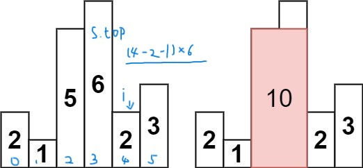

# 单调栈总结

## 一、定义

单调栈是一种：栈内元素始终具有单调性的栈。

## 二、类型

一般来说，分为两种类型：
* 单调递增栈
* 单调递减栈

## 三、适用范围

什么时候用单调栈？

一般来说，当元素以一维的方式存储，要寻找某一元素左（右）边**第一个**大（小）于该元素的元素。此时，可以考虑用单调栈。

## 四、模板

下面以一道题为例子

[每日温度](https://leetcode.cn/problems/daily-temperatures/)

给定一个整数数组 temperatures ，表示每天的温度，返回一个数组 answer ，其中 answer[i] 是指对于第 i 天，下一个**更高温度**出现在几天后。如果气温在这之后都不会升高，请在该位置用 0 来代替。

**分析：**

根据题意，可以发现：我们要寻找 **右边** 第一个 **大于** 某元素的元素。因此，我们考虑使用单调栈

使用单调递增栈还是单调递减栈？

由于要寻找 **右边** 第一个 **大于** 某元素的元素，因此，栈内元素必须是**递减**的。这样，当遍历到一个元素比栈顶元素大，才能说明栈顶元素右边第一个大于栈顶元素的元素就是当前遍历的元素。

可能文字描述有点抽象，上代码！

~~~C++
class Solution {
public:
    vector<int> dailyTemperatures(vector<int>& temperatures) {
        std::stack<int> s; //保存temperature的下标，温度递减栈
        s.push(0);
        int n = temperatures.size();
        std::vector<int> res(n, 0);
        for(int i = 1; i < n; i++)
        {
            //当前元素小于等于栈顶元素
            if(temperatures[i] <= temperatures[s.top()])
            {
                s.push(i); //加入到栈中，等待第一个比它大的元素
            }
            else
            {
                //当前元素比栈顶元素大，如果直接加入到栈中，会破坏递减性
                while(!s.empty() && temperatures[s.top()] < temperatures[i])
                {
                    res[s.top()] = i - s.top(); //距离
                    s.pop(); // 弹出当前元素
                }
                s.push(i); //将当前元素加入到栈中，等待第一个比它大的元素
            }
        }
        return res;
    }
};
~~~

注意：我们栈内存储的是元素的**下标**，维护的是**温度的递减性**。

因此，我们给出单调栈的模板
~~~C++
class monotoneStack
{
    std::vector<int> getRes(std::vector<int> &nums)
    {
        int n = nums.size();
        //res是最终的答案，该存储什么根据具体问题分析
        std::vector<int> res(n, ...); //...指你想要怎么初始化
        if(n == 1) return res;
        std::stack<...> s; // 该存储什么根据具体问题分析
        s.push(...); //...可能是第一个元素的下标，也可能是第一个元素的值等，取决于你要存储什么，根据具体问题分析
        
        //下面以单调递增栈为例，s中存储元素的下标
        for(int i = 1; i < n; i++)
        {
            if(nums[i] >= nums[s.top()]) //加不加等号也要根据题来，看看栈内元素需不需要严格递增
            {
                s.push(i);
            }
            else
            {
                while (!s.empty() && nums[i] < nums[s.top()])
                {
                    res[s.top()] = nums[i];  // 这里是处理栈顶元素，处理方式可能很复杂，取决于你的问题
                    s.pop();
                }
                s.push(i);
            }
        }
        return res;
    }
};
~~~

上述代码核心部分可以精简，核心代码如下
~~~C++
for(int i = 1; i < n; i++)
{
    //当前元素小于栈顶元素，继续添加会破坏单调递增性
    while (!s.empty() && nums[i] < nums[s.top()])
    {
        res[s.top()] = nums[i];  // 这里是处理栈顶元素，处理方式可能很复杂，取决于你的问题
        s.pop();
    }
    s.push(i);
}
~~~

**注意：** 给出模板不是让你背的，而是结合模板理解单调栈工作的本质，实际上，需要使用单调栈的题，大多综合性较强，如果不理解其工作本质，而是一味地套模板，不可能顺利地写出题来。

## 五、综合运用

### 1. [下一个更大元素 I](https://leetcode.cn/problems/next-greater-element-i/)

nums1 中数字 x 的 下一个更大元素 是指 x 在 nums2 中对应位置 **右侧** 的 **第一个** 比 x **大** 的元素。

给你两个 **没有重复元素** 的数组 nums1 和 nums2 ，下标从 0 开始计数，**其中 nums1 是 nums2 的子集** 。

对于每个 0 <= i < nums1.length ，找出满足 nums1[i] == nums2[j] 的下标 j ，并且 **在 nums2** 确定 nums2[j] 的 下一个更大元素 。如果不存在下一个更大元素，那么本次查询的答案是 -1 。

返回一个长度为 nums1.length 的数组 ans 作为答案，满足 ans[i] 是如上所述的 下一个更大元素 。

**分析：**

要在 **nums2** 确定 nums2[j] 的 下一个更大元素，可以想到使用 **单调递减栈** 。

结果集需要返回一个长度为 nums1.length 的数组 ans 作为答案，也就是说，我们还要判断当前的 nums2[j] 在 nums1 中是否存在，如果存在，对应的 nums1 的下标又是多少。

此时，又要查找，又要知道下标，我们可以想到用 **哈希表** 来解决这个问题。

这道题就是**单调栈与哈希表**综合利用！

Code：
~~~C++
class Solution {
public:
    vector<int> nextGreaterElement(vector<int>& nums1, vector<int>& nums2) {
        int n = nums1.size();
        std::vector<int> res(n, -1);
        if(n == 0) return res;
        std::unordered_map<int,int> hash;
        for(int i = 0; i < n; i++)
        {
            hash[nums1[i]] = i;
        }
        std::stack<int> s; //保存nums2下标，元素递减栈
        s.push(0);
        for(int i = 1; i < nums2.size(); i++)
        {
            if(nums2[i] <= nums2[s.top()])
            {
                s.push(i);
            }
            else
            {
                //当前元素比栈顶元素大，如果直接加入到栈中，会破坏递减性
                while(!s.empty() && nums2[i] > nums2[s.top()])
                {
                    if(hash.find(nums2[s.top()]) != hash.end())
                    {
                        res[hash[nums2[s.top()]]] = nums2[i];
                    }
                    s.pop();
                }
                s.push(i);
            }
        }
        return res;
    }
};
~~~
### 2. [移掉 K 位数字](https://leetcode.cn/problems/remove-k-digits/)

给你一个以字符串表示的非负整数 num 和一个整数 k ，移除这个数中的 **k** 位数字，使得剩下的数字**最小**。请你以字符串形式返回这个**最小**的数字。

**分析：**

又要移除元素，又要移除元素后，剩余的数字最小，那我们就让数字高位的数更小。因此，想到使用 **单调递增栈** ！

以题中的示例 1 为例：

num = "1432219"

14XX 与 13XX 比，谁更小？

肯定是 13XX 小。

因此，我们希望去掉 '4' ，保留 '3' ，使数字尽可能小

当 4 为栈顶元素，当前元素为 3 ，很容易想到，我们需要将 4 弹出，将 3 入栈，因此，维护一个单调递增栈就ok了
 
与之前的题不同，此题已经**限制了**我们要**移除的元素个数**，因此，在控制元素出栈时，要特别考虑当前已经移除的元素个数，避免多移除或者少移除了元素。

Code：
~~~C++
// 14XX 13XX 谁更小？
// 肯定是 13XX
// 因此，我们希望去掉'4'，保留'3'，使数字尽可能小
// 维持一个递增栈
class Solution {
public:
    string removeKdigits(string num, int k) {
        int n = num.size();
        if(n == k) return "0";
        std::deque<char> s; // 后面res就可以不reverse了
        s.push_back(num[0]);
        for(int i = 1; i < n; i++)
        {
            while (!s.empty() && num[i] < s.back() && k)
            {
                s.pop_back();
                k--;
            }
            s.push_back(num[i]);
        }
        //如果k还不等于0，则还要继续弹出栈内元素
        //此时，栈内元素一定递增
        //并且，由于数字要尽可能的小，我们弹出末尾的元素即可
        while (!s.empty() && k) 
        {
            s.pop_back();
            k--;
        }
        std::string res = "";
        while(!s.empty())
        {
            res.push_back(s.front());
            s.pop_front();
        }
        //去除前导0
        int start = 0;
        while(start < res.size() && res[start] == '0') start++;
        res = res.substr(start, res.size() - start);
        return res == "" ? "0" : res;
    }
};
~~~
这道题难就难在怎么想到用单调栈，以及用哪种单调栈。

此外，还有一类题（例如：[找出最具竞争力的子序列](https://leetcode.cn/problems/find-the-most-competitive-subsequence/)）要求选择 k 个数（不改变 k 个数在原数组的相对顺序），使构成的数最大（小），本质上与这道题是一致的。**将选 k 个数转换为 删 n - k 个数即可**

### [3. 柱状图中最大的矩形](https://leetcode.cn/problems/largest-rectangle-in-histogram/description/)

给定 n 个非负整数，用来表示柱状图中各个柱子的高度。每个柱子彼此相邻，且宽度为 1 。

求在该柱状图中，能够勾勒出来的矩形的最大面积。

**分析：**

整体思路：我们可以遍历每根柱子，以当前柱子 i 的高度作为矩形的高，那么矩形的宽度边界即为向左找到**第一个**高度**小于**当前柱体 i 的柱体，向右找到**第一个**高度**小于**当前柱体 i 的柱体。

对于每个柱子我们都如上计算一遍以当前柱子作为高的矩形面积，最终比较出最大的矩形面积即可。

如何找到每根柱子左边**第一个**高度**小于**当前柱体 i 的柱体，右边**第一个**高度**小于**当前柱体 i 的柱体呢？

相信通过上面的分析，你一定想到了单调栈，并且是**单调递增栈**！

现在，我们知道了栈顶柱子的高，只需要知道合法的宽度就可以计算矩形的面积了！

要寻找合法宽度，我们就要依次遍历柱子。当遍历到一个柱子的高度小于栈顶柱子的高度时，我们就能计算**栈顶柱子**所能构成矩形的最大面积！

因为栈是递增栈，所以栈顶柱子左边的柱子高度一定比栈顶的小。

那宽度是个啥呢？

```当前元素下标 i - 栈顶柱子左边的柱子的下标 + 1```



上面的图，栈顶柱子高度为 6 ，合法宽度就是 4 - 2 - 1 = 1，因此，以 6 为高度的合法矩形的面积就计算出来了。

然后 6 出栈，height[i] < height[s.top()]，因此，继续计算高度为 5 的矩形的面积。

最后，遍历完所有元素，栈内可能还有元素没被弹出，我们也要依次计算。

此时，栈内柱子高度一定是单调递增的！

我们假设最右边还有一个高度为0，下标为n的矩形，这样，我们就能方便的计算以栈内剩余柱子的高度为高度的合法矩形的面积了。

分析完毕，代码如下：
~~~C++
class Solution {
public:
    int largestRectangleArea(vector<int>& heights) {
        int n = heights.size();
        std::stack<int> s;
        s.push(0);
        int res = std::max(heights[0], heights[n - 1]);
        for(int i = 1; i < n; i++)
        {
            while(!s.empty() && heights[i] < heights[s.top()])
            {
                int index = s.top(); //待出栈元素下标
                s.pop();
                int dis = i;
                if(!s.empty()) //待出栈元素左边有元素
                {
                    dis = i - s.top() - 1; //合法矩形宽度
                }
                res = std::max(res, dis * heights[index]); //dis * heights[index]：以height[index]为高度的矩形的最大面积
            }
            s.push(i);
        }
        //栈内还有元素
        while(!s.empty())
        {
            int index = s.top();
            s.pop();
            if(s.empty()) res = std::max(res, heights[index] * (n - (-1) - 1));
            else 
            {
                res = std::max(res, heights[index] * (n - s.top() - 1)); //假设最有边还有一个高度为0，下标为n的矩形
            }
        }
        return res;
    }
};
~~~

我们还可以引入虚拟节点，也就是**哨兵**，简化我们的代码
~~~C++
/*加入哨兵节点，方便操作，并使代码更简洁*/
class Solution {
public:
    int largestRectangleArea(vector<int>& heights) {
        int n = heights.size();
        std::stack<int> s;
        s.push(-1); //哨兵
        s.push(0);
        int res = 0;
        for(int i = 1; i < n; i++)
        {
            while(s.top() != -1 && heights[i] < heights[s.top()])
            {
                int index = s.top(); //待出栈元素下标
                s.pop();
                int dis = i - s.top() - 1;
                res = std::max(res, dis * heights[index]); //dis * heights[index]：以height[index]为高度的矩形的最大面积
            }
            s.push(i);
        }
        //栈内还有元素
        while(s.top() != -1)
        {
            int index = s.top();
            s.pop();
            res = std::max(res, heights[index] * (n - s.top() - 1)); //假设最有边还有一个高度为0，下标为n的矩形
        }
        return res;
    }
};
~~~

此外，本题还能使用动态规划来求每一根柱子：左边**第一个**高度**小于**当前柱体 i 的柱体，右边**第一个**高度**小于**当前柱体 i 的柱体，并分别保存下左边的下标和右边的下标，然后再来计算。

下面给出动规的解法：
~~~C++
class Solution {
public:
    int largestRectangleArea(vector<int>& heights) {
        int n = heights.size();
        // minLeftIndex[i]：i左边第一个比height[i]小的元素的下标
        int minLeftIndex[n], minRightIndex[n];
        minLeftIndex[0] = -1; minRightIndex[n - 1] = n;
        for(int i = 1; i < n; i++)
        {
            int temp = i - 1;
            while(temp >= 0 && heights[temp] >= heights[i]) //找左边第一个小于height[i]的元素
                temp = minLeftIndex[temp]; //找左边第一个小于height[temp]的元素（状态转移）
            minLeftIndex[i] = temp;
        }
        for(int i = n - 2; i >= 0; i--)
        {
            int temp = i + 1;
            while(temp < n && heights[temp] >= heights[i]) //找左边第一个小于height[i]的元素
                temp = minRightIndex[temp]; //找左边第一个小于height[temp]的元素（状态转移）
            minRightIndex[i] = temp;
        }
        int res = 0;
        for(int i = 0; i < n; i++)
        {
            int dis = minRightIndex[i] - minLeftIndex[i] - 1;
            res = std::max(res, dis * heights[i]);
        }
        return res;
    }
};
~~~
与这道题相似的经典问题还有[接雨水](https://leetcode.cn/problems/trapping-rain-water/description/)，这道题可以使用动规、双指针、单调栈解决，也是一道值得掌握的好题！

### 4. [拼接最大数](https://leetcode.cn/problems/create-maximum-number/description/?orderBy=most_votes)

给定长度分别为 m 和 n 的两个数组，其元素由 0-9 构成，表示两个自然数各位上的数字。现在从这两个数组中选出 k (k <= m + n) 个数字拼接成一个新的数，要求从同一个数组中取出的数字**保持其在原数组中的相对顺序**。

求满足该条件的**最大数**。结果返回一个表示该最大数的长度为 k 的数组。

说明: 请尽可能地优化你算法的时间和空间复杂度。

**分析：**

本题综合性很强，涉及到很多知识。

整体分为三个子问题：
* 在 nums1 中选取 i 个数，在 nums2 中选取 k - i 个数
* 将这两部分进行整合，得到临时答案
* 每次再与最终答案比较，最终得到答案

由于要得到最大的数，因此我们在选择的时候，应保证选择的元素尽可能大。因此，考虑使用单调递减栈（前面的元素越大，越能保证最终的答案更大）

此外，与[移掉 K 位数字](https://leetcode.cn/problems/remove-k-digits/)一样，本题也限制了栈内元素的个数，因此在弹出栈内元素时也要特别注意！

分析完毕，代码如下：

~~~C++
class Solution {
public:
    vector<int> maxNumber(vector<int>& nums1, vector<int>& nums2, int k) {
        int m = nums1.size(), n = nums2.size();
        std::vector<int> res;
        //从nums1中取 i（ i <= k ） 个，nums2中取 k - i 个
        for(int i = 1; i <= k && i <= m; i++)
        {
            if(k - i > n) continue;
            std::vector<int> temp1 = helper(nums1, i);
            std::vector<int> temp2 = helper(nums2, k - i);
            res = std::max(res, myMerge(temp1, temp2));
        }
        return res;
    }
private:
    std::vector<int> helper(std::vector<int> &nums, int need)
    {
        int n = nums.size();
        int popCnt = n - need; //需要pop的个数
        std::deque<int> s;
        s.push_back(nums[0]);
        for(int i = 1; i < n; i++)
        {
            while (!s.empty() && nums[i] > s.back() && popCnt)
            {
                s.pop_back();
                popCnt--;
            }
            s.push_back(nums[i]);
        }
        //栈中可能有多余元素（此时栈中元素一定单调递减，由于我们想要最大的数，所以pop后面的）
        while (!s.empty() && popCnt)
        {
            s.pop_back();
            popCnt--;
        }
        std::vector<int> res;
        while (!s.empty())
        {
            res.push_back(s.front());
            s.pop_front();
        }
        return res;
    }
    //获得afterMerge应该添加哪个数
    //true：添加arr1[j]
    //false：添加arr2[k]
    bool cmp(std::vector<int> &temp1, std::vector<int> &temp2, int ptr1, int ptr2)
    {
        int m = temp1.size(), n = temp2.size();
        for(; ptr1 < m && ptr2 < n && temp1[ptr1] == temp2[ptr2]; ptr1++, ptr2++)
        if(ptr1 == m && ptr2 == n) return true; //两个数一直相等，走到末尾，随便添加哪个都行
        if(ptr1 == m) return false; //ptr1走到末尾，添加arr2[k]，这样可以让arr1继续参与后续比较
        if(ptr2 == n) return true;
        return temp1[ptr1] > temp2[ptr2];
    }
    std::vector<int> myMerge(std::vector<int> &arr1, std::vector<int> &arr2)
    {
        int j = 0, k = 0;
        std::vector<int> afterMerge;
        while (j < arr1.size() && k < arr2.size())
        {
            if(cmp(arr1, arr2, j, k))
            {
                afterMerge.push_back(arr1[j++]);
            }
            else afterMerge.push_back(arr2[k++]);
        }
        while (j < arr1.size())
        {
            afterMerge.push_back(arr1[j++]);
        }
        while (k < arr2.size())
        {
            afterMerge.push_back(arr2[k++]);
        }
        return afterMerge;
    }
};
~~~

细节：

1. for循环终止条件

    ~~~C++
    for(int i = 1; i <= k && i <= m; i++)
    ~~~
    不要忘记 i <= m

2. 栈中可能有多余元素，需要特别处理
3. cmp的实现
4. 如何比较临时答案与最终答案的大小（这里我调用了库函数，然而，并不是所有编程语言都能支持数组之间的比较，就算支持，也不一定得到你想要的结果）

## 六、最后总结

1. 遇到*当元素以一维的方式存储，要寻找某一元素左（右）边**第一个**大（小）于该元素的元素* 这种情况时，不妨考虑用单调栈解决
2. 纯单调栈问题比较少，需要判断能不能将题转换为单调栈问题，再解答
3. 确定了用单调栈，还要搞清楚用哪一种形式的单调栈
4. 遇到复杂的问题，要学会利用分治思想，将问题拆分成几个子问题，分别解决，使问题简单化

## That's All