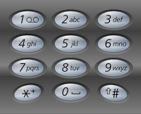

# 回溯算法总结  
## 摘要  
回溯算法可以理解为递归的副产物，它与DFS紧密结合，本质上就是一种通过暴力搜索，最终得到答案的算法，效率不高，在以下问题中可以考虑使用该算法：
* 组合问题
* 切割问题
* 子集问题
* 排列问题  
* 棋盘问题（如N皇后，数独问题）

下面，将根据上述问题，分别给出实例。  
## 回溯算法模板
一般来说，使用回溯算法需考虑以下几点

* 函数的返回值：一般是 ***void***，在某些情况（如：要求只要得到一个解就**立即返回**，可以考虑用 ***bool*** 作为返回值）
* 函数的参数：一般来说，参数是在实现回溯的过程中发现自己需要什么，就添加什么，不会一开始就确定
* 回溯的终点：何时应结束回溯
* 回溯搜索的遍历过程

根据上述考虑因素，不难得到以下模板
~~~C++
class Solution
{
private:
    //Example:
    std::vector<std::vector<int>> res; 
    std::vector<int> path;
    void backTracking(参数)
    {
        if(终止条件)
        {
            将当前收集到结果加入至结果集中
            return ;
        }
        for(选择本层元素) //for循环：层内遍历（横向）
        {
            path.push_back(...) //处理节点
            backTracking(...); //递归：层间遍历（纵向）
            path.pop_back(); //回溯
        }
    }
public:
    ...
};
~~~

## 组合问题
1. [组合总和](https://leetcode.cn/problems/combination-sum-iii/)  
   找出所有相加之和为 n 的 k 个数的组合，且满足下列条件：
   * 只使用数字**1到9**
   * 每个数字 **最多使用一次**  
   返回所有可能的有效组合的列表 。该列表不能包含相同的组合两次，组合可以以任何顺序返回。

    **思路：**  
    1. 确定返回值：***void***
    2. 明确搜索终点：当收集到的元素个数与**k**相等时，到达终点
    3. 明确参数：k，n，curSum（记录已收集的元素的总和），**s（记录当前应从哪开始遍历）**
    4. 明确搜索过程，**组合问题在递归树叶子节点收集res，与子集问题区分！**
    
    ~~~C++
    class Solution {
        std::vector<std::vector<int>> res;
        std::vector<int> temp;
        void backTracking(int k, int n, int s, int curSum)
        {
            //递归终点
            if(temp.size() == k)
            {
                //满足条件，在叶子节点收集结果
                if(curSum == n) res.push_back(temp); 
                return;
            }
            for(int i = s; i < 10; i++)
            {
                int m = k - temp.size();
                //剪枝
                if(m * i + m * (m - 1) / 2 > n - curSum)
                    break;
                //处理节点
                temp.push_back(i); //将当前节点值加入到路径中
                //注意 s = i + 1，即下层搜索应从当前节点的右边开始，避免重复使用当前元素
                backTracking(k, n, i + 1, curSum + i);
                temp.pop_back(); //回溯
            }
        }
    public:
        vector<vector<int>> combinationSum3(int k, int n) {
            backTracking(k, n, 1, 0);
            return res;
        }
    };
    ~~~
2. [组合总和II](https://leetcode.cn/problems/combination-sum/)

   给你一个**无重复元素**的整数数组*candidates*和一个目标整数*target*，找出*candidates*中可以使数字和为目标数*target*的所有不同组合 ，并以列表形式返回。  
    *candidates*中的**同一个**数字可以**无限制重复**被选取 。如果至少一个数字的被选数量不同，则两种组合是不同的。

    **思路：**  
    与上一题的不同在于同一元素可以被重复选取，所以，**下一层**的起始搜索位置 **s = i**，就可以确保当前元素可以被重复选择。  
    
    代码实现不表。

3. [组合总和III](https://leetcode.cn/problems/combination-sum-ii/)
   
    给你一个**可能含重复元素**的整数数组*candidates*和一个目标整数*target*，找出*candidates*中可以使数字和为目标数*target*的所有不同组合 ，并以列表形式返回。  
    *candidates*中的每个数字在每个组合中**只能使用一次** 。  
    **注意：解集不能包含重复的组合。**

    **思路：**
    
    与前面两道题不同的是，这道题涉及到了同一层元素的**去重问题**  
    对于组合问题，若题目对元素间顺序没有要求，可以先对原数据排序，在同一层利用循环的次数进行去重  
    代码如下：
    ~~~C++
    class Solution {
    std::vector<std::vector<int>> res;
    std::vector<int> temp;
    void backTracking(const std::vector<int> &candidates, int target, int curSum, int s)
    {
        if(curSum >= target)
        {
            if(curSum == target) res.push_back(temp);
            return;
        }
        for(int i = s;i < candidates.size();i++)
        {
            if(curSum + candidates[i] > target) break;
            if(i > s && candidates[i] == candidates[i - 1]) continue;
            temp.push_back(candidates[i]);
            backTracking(candidates,target,curSum + candidates[i], i + 1);
            temp.pop_back();
        }
    }
    public:
        vector<vector<int>> combinationSum2(vector<int>& candidates, int target) {
            std::sort(candidates.begin(),candidates.end()); //排序
            backTracking(candidates,target,0,0);
            return res;
        }
    };
    ~~~
    其中，核心的去重代码为：
    ~~~C++
    if(i > s && candidates[i] == candidates[i - 1]) continue;
    ~~~
    这句话的含义是：**当层循环不是第一次执行时，若当前元素与前一元素相等，则跳过。** 具体地说：第一次执行本层循环时，当前元素在本层一定没有被选过，应当选中。第二次及以后执行本层循环时，当前元素前面的元素已经被选过，由于元素已事先排序，若当前元素与前一元素相等，自然不能再选。
4.  [电话号码的字母组合](https://leetcode.cn/problems/letter-combinations-of-a-phone-number/)  
    给定一个仅包含数字 2-9 的字符串，返回所有它能表示的字母组合。答案可以按 **任意顺序** 返回。  
    给出数字到字母的映射如下（与电话按键相同）。注意 1 不对应任何字母。  
    

    **思路：**  
    此题与前三题最大的不同在于**存在多个集合**，如何保存数字与集合的映射以及搜索的过程是一大难点。
    * 利用二维数组保存映射
    * 搜索参数**不需要startIndex**  
    代码如下：
    ~~~C++
    class Solution {
    const std::string mapping[10] = 
    {
        "","","abc","def","ghi","jkl",
        "mno","pqrs","tuv","wxyz"
    };
    std::vector<std::string> res;
    std::string temp;
    void backTracking(int dep, std::string digits)
    {
        if(temp.size() == digits.size())
        {
            res.push_back(temp);
            return;
        }
        for(auto &ch : mapping[digits[dep] - '0'])
        {
            temp.push_back(ch);
            backTracking(dep + 1, digits);
            temp.pop_back();
        }
    }
    public:
        vector<string> letterCombinations(string digits) {
            if(digits.size() != 0) backTracking(0, digits);
            return res;
        }
    };
    ~~~
    其中：dep代表了当前搜索的层数，也代表了当前应该搜索的集合

## 切割问题
**难点：**  
1. 如何模拟切割线
2. 搜索终止条件
3. 如何截取子串
4. 判断切割得到的子串是否符合要求
   
### **实例：**  
1. [分割回文串](https://leetcode.cn/problems/palindrome-partitioning/)

给你一个字符串 *s*，请你将 *s* 分割成一些子串，使每个子串都是 回文串 。返回 *s* 所有可能的分割方案。

**思路：**  
利用startIndex模拟切割线，截取 **[startIndex,i]** 的子串，当  **startIndex == s.size()** 时，搜索终止。  
Code:
~~~C++
class Solution {
    std::vector<std::vector<std::string>> res;
    std::vector<std::string> temp;
    bool isPal(std::string &s, int l, int r)
    {
        while (l < r)
        {
            if(s[l] != s[r]) return false;
            l++;r--;
        }
        return true;
    }
    void backTracking(std::string &s,int start)
    {
        if(start >= s.size())
        {
            res.push_back(temp);
            return ;
        }
        //截取[start,i]的字串
        for(int i = start; i < s.size();i++)
        {
            if(isPal(s,start,i))
            {
                temp.push_back(s.substr(start,i - start + 1));
                backTracking(s,i + 1);
                temp.pop_back();
            }
        }
    }
public:
    vector<vector<string>> partition(string s) {
        backTracking(s,0);
        return res;
    }
};
~~~
注意到上述代码中判断是否为回文子串利用了双指针的算法，但实际上，这样会多出很多不必要的判断，因此，可以考虑用 ***DP*** 预处理原串，得到原串中任意子串是否为回文串。  
Code:
~~~C++
std::vector<std::vector<bool>> isPal; //isPal[i][j]保存s[i] ~ s[j]之间是否为回文串
    void preTreatment(const std::string &s)
    {
        int n = s.size();
        isPal.resize(n, std::vector<bool>(n, false));
        for(int i = n - 1; i >= 0; i--)
        {
            for(int j = i; j < n; j++)
            {
                if(i == j) isPal[i][j] = true;
                else if(j - i == 1 && s[i] == s[j]) isPal[i][j] = true;
                else isPal[i][j] = (s[i] == s[j] && isPal[i + 1][j - 1]);
            }
        }
    }
~~~
值得注意的是：判断时应从后往前，保证处理当前子串的时候，后面的子串已经处理好了，这样才能利用后面子串的结果来动态规划。

2. [复原*IP*地址](https://leetcode.cn/problems/restore-ip-addresses/description/)

有效*IP*地址正好由四个整数（ 每个整数位于 0 到 255 之间组成，且**不能含有前导 0** ），整数之间用 '.' 分隔。  
给定一个只包含数字的字符串 s ，用以表示一个 IP 地址，返回所有可能的有效 IP 地址，这些地址可以通过在 s 中插入 '.' 来形成。你 **不能** 重新排序或删除 s 中的任何数字。

**思路：**  
思路总体上与上一题相同，但不一样的是：此题的终止条件不再是：收集到的子串的数目 == 4 ，而应该为 **收集到的子串的数目 == 3**，因为若收集子串数目为4才结束搜索，会导致题中给定的字符串 s 中的数字**可能未被全部使用** 。
Code:
~~~C++
class Solution {
    std::vector<std::string> res;
    std::vector<int> temp;
    int isValid(std::string &s, int l, int r) //左闭右闭
    {
        if(l > r) return -1;
        if(s[l] == '0' && l != r) return -1; //含前导0
        int num = 0;
        while (l <= r)
        {
            num = num * 10 + s[l] - '0';
            l++;
            if(num > 255) return -1;
        }
        //if(num > 255) return -1; 放在这会溢出
        return num;
    }
    void backTracking(std::string &s, int start)
    {
        //注意终止条件
        if(temp.size() == 3)
        {
            //将剩余数字全部加入至lastnum
            int lastnum = isValid(s, start, s.size() - 1);
            if(lastnum != -1)
            {
                std::string IP;
                for(auto &num : temp)
                {
                    IP += std::to_string(num);
                    IP += ".";
                }
                IP += std::to_string(lastnum);
                res.push_back(IP);
            }
            return ;
        }
        for(int i = start; i < s.size(); i++)
        {
            int num = isValid(s,start,i);
            if(num != -1)
            {
                temp.push_back(num);
                backTracking(s, i + 1);
                temp.pop_back();
            }
        }
    }
public:
    vector<string> restoreIpAddresses(string s) {
        backTracking(s,0);
        return res;
    }
};
~~~

## 子集问题

与组合问题不同的是，组合问题一般在叶子节点才收集最终结果，而子集问题一般在每个节点都要收集结果。

### **实例：**

1. [子集II](https://leetcode.cn/problems/subsets-ii/)

给你一个整数数组 nums ，其中**可能包含重复元素**，请你返回该数组所有可能的子集（幂集）。  
解集 **不能** 包含重复的子集。

**思路：**  
本题再次涉及到去重问题，与前文提到的组合问题一样，先**对原数据排序**，然后去重。不同的是，本题为子集问题，需要在每个节点收集结果。  

Code:
~~~C++
class Solution {
    std::vector<std::vector<int>> res;
    std::vector<int> temp;
    void backTracking(std::vector<int> &nums, int start)
    {
        if(start >= nums.size()) return; //终止条件
        for(int i = start; i < nums.size(); i++)
        {
            if(i > start && nums[i] == nums[i - 1]) continue; //去重
            temp.push_back(nums[i]); //保存路径
            res.push_back(temp); //保存结果！！！
            backTracking(nums,i + 1);
            temp.pop_back(); //回溯
        }
    }
public:
    vector<vector<int>> subsetsWithDup(vector<int>& nums) {
        res.push_back({});
        std::sort(nums.begin(),nums.end()); //排序
        backTracking(nums,0);
        return res;
    }
};    
~~~
2. [递增子序列](https://leetcode.cn/problems/non-decreasing-subsequences/)

给你一个整数数组 nums ，找出并返回所有该数组中 **不同的** 递增子序列，递增子序列中 **至少有两个元素** 。  
数组中**可能含有重复元素**，如**出现两个整数相等**，也可以视作递增序列的一种特殊情况。

**思路：**  
本题与上题最大的不同是：**不能**对原数组排序，因此，原有的去重逻辑不再适用。那该如何去重呢？ 答案是：在每一层利用 ***set*** 对本层元素去重。

Code：
~~~C++
class Solution {
    std::vector<std::vector<int>> res;
    std::vector<int> temp;
    void backTracking(std::vector<int> &nums, int start)
    {
        if(start == nums.size()) return ;
        bool Hash[201]; //利用set去重，由于数据范围为[-100,100]，故可用数组代替set，提高效率
                        //同一节点下的本层去重
        for(int i = 0; i <= 200; i++) Hash[i] = false;
        for(int i = start; i < nums.size(); i++)
        {
            if(Hash[nums[i] + 100]) continue; //有重复元素就跳过
            if(temp.size() && nums[i] < temp.back()) continue; //不满足递增，跳过
            Hash[nums[i] + 100] = true; //标记为已访问
            temp.push_back(nums[i]); //加入至路径
            if(temp.size() >= 2) res.push_back(temp); //路径有两个元素以上才加入至结果集中
            backTracking(nums, i + 1);
            temp.pop_back(); //回溯
        }
    }
public:
    vector<vector<int>> findSubsequences(vector<int>& nums) {
        backTracking(nums, 0);
        return res;
    }
};
~~~
**注意：** set仅仅记录**本层元素**是否被使用，是针对本层元素的去重，新的一层的set**会被重新定义**。所以，针对**单个**元素，标记为已访问后，**不用再次标记为未访问**，这是与后面的排列问题有所不同的。  

去重时，若数据范围较小，可以使用数组代替set，提高效率。  

值得一提的是，去重时可能会**错误的**将set作为**全局变量**，并模仿回溯的样子将某个元素又标记为未访问，就像这样：  
~~~C++
class Solution {
    std::vector<std::vector<int>> res;
    std::vector<int> temp;
    std::unordered_set<int> Hash; //定义为全局变量
    void backTracking(std::vector<int> &nums, int start)
    {
        if(start == nums.size()) return ;
        for(int i = start; i < nums.size(); i++)
        {
            if(Hash.find(nums[i]) != Hash.end()) continue;
            if(temp.size() && nums[i] < temp.back()) continue;
            Hash.insert(nums[i]); //标记为已访问
            temp.push_back(nums[i]); 
            if(temp.size() >= 2) res.push_back(temp); 
            backTracking(nums, i + 1);
            temp.pop_back(); //回溯
            Hash.erase(nums[i]) //回溯
        }
    }
public:
    ...
};
~~~

实际上，将set放在全局变量中，它控制的就是**整棵树**，包括树枝，因此，势必会影响本层的去重。所以，正确的做法是**在每一层单独定义一个set**，对本层元素去重。  
另外，由于每一层都定义了一个set，所以整体的空间复杂度为 $O(n^2)$. 包括递归栈的空间以及set的空间。

## 排列问题

与前面三个问题最大的不同是：在前面，[1,2]，[2,1]被看作为同一组合，而在排列中，这两种是不同的排列。  
因此，我们每次搜索，都应该从第一个元素开始搜索。  
值得注意的是，在排列问题中，通常利用一个 ***used*** 数组来记录本层元素是否被访问，以此达到不选择上一层已选元素的目的。

### **实例：**  
1. [全排列](https://leetcode.cn/problems/permutations/)

给定一个**不含重复数字**的数组 *nums* ，返回其 **所有可能的全排列** 。

**思路：**

利用一个 ***used*** 数组来记录本层元素是否被访问，当收集到的元素个数 == nums.size() 时，将路径加入至结果集中。  

Code:
~~~C++
class Solution {
    std::vector<std::vector<int>> res;
    std::vector<int> path;
    //visited前加了引用，相当于全局变量
    void backTrack(std::vector<int> &nums,std::vector<bool> &visited)
    {
        //终止条件
        if(path.size() == nums.size())
        {
            res.push_back(path);
            return ;
        }
        for(int i = 0;i < nums.size();i++)
        {
            //上一层没有访问过该元素
            if(!visited[i])
            {
                visited[i] = true; //标记为已访问
                path.push_back(nums[i]);
                backTrack(nums,visited);
                path.pop_back();
                visited[i] = false; //标记为未访问
            }
        }
    }
public:
    vector<vector<int>> permute(vector<int>& nums) {
        std::vector<bool> visited(nums.size(),false);
        backTrack(nums,visited);
        return res;
    }
};
~~~
**注意：** 与前面set去重不同的是，visited**需作为全局变量，或者是函数的参数**，以便于传给下一层，让下一层知道上一层的某个元素是否被访问过，这**不是本层去重**，是与set去重有本质区别的。

2. [全排列II](https://leetcode.cn/problems/permutations-ii/)

给定一个**含重复数字**的数组 *nums* ，返回其 **所有可能的全排列** 。

**思路：**

核心代码与上一题几乎一致，区别在于**此题需要对本层元素去重**，由于题目对元素相对顺序没有要求，故可以先排序，再去重，不使用set，提高效率。

Code:  
~~~C++
class Solution {
    std::vector<std::vector<int>> res;
    std::vector<int> path;
    void backTrack(std::vector<int> &nums,std::vector<bool> &visited)
    {
        if(path.size() == nums.size())
        {
            res.push_back(path);
            return ;
        }
        for(int i = 0;i < nums.size();i++)
        {
            if(i > 0 && nums[i] == nums[i - 1] && visited[i - 1] == false) continue;
            //注意visited[i - 1] == false，有这个条件才能说明是树层去重，不加的话，会导致树枝元素被去掉
            if(!visited[i])
            {
                visited[i] = true;
                path.push_back(nums[i]);
                backTrack(nums,visited);
                path.pop_back();
                visited[i] = false;
            }
        }
    }
public:
    vector<vector<int>> permuteUnique(vector<int>& nums) {
        std::vector<bool> visited(nums.size(),false);
        std::sort(nums.begin(),nums.end()); //排序
        backTrack(nums,visited);
        return res;
    }
};
~~~

核心的去重代码：  
~~~C++
if(i > 0 && nums[i] == nums[i - 1] && visited[i - 1] == false) continue;
//注意visited[i - 1] == false，有这个条件才能说明是树层去重，不加的话，会导致树枝元素被去掉
~~~

与组合问题不一样的是：*i > startIndex* 变成了 *i > 0*，这是由排列的性质决定的。注意到 **“visited[i - 1] == false”** 这一句，有这个条件才能说明是树层去重，不加的话，会导致树枝元素被去掉。如图所示：
  
事实上， **“visited[i - 1] == true”** 也是可以的，它代表着树枝去重。看图理解：  

树层上去重（ **“visited[i - 1] == false”**）：
  

树枝上去重（ **“visited[i - 1] == true”**）：  

从图中我们可以看到，树枝去重的效率比树层去重效率低，所以仍然推荐树层去重。

## 棋盘问题

1. [N皇后](https://leetcode.cn/problems/n-queens/) 
   
n 皇后问题 研究的是如何将 n 个皇后放置在 n×n 的棋盘上，并且使皇后彼此之间不能相互攻击。  
给你一个整数 n ，返回所有不同的 n 皇后问题 的解决方案。  
每一种解法包含一个不同的 n 皇后问题 的棋子放置方案，该方案中 'Q' 和 '.' 分别代表了皇后和空位。

**思路：**  

与以往的题不同，这道题的元素是以二维的形式存储的，因此，需要特别考虑搜索的逻辑，即横向、纵向应该如何搜索。  

  

将 3x3 的棋盘的搜索过程抽象成一棵树，从图中可以看出，横向搜索，即树的宽度，为棋盘的宽；纵向搜索，即树的深度，为棋盘的长，明确搜索逻辑，题就好做了。  

Code:
~~~C++
class Solution {
    std::vector<std::vector<std::string>> res;
    bool isValid(int row, int col, std::vector<std::string> &curChessBoard)
    {
        for(auto & ch : curChessBoard[row])
        {
            if(ch == 'Q') return false;
        }
        for(auto &s : curChessBoard)
        {
            if(s[col] == 'Q') return false;
        }
        //左上
        for(int i = row, j = col; i >= 0 && j >= 0;i--,j--)
        {
            if(curChessBoard[i][j] == 'Q') return false;
        }
        //右上
        for(int i = row, j = col; i >= 0 && j < curChessBoard[0].size(); i--,j++)
        {
            if(curChessBoard[i][j] == 'Q') return false;
        }
        return true;
    }
    void backTrack(std::vector<std::string> &curChessBoard,int curRow)
    {   
        if(curRow == curChessBoard.size())
        {
            res.push_back(curChessBoard);
            return ;
        }
        for(int curCol = 0; curCol < curChessBoard[0].size(); curCol++)
        {
            if(isValid(curRow, curCol, curChessBoard))
            {
                curChessBoard[curRow][curCol] = 'Q';
                backTrack(curChessBoard,curRow + 1);
                curChessBoard[curRow][curCol] = '.';
            }
        }
    }
public:
    vector<vector<string>> solveNQueens(int n) {
        std::vector<std::string> curChessBoard(n,std::string(n,'.'));
        backTrack(curChessBoard,0);
        return res;
    }
};
~~~

2. [解数独](https://leetcode.cn/problems/sudoku-solver/description/)

一个数独的解法需遵循如下规则：数字 1-9 在每一行只能出现一次。数字 1-9 在每一列只能出现一次。 数字 1-9 在每一个以粗实线分隔的 3x3 宫内只能出现一次。空白格用 '.' 表示。
   

提示：

* 给定的数独序列只包含数字 1-9 和字符 '.' 。
* 你可以假设给定的数独只有唯一解。
* 给定数独永远是 9x9 形式的。  

**思路：**  

N皇后只需要每行放一个皇后即可，本质仍然是一维递归，而本题最大的不同就是需要二维递归，每一行的每一列都要放数字，将部分搜索过程抽象成树，如图所示：  

因此，需要思考的是：  
* 函数的返回值： 此题因为要求找到一个解即可，所以使用 ***bool*** 类型
* 搜索终点：所有空格都被填充，找到解
* 如何判断某一位置是否可以放某一数字
* 搜索过程  

Code:  
~~~C++
class Solution {
    bool isValid(std::vector<std::vector<char>> &curBoard, int curRow, int curCol, char num)
    {
        //检查列
        for(auto &ch : curBoard[curRow])
        {
            if(ch == '.') continue;
            if(ch == num) return false;
        }
        //检查行
        for(auto &vec : curBoard)
        {
            if(vec[curCol] == '.') continue;
            if(vec[curCol] == num) return false;
        }
        //确定判断的九宫格
        int startRow = curRow / 3 * 3;
        int startCol = curCol / 3 * 3;
        for(int row = startRow; row < startRow + 3; row++)
        {
            for(int col = startCol; col < startCol + 3; col++)
            {
                char &ch = curBoard[row][col];
                if(ch == '.') continue;
                if(ch == num)
                    return false;
            }
        }
        return true;
    }
    bool backTrack(std::vector<std::vector<char>> &curBoard)
    {
        for(int row = 0; row < 9; row++)
        {
            for(int col = 0; col < 9; col++)
            {
                if(curBoard[row][col] != '.') continue;
                for(char num = '1'; num <= '9'; num++)
                {
                    if(isValid(curBoard,row,col,num))
                    {
                        curBoard[row][col] = num;
                        if(backTrack(curBoard)) return true; //找到解立即返回
                        curBoard[row][col] = '.'; //回溯
                    }
                }
                return false; // 1 ~ 9全枚举过，均不符合
            }
        }
        return true;
    }
public:
    void solveSudoku(vector<vector<char>>& board) {
        backTrack(board);
    }
};
~~~
注意到上述代码每次遍历都要从0开始，存在重复遍历，因此，优化后的代码如下：  

Code:  
~~~C++
bool backTrack(std::vector<std::vector<char>> &curBoard, int row, int col)
{
    //当前行已枚举完毕，换行
    if(col == 9)
    {
        col = 0;
        row++;
    }
    //全部枚举完毕
    if(row == 9) return true;
    if(curBoard[row][col] != '.') return backTrack(curBoard,row,col + 1);
    for(char num = '1'; num <= '9'; num++)
    {
        if(isValid(curBoard,row,col,num))
        {
            curBoard[row][col] = num;
            if(backTrack(curBoard,row,col + 1)) return true; //找到解立即返回
            curBoard[row][col] = '.'; //回溯
        }
    }
    return false; // 1 ~ 9全枚举过，均不符合
}
~~~
优化后的代码本质上仍然是二维递归，但减少了重复遍历。  

## 对返回值类型为 ***bool*** 的补充

何时应使用 ***bool*** 作为返回值？当题中要求只需要一个解时，就可以考虑用 ***bool*** 类型，找到合适解返回 *true* ，无需继续搜索。  

例如：[重新安排行程](https://leetcode.cn/problems/reconstruct-itinerary/)  

给定一个机票的字符串二维数组 [from, to]，子数组中的两个成员分别表示飞机出发和降落的机场地点，对该行程进行重新规划排序。所有这些机票都属于一个从 JFK（肯尼迪国际机场）出发的先生，所以该行程必须从 JFK 开始。  

提示：

* 如果存在多种有效的行程，请你按字符自然排序返回**最小**的行程组合。例如，行程 ["JFK", "LGA"] 与 ["JFK", "LGB"] 相比就更小，排序更靠前
* 所有的机场都用三个大写字母表示（机场代码）。
* 假定所有机票至少存在一种合理的行程。
* 所有的机票**必须都用一次** 且 **只能用一次**。

**思路：**  
这道题要求返回按字符自然排序返回**最小**的行程组合，满足返回值为 ***bool*** 的条件。需要思考的有：  
* 如何保存机场与机场之间的映射（类似邻接矩阵）
* 如何遍历一个机场对应的其余机场（类似邻接表）
* 如何排序
* 搜索逻辑与搜索终止条件

可以说，上面的所有点都比较难想，下面将一一解释。  

1. 由于需要类似邻接矩阵和邻接表的数据结构，并且需要排序，我们可以使用 **std::unordered_map< std::string,某种容器 >** 来保存机场与机场间的映射。那该选择哪种容器存储一个机场对应的其余机场呢？注意到需要按字符自然排序，所以不妨用 **std::map< std::string,int >** 来保存一个机场对应的其余机场，*int*保存的是对应机票的张数（因为可能相同的机票有多张）
2. 搜索时，应根据当前所在的机场相对应地来选择下一个机场，并将其加入至路径中；下一次搜索根据路径的最后一个位置继续搜索
3. 当路径的机场数 == 机票张数 + 1时，说明搜索结束。

Code:  
~~~C++
class Solution {
    //flight[begin][end] = ticketNum;
    //即保存了机票的起始地点到终止地点，以及机票的张数
    //此结构在图中既可以用作邻接矩阵，又可以用作邻接表，一举两得，应当记住
    //利用map对机票的终止地点的字典序进行排序
    std::unordered_map<std::string,std::map<std::string,int>> flight;
    bool backTrack(std::vector<std::string> &res, int ticketNum)
    {
        if(res.size() == ticketNum + 1) //即当前机场总数 == 机票张数 + 1;
        {
            return true; //规划完成，立即返回
        }
        //用作邻接表
        for(std::pair<const std::string, int> &curFlight : flight[res.back()])
        {
            //剩余机票张数 > 0
            if(curFlight.second > 0)
            {
                curFlight.second--;
                res.push_back(curFlight.first);
                if(backTrack(res, ticketNum)) return true; //规划完成，立即返回
                //规划失败，回溯，重新规划
                curFlight.second++; //回溯
                res.pop_back(); //回溯
            }
        }
        return false;
    }
public:
    vector<string> findItinerary(vector<vector<string>>& tickets) {
        std::vector<std::string> res;
        //用作邻接矩阵
        for(auto &vec : tickets)
        {
            flight[vec[0]][vec[1]]++; //机票张数++
        }
        res.push_back("JFK"); //从JFK开始
        backTrack(res,tickets.size());
        return res;
    }
};
~~~

## 最后的总结

通过学习回溯算法，你将解决如下问题：  
* 回溯算法模板
* 组合问题
* 切割问题
* 子集问题
* 排列问题  
* 棋盘问题（如N皇后，数独问题）
* 组合、子集、排列问题去重方式的相同点与不同点以及如何去重
* 如何剪枝优化
