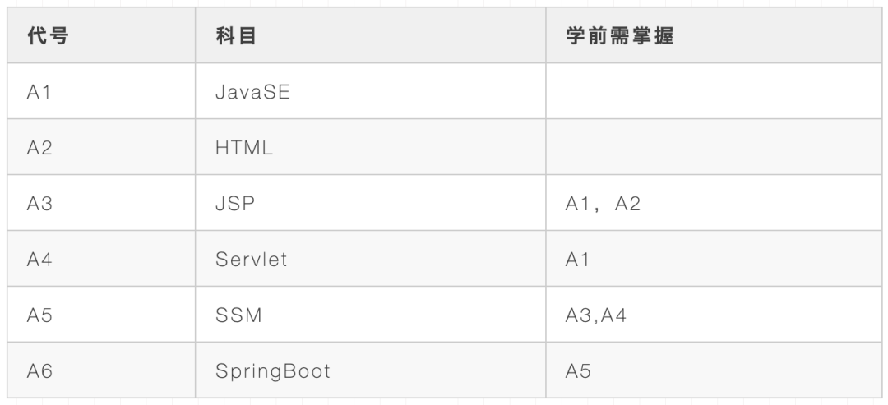
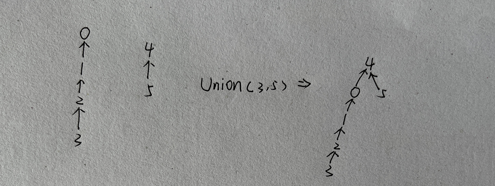
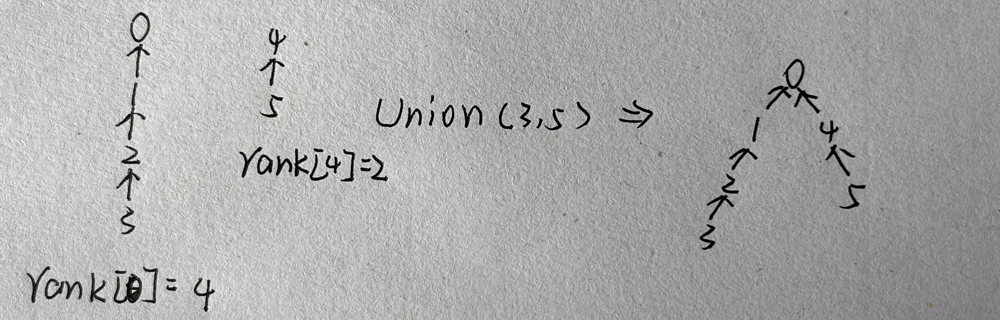
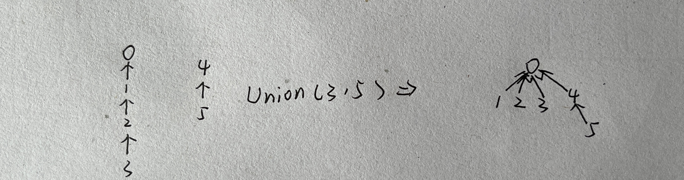
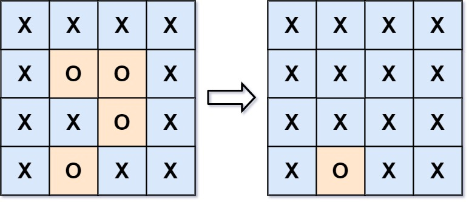

# 图论总结

## 常用算法：

1. DFS、BFS（图的遍历）
2. 基于BFS的拓扑排序（判断图是否有环）
3. 判断图是不是二分图（染色法、并查集）
4. Kruskal算法、prim算法（最小生成树）
5. dijkstra算法（最短路径）

## 图的遍历

### 引入

图的遍历大体上与树的遍历差不多，主要有DFS、BFS两种

* DFS：一条路走到头再返回找下一条路
* BFS：尽可能一次搜索多条路（一层一层的搜索）

在遍历时，常常用一个 visited 数组记录已经访问过的节点，避免因图中有环导致走回头路。

BFS 算法一般使用队列来辅助搜索

### 例题

#### [797. 所有可能的路径](https://leetcode.cn/problems/all-paths-from-source-to-target/description/)

给你一个有 n 个节点的 **有向无环图（DAG）**，请你找出所有从节点 0 到节点 n-1 的路径并输出（不要求按特定顺序）

graph[i] 是一个从节点 i 可以访问的所有节点的列表（即从节点 i 到节点 graph[i][j]存在一条有向边）。

**分析：**

注意到题中说到是**无环图**，因此，我们可以不用visited数组

以 DFS 实现：

~~~C++
class Solution {
    std::vector<int> path;
    std::vector<std::vector<int>> res;
    void dfs(vector<vector<int>>& graph, int s)
    {
        path.push_back(s);
        if(s == graph.size() - 1)
        {
            res.push_back(path);
            path.pop_back(); //不要忘记这里的回溯
            return;
        }
        for(auto i : graph[s])
        {
            dfs(graph, i);
        }
        path.pop_back();
    }
public:
    vector<vector<int>> allPathsSourceTarget(vector<vector<int>>& graph) {
        dfs(graph, 0);
        return res;
    }
};
~~~

可以发现，上面的代码结合了回溯的思想，因此，如果按照回溯的模板，还可以这样写：

~~~C++
class Solution {
    std::vector<int> path;
    std::vector<std::vector<int>> res;
    void dfs(vector<vector<int>>& graph, int s)
    {
        // path.push_back(s);
        if(s == graph.size() - 1)
        {
            res.push_back(path);
            // path.pop_back();
            return;
        }
        for(auto i : graph[s])
        {
            path.push_back(i);
            dfs(graph, i);
            path.pop_back();
        }
    }
public:
    vector<vector<int>> allPathsSourceTarget(vector<vector<int>>& graph) {
        path.push_back(0); //要先将起点添加到路径中
        dfs(graph, 0);
        return res;
    }
};
~~~

两种方式本质相同，重要的是理解什么时候该回溯

以 BFS 实现：

~~~C++
class Solution {
public:
    vector<vector<int>> allPathsSourceTarget(vector<vector<int>>& graph) {
        int n = graph.size();
        std::vector<std::vector<int>> res;
        std::queue<std::vector<int>> q;
        q.push({0}); // 加入起点
        while (!q.empty())
        {
            std::vector<int> path = q.front();
            q.pop();
            // path 的最后一个元素是终点
            if(path.back() == n - 1)
            {
                res.push_back(path);
            }
            else
            {
                for(auto &next : graph[path.back()])
                {
                    path.push_back(next);
                    q.push(path);
                    path.pop_back();
                }
            }
        }
        return res;
    }
};
~~~

上述 BFS 中，队列里面存放路径（vector）的方式值得学习

## 拓扑排序

拓扑排序：对于**有向无环图**，将图中所有节点排成一个**线性**序列，使得对于任意的节点a、b，若 a 在 b 的上位，则在序列中 a 也在 b 的前面，满足这样的序列叫做拓扑序列。

一个简单的例子：

在图中可以发现：课程之间的关系可以抽象成一张有向图，将课程以线性序列输出，如果该序列任意两个课程均满足学习的先后顺序，那么这个序列就是拓扑序列

如果课程之间存在相互推导关系（也就是环），那么一定不能得到拓扑序列

因此，拓扑排序可以用于有向图中的**环检测**

拓扑排序算法步骤：

1. 维护一个**队列**，队中节点的入度均为0（相当于没有前置任务，或者前置任务已经完成）
1. 统计每个节点的入度
2. 首次扫描入度为 0 的节点，加入到队列中
3. 遍历队列中的每一个节点，出队（相当于完成任务），加至结果序列 res 中，然后将其**所有后继节点**的入度 - 1（使后置任务的前置任务数量 - 1）。如果此时后继节点的入度为 0，那么将其加入到队列中。
4. 如果队中还有节点，重复 4
5. 判断结果集 res 里面的元素数量是不是节点的总数量
    
    * 如果是，说明得到正确的拓扑序列，输出
    * 如果不是，说明图中有环，返回错误信息

下面，我们用例题来加以理解

#### [207. 课程表](https://leetcode.cn/problems/course-schedule/)

你这个学期必须选修 numCourses 门课程，记为 0 到 numCourses - 1 。

在选修某些课程之前需要一些先修课程。 先修课程按数组 prerequisites 给出，其中 prerequisites[i] = [ai, bi] ，表示如果要学习课程 ai 则 必须 先学习课程  bi 。

例如，先修课程对 [0, 1] 表示：想要学习课程 0 ，你需要先完成课程 1 。
请你判断是否可能完成所有课程的学习？如果可以，返回 true ；否则，返回 false 。

**分析：**

可以发现，如果课程间成了环，那无论如何也没有办法修完所有课程，因此，该问题转换为了**环检测问题**。

方法一：拓扑排序：

结合上述拓扑排序算法步骤，不难写出以下代码：
~~~C++
/*问题转化为判断图中是否有环*/
//当一个节点的入度 == 0 时，说明它的前序节点（任务）均已经被访问（完成），此时，可以执行这个任务
//反映在代码中的操作就是入队
class Solution {
public:
    bool canFinish(int numCourses, vector<vector<int>>& prerequisites) {
        std::vector<std::vector<int>> map(numCourses);
        std::vector<int> inDegree(numCourses, 0);
        //建图
        for(auto &edge : prerequisites)
        {
            map[edge[1]].push_back(edge[0]);
            inDegree[edge[0]]++;
        }
        //队列中保存入度为 0 的节点（没有或已经完成前置任务）
        std::queue<int> q;
        //首次扫描入度为0的节点（没有任何前置任务）
        for(int i = 0; i < numCourses; i++)
        {
            if(inDegree[i] == 0) q.push(i);
        }
        int cnt = 0; // 统计完成任务的数量
        while (!q.empty())
        {
            int index = q.front();
            q.pop();
            //相当于完成任务
            cnt++;
            //将入度为 0 的节点的后继节点的入度 - 1（少了一个前置任务）
            for(auto &node : map[index])
            {
                inDegree[node]--;
                if(inDegree[node] == 0) q.push(node);
            }
        }
        if(cnt == numCourses) return true;
        //完成任务数少于总任务数，说明有环
        return false;
    }
};
~~~

方法二：DFS 遍历图

由于图中可能有环，因此需要一个 visited 数组来保存我们已经访问过的节点。此外，我们可以用一个数组 onPath 来记录当前路径上的节点，如果当前访问的节点已经在路径上，则说明一定有环

代码如下：

~~~C++
class Solution {
    std::vector<bool> visited; //记录已经访问过的节点，避免重复访问
    std::vector<bool> onPath;
    bool hasCycle;
    void dfs(std::vector<std::vector<int>> &map, int s)
    {
        if(onPath[s]) hasCycle = true;
        if(visited[s] || hasCycle) return;
        visited[s] = true;
        onPath[s] = true;
        for(auto &node : map[s])
        {
            dfs(map, node);
        }
        onPath[s] = false;
    }
public:
    bool canFinish(int numCourses, vector<vector<int>>& prerequisites) {
        visited = std::vector<bool>(numCourses, false);
        onPath = std::vector<bool>(numCourses, false);
        std::vector<std::vector<int>> map(numCourses);
        // 建图（邻接表）
        for(auto &edge : prerequisites)
        {
            map[edge[1]].push_back(edge[0]);
        }
        //初始化为没有成环
        hasCycle = false;
        // 注意：由于可能有多个连通子图，我们需要以每一个节点为起点来搜索
        for(int i = 0; i < numCourses; i++)
        {
            dfs(map, i);
            if(hasCycle) return false;
        }
        return true;
    }
};
~~~

注意：由于可能有多个连通子图，我们需要以每一个节点为起点来搜索

#### [210. 课程表 II](https://leetcode.cn/problems/course-schedule-ii/)

现在你总共有 numCourses 门课需要选，记为 0 到 numCourses - 1。给你一个数组 prerequisites ，其中 prerequisites[i] = [ai, bi] ，表示在选修课程 ai 前 必须 先选修 bi 。

例如，想要学习课程 0 ，你需要先完成课程 1 ，我们用一个匹配来表示：[0,1] 。
返回你为了学完所有课程所**安排的学习顺序**。可能会有多个正确的顺序，你只要返回 任意一种 就可以了。如果不可能完成所有课程，返回 一个空数组 。

**分析：**

此题相较前一题来说，就是要得到拓扑序列，因此，稍微修改上题的代码，就能 AC 这道题

~~~C++
//当一个节点的入度 == 0 时，说明它的前序节点（任务）均已经被访问（完成），此时，可以执行这个任务
//反映在代码中的操作就是入队
class Solution {
public:
    vector<int> findOrder(int numCourses, vector<vector<int>>& prerequisites) {
        std::vector<std::vector<int>> map(numCourses);
        std::vector<int> inDegree(numCourses, 0);
        //建图
        for(auto &edge : prerequisites)
        {
            map[edge[1]].push_back(edge[0]);
            inDegree[edge[0]]++;
        }
        //队列中保存入度为 0 的节点（没有或已经完成前置任务）
        std::queue<int> q;
        //首次扫描入度为0的节点（没有任何前置任务）
        for(int i = 0; i < numCourses; i++)
        {
            if(inDegree[i] == 0) q.push(i);
        }
        std::vector<int> res;
        while (!q.empty())
        {
            int index = q.front();
            q.pop();
            //相当于执行任务
            res.push_back(index);
            //将入度为 0 的节点的后继节点的入度 - 1（少了一个前置任务）
            for(auto &node : map[index])
            {
                inDegree[node]--;
                if(inDegree[node] == 0) q.push(node);
            }
        }
        if(res.size() == numCourses) return res;
        //完成任务数少于总任务数，说明有环
        return {};
    }
};
~~~

#### 684. [冗余连接](https://leetcode.cn/problems/redundant-connection/description/)

树可以看成是一个连通且 **无环** 的 **无向** 图。

给定往一棵 n 个节点 (节点值 1～n) 的树中添加一条边后的图。添加的边的两个顶点包含在 1 到 n 中间，且这条附加的边不属于树中已存在的边。图的信息记录于长度为 n 的二维数组 edges ，edges[i] = [ai, bi] 表示图中在 ai 和 bi 之间存在一条边。

请找出一条可以删去的边，删除后可使得剩余部分是一个有着 n 个节点的树。如果有多个答案，则返回数组 edges 中**最后出现**的边。

**分析：**

此题要求删去一条边，使得有环无向图变为无环无向图

无向图还能用拓扑排序吗？

可以

区别在于无向图的每个节点不区分入度、出度

可以想到：度为 1 的节点一定不在环中，因此，我们删去度为 1 的节点，最后剩余的点就是在环中的点

Code：

~~~C++
class Solution {
public:
    vector<int> findRedundantConnection(vector<vector<int>>& edges) {
        int n = edges.size();
        std::vector<std::vector<int>> map(n + 1);
        std::vector<int> degree(n + 1, 0);
        for(auto &edge : edges)
        {
            map[edge[0]].push_back(edge[1]);
            map[edge[1]].push_back(edge[0]);
            ++degree[edge[0]];
            ++degree[edge[1]];
        }
        // 拓扑排序
        std::queue<int> q;
        // 首次扫描度为 1 的节点
        for(int i = 1; i <= n ;i++)
        {
            if(degree[i] == 1)
            {
                q.push(i);
            }
        }
        while(!q.empty())
        {
            int id = q.front();
            q.pop();
            // 度为 1 的节点一定不在环内
            // 删去度为 1 的节点
            degree[id] = 0;
            // 与 id 相连的 node 的度 - 1
            for(auto &node : map[id])
            {
                if(degree[node] != 0) --degree[node];
                if(degree[node] == 1) 
                    q.push(node);
            }
        }
        // 删去节点后，剩下的就只是环了
        int i = n - 1;
        for(; i >= 0; i--)
        {
            if(degree[edges[i][0]] != 0 && degree[edges[i][1]] != 0)
                break;
        }
        return edges[i];
    }
};
~~~

还有一些例题，这里就不再赘述

[802. 找到最终的安全状态](https://leetcode.cn/problems/find-eventual-safe-states/description/?orderBy=most_votes)

## 染色法

首先给出二分图的定义：

**二分图** 定义：如果能将一个图的节点集合分割成两个独立的子集 A 和 B ，并使图中的每一条边的两个节点一个来自 A 集合，一个来自 B 集合，就将这个图称为 **二分图** 。

由二分图的定义可知：**相邻两个节点一定属于不同的集合。** 我们用不同的颜色加以区分，并依次染色，如果发现有两个节点颜色相同，说明不符合二分图的定义

因此，可以用染色法解决二分图的判定问题。

算法步骤：

1. 维护一个 visited 数组以及一个 color 数组
2. 采用 DFS 或 BFS 的方式遍历图
3. 对于任意一个节点 s，我们访问它的后继节点
   
   * 如果它的后继节点没有被访问过（也就是没有染色），那么，将其染成相反的颜色
   * 如果它的后继节点被访问过（也就是已经染色），那么，判断二者颜色是否相同
        
        * 如果相同，说明不是二分图，退出遍历
        * 如果不相同，无法判断是不是二分图，继续遍历 

4. 如果能够顺利访问完所有节点 s，说明是二分图，返回 true，否则返回false

一样的，我们用例题加以理解

#### [785. 判断二分图](https://leetcode.cn/problems/is-graph-bipartite/description/)

存在一个 无向图 ，图中有 n 个节点。其中每个节点都有一个介于 0 到 n - 1 之间的唯一编号。给你一个二维数组 graph ，其中 graph[u] 是一个节点数组，由节点 u 的邻接节点组成。形式上，对于 graph[u] 中的每个 v ，都存在一条位于节点 u 和节点 v 之间的无向边。该无向图同时具有以下属性：
* 不存在自环（graph[u] 不包含 u）。
* 不存在平行边（graph[u] 不包含重复值）。
* 如果 v 在 graph[u] 内，那么 u 也应该在 graph[v] 内（该图是无向图）

**这个图可能不是连通图，也就是说两个节点 u 和 v 之间可能不存在一条连通彼此的路径。**

**二分图** 定义：如果能将一个图的节点集合分割成两个独立的子集 A 和 B ，并使图中的每一条边的两个节点一个来自 A 集合，一个来自 B 集合，就将这个图称为 **二分图**。

如果图是二分图，返回 true ；否则，返回 false 。

**分析：**

题干虽然很长，但实际上就是让我们判断一个图是不是二分图

DFS版本：

~~~C++
class Solution {
public:
    bool isBipartite(vector<vector<int>>& graph) {
    int n = graph.size();
    if(n == 1) return true;
    visited.resize(n, false);
    color.resize(n, true);
    // dfs(graph, 0);
    // 可能存在多个子图，需要遍历每一个点
    for(int i = 0; i < n && isbin; i++)
    {
        if(visited[i]) continue;
        dfs(graph, i);
    }
    return isbin;
}
private:
    std::vector<bool> visited;
    std::vector<bool> color;
    bool isbin = true;
    void dfs(std::vector<std::vector<int>> &map, int s)
    {
        if(!isbin) return ; //已经判断了不是二分图，没有必要继续遍历
        visited[s] = true;
        for(auto &node : map[s])
        {
            if(!visited[node]) 
            { 
                color[node] = !color[s]; //将该节点相连的节点染成相反的颜色
                dfs(map, node);
            }
            //已经被访问过，则判断这两个节点的颜色是否相同
            else
            {
                if(color[node] == color[s]) 
                {
                    isbin = false;
                    return ;
                }
            }
        }
    }
};
~~~
**注意：** 可能存在多个子图，需要遍历每一个点

同样的，BFS版本如下：

~~~C++
class Solution {
public:
    bool isBipartite(vector<vector<int>>& graph) {
        int n = graph.size();
        if(n == 1) return true;
        std::vector<bool> visited(n, false);
        std::vector<bool> color(n, false);
        // 可能存在多个连通子图
        for(int i = 0; i < n; i++)
        {
            if(visited[i]) continue;
            std::queue<int> q;
            q.push(i);
            visited[i] = true; // 将 i 标记为已染色（初始值）
            while(!q.empty())
            {
                int m = q.size();
                for(int i = 0; i < m; i++)
                {
                    int node = q.front();
                    q.pop();
                    for(auto &next : graph[node])
                    {
                        // 没有被染过色
                        if(!visited[next])
                        {
                            color[next] = !color[node];
                            visited[next] = true; // 标记为已染色
                            q.push(next);
                        }
                        else 
                        {
                            // 颜色相同，不是二分图
                            if(color[next] == color[node]) return false;
                        }
                    }
                }
            }
        }
        return true;
    }
};
~~~

## 并查集

并查集是一种判断图中任意两点是否连通的高效算法。

顾名思义，并查集支持两种操作：

* 并（Union）：合并两个节点所在集合
* 查（Find）：寻找节点在哪一集合

### 并查集的基本操作：

1. 初始化

    我们需要一个数组 uf 来存储每个节点的上级，在起初，每个节点的上级应该是其本身，分属于不同集合，因此，有如下初始化代码：
    ~~~C++
    std::iota(uf.begin(), uf.end(), 0);
    ~~~

2. 查询

    使用递归的思想来查询每个节点的上级。可以想到，当上级就是自己时，说明递归达到终点，因此，有如下查询代码：
    ~~~C++
    int Find(int x)
    {
        return x == uf[x] ? x : Find(uf[x]);    
    }
    ~~~

3. 合并

    我们只需要分别找到两个节点的上级，然后将其中某一个上级的上级变为另一个上级就可以了
    
    代码如下：
    ~~~C++
    void Union(int x, int y)
    {
        x = Find(x);
        y = Find(y);
        if(x == y) return; // 二者上级相同，不用合并
        uf[x] = y; 
    }
    ~~~

4. 判断两个节点是否属于同一集合

    只需要判断两个节点上级是否相同即可
    ~~~C++
    bool isConnected(int x, int y)
    {
        return Find(x) == Find(y);
    }
    ~~~

并查集的基本操作就是这些，然而，上述代码在遇到这种情况时：

并查集就几乎退化成了链表，这样，查询和合并的时间复杂度大大增加，因此，考虑优化。

### 优化

1. 添加等级制度（按秩合并）：

注意到上述合并操作中，我们直接将 x 的上级更改成了 y，这是导致我们的并查集退化成链表的根本原因。因此，需要对合并操作进行优化。

如何优化？

我们可以添加一个rank数组，保存每一个节点的等级，将等级低的节点作为等级高的节点的下级，这样，就可以**将较小的树放在较大的树的下面**，避免头重脚轻

优化后的合并操作代码如下：
~~~C++
void Union(int x, int y)
{
    x = Find(x);
    y = Find(y);
    if (x == y)
        return;
    // x的根节点的等级更高
    if (rank[x] > rank[y])
    {
        uf[y] = x; // y的上级改为x
    }
    else
    {
        // 二者等级相同
        if (rank[x] == rank[y])
        {
            rank[y]++; // x变为y的下级，y的等级自然应该+1
        }
        uf[x] = y;
    }
}
~~~

这样，树的高度趋于平衡，查询的时间复杂度就降为 $O(logn)$ 了

2. 采用路径压缩：

在查询的时候，如果当前节点不是我们需要的节点，我们就顺便将当前节点的上级改为当前节点的上级的上级，这样，就能将这棵树压缩成

压缩后，以后的查询，合并操作都可以在常数时间内完成

因此，采用路径压缩的查找算法如下：

~~~C++
int Find(int x)
{
    return x == uf[x] ? x : uf[x] = Find(uf[x]);
}
~~~

采用路径压缩后，就可以不用采用等级制度了

并查集整体代码如下

~~~C++
class UnionFind
{
private:
    std::vector<int> uf;
    std::vector<int> rank;
public:
    UnionFind(int n)
    {
        uf.resize(n);
        rank.resize(n, 1);
        std::iota(uf.begin(), uf.end(), 0); //上级为自己
    }
    int Find(int key)
    {
        return key == uf[key] ? key : uf[key] = Find(uf[key]);
    }
    void Union(int x, int y)
    {
        x = Find(x);
        y = Find(y);
        if (x == y)
            return;
        // x的根节点的等级更高
        if (rank[x] > rank[y])
        {
            uf[y] = x; // y的上级改为x
        }
        else
        {
            // 二者等级相同
            if (rank[x] == rank[y])
            {
                rank[y]++; // x变为y的下级，y的等级自然应该+1
            }
            uf[x] = y;
        }
    }
    bool isConnected(int x, int y)
    {
        return Find(x) == Find(y);
    }
};
~~~

### 例题

#### [785. 判断二分图](https://leetcode.cn/problems/is-graph-bipartite/description/)

**分析：**

这道题前面已经提到过，下面提供一种并查集解法：

由于任意两个相连节点一定不属于同一集合，因此，我们可以将一个节点的所有后继节点**合并**，最后再遍历所有节点，依次判断所有节点与它们的后继节点是否属于同一集合，如果处于同一集合，那就不是二分图。

当然，我们不一定要等到全部合并完成了又重复遍历。事实上，可以在合并之前检查：后继节点是否已经与根节点属于同一集合。如果已经在同一集合，就不满足二分图的定义，直接返回 false 就 ok 了，无需继续遍历。

代码如下：

~~~C++
// 并查集模板......

class Solution {
public:
    bool isBipartite(vector<vector<int>>& graph) {
        int n = graph.size();
        UnionFind uf(n);
        for(int i = 0; i < n; i++)
        {
            for(auto &node : graph[i])
            {
                // 如果根节点与任意后继节点已经在同一集合，说明不符合二分图的定义
                if(uf.Find(node) == uf.Find(i)) return false;
                // 合并后继节点
                uf.Union(graph[i][0], node);
            }
        }
        return true;
    }
};
~~~

#### [130. 被围绕的区域](https://leetcode.cn/problems/surrounded-regions/)

给你一个 **m x n** 的矩阵 board ，由若干字符 'X' 和 'O' ，找到所有被 'X' 围绕的区域，并将这些区域里所有的 'O' 用 'X' 填充。

**示例：**

**输入：** board = [[["X","X","X","X"],["X","O","O","X"],["X","X","O","X"],["X","O","X","X"]]]

**输出：** [[["X","X","X","X"],["X","X","X","X"],["X","X","X","X"],["X","O","X","X"]]]

**解释：** 被围绕的区间不会存在于边界上，换句话说，任何边界上的 'O' 都不会被填充为 'X'。 **任何不在边界上，或不与边界上的 'O' 相连的 'O' 最终都会被填充为 'X'。** 如果两个元素在水平或垂直方向相邻，则称它们是“相连”的。

**分析：**

注意示例的解释：**任何不在边界上，或不与边界上的 'O' 相连的 'O' 最终都会被填充为 'X'。** 因此，我们只要知道哪些 'O' **不与**边界上的 'O' 相连，然后将这些 'O' 替换为 'X' 即可。

如何找到不与边界上的 'O' 相连的 'O' 呢？

并查集！

这里使用并查集有两个技巧

* 由于图是二维的，并查集的节点都是一维的，因此，我们需要将坐标一维化：

    ~~~C++
    int toOneD(int x, int y, int col)
    {
        return x * col + y;
    }
    ~~~

* 既然要寻找与边界上的 'O' 相连的 'O' ，不妨将边界上的 'O' 与一个**虚拟节点**合并，然后将所有边界上的 'O' 与其相连的 'O' 合并。最后再遍历整张图，将所有**不与虚拟节点相连**的 'O' 替换为 'X' 即可。

代码如下：

~~~C++
// 并查集模板......

class Solution {
    int toOneD(int x, int y, int col)
    {
        return x * col + y;
    }
public:
    void solve(vector<vector<char>>& board) {
        int row = board.size(), col = board[0].size();
        UnionFind uf(row * col);
        int dummyNode = row * col; // 虚拟节点
        for(int i = 0; i < row; i++)
        {
            for(int j = 0; j < col; j++)
            {
                if(board[i][j] == 'O')
                {
                    int pos = toOneD(i, j, col);
                    if(i == 0 || j == 0 || i == row - 1 || j == col - 1)
                    {
                        // 将边界上的 'O' 与虚拟节点相连
                        uf.Union(pos, dummyNode);
                    }
                    else
                    {
                        // 将 与边界上的 'O' 相连的 'O'  与 边界上的 'O' 合并
                        if(i - 1 >= 0 && board[i - 1][j] == 'O') uf.Union(pos, toOneD(i - 1, j, col));
                        if(i + 1 < row && board[i + 1][j] == 'O') uf.Union(pos, toOneD(i + 1, j, col));
                        if(j - 1 >= 0 && board[i][j - 1] == 'O') uf.Union(pos, toOneD(i, j - 1, col));
                        if(j + 1 < col && board[i][j + 1] == 'O') uf.Union(pos, toOneD(i, j + 1, col));
                    }
                }
            }
        }
        for(int i = 0; i < row; i++)
        {
            for(int j = 0; j < col; j++)
            {
                if(board[i][j] == 'O' && !uf.isConnected(toOneD(i, j, col), dummyNode))
                    board[i][j] = 'X';
            }
        }
    }
};
~~~

#### [990. 等式方程的可满足性](https://leetcode.cn/problems/satisfiability-of-equality-equations/description/)

给定一个由表示变量之间关系的字符串方程组成的数组，每个字符串方程 equations[i] 的长度为 4，并采用两种不同的形式之一："a==b" 或 "a!=b"。在这里，a 和 b 是小写字母（不一定不同），表示单字母变量名。

只有当可以将整数分配给变量名，以便满足所有给定的方程时才返回 true，否则返回 false。 

**分析：**

此题最重要的是将问题抽象成：图的连通性问题。想到这点，题就很好做了

对于每一个等式，我们将两个**字母**抽象为**节点** ，将**值是否相等**抽象成**节点是否相连**。可以发现，这就是典型的用并查集解决的问题。

解题步骤如下：

1. 我们先遍历所有方程，若二者关系是相等，那我们就将二者合并，否则不做任何操作。
2. 再次遍历所有方程，在并查集中查询两个节点是否相连，再来看看连通性与方程中二者的关系是否相同，若不同，说明该方程不成立，返回 false
3. 若遍历到最后，说明所有方程均正确，返回 true 即可

分析完毕，代码如下：

~~~C++
// 并查集模板......

class Solution {
public:
    bool equationsPossible(vector<string>& equations) {
        UnionFind uf(26);
        for(auto &s : equations)
        {
            if(s[1] == '!') continue;
            uf.Union(s[0] - 'a', s[3] - 'a');
        }
        for(auto &s : equations)
        {
            bool temp = uf.isConnected(s[0] - 'a', s[3] - 'a');
            if((s[1] != '!') != temp) return false;
        }
        return true;
    }
};
~~~

#### [1697. 检查边长度限制的路径是否存在](https://leetcode.cn/problems/checking-existence-of-edge-length-limited-paths/description/?orderBy=most_votes)

给你一个 n 个点组成的无向图边集 edgeList ，其中 edgeList[i] = [ui, vi, disi] 表示点 ui 和点 vi 之间有一条长度为 disi 的边。请注意，两个点之间可能有 **超过一条边** 。

给你一个查询数组queries ，其中 queries[j] = [pj, qj, limitj] ，你的任务是对于每个查询 queries[j] ，判断是否存在从 pj 到 qj 的路径，且这条路径上的每一条边都 **严格小于** limitj 。

请你返回一个 **布尔数组** answer ，其中 answer.length == queries.length ，当 queries[j] 的查询结果为 true 时， answer 第 j 个值为 true ，否则为 false 。

**分析：**

此题的特点是**离线查询 + 并查集**的综合运用，并且还结合了**排序**，是一道综合性强的难题

首先，要判断是否存在从 pj 到 qj 的路径，我们可以逐条的添加边，直到不满足 queries[j][3]，这时，利用并查集可以快速的判断是否存在从 pj 到 qj 的路径。

其次，既然要逐条的添加边，我们就需要**按照边权从小到大，对 edgeList 排序**。

因此，解题步骤如下：

1. 按照边权从小到大，对 edgeList 排序
2. 对每一个 queries[j]，新建一个并查集，逐条的添加边，直到不满足 queries[j][2]
3. 利用并查集，判断此时是否存在从 pj 到 qj 的路径，如果存在，answer[j] = true，否则，answer[j] = false
4. 重复 2、3，直到 queries 遍历结束

可以发现，一旦 queries 达到一定的规模，这样操作一定会**超时**，因为我们每一次都要重新新建并查集，添加边，这是非常耗时的！

能不能不用每次都重新新建并查集，添加边呢？

可以！

结合动态规划的思想，如果可以利用上一个 queries 的并查集，那就不用重新新建并查集了！

因此，我们也需要对 queries **按照 limitj 从小到大排序**。

由于 edgeList 也是按边权从小到大排序的，因此，当 edgeList[j][2] 不满足当前的 queries[j][2] 时，我们就可以判断当前的 queries[j] 是否成立了。

然后继续遍历 queries[j]，**此时我们就可以利用上一次得到的并查集了！** 因为**当前的** queries[j + 1][2] 一定 **大于等于** **前面的** queries[j][2]，前面并查集里面所有的边的长度都一定满足当前的 queries[j + 1][2]！

这里不太好理解，需要多琢磨琢磨。

此外，对 queries 排序时，还有一个细节：当 queries[j] 的查询结果为 true 时， answer 第 j 个值为 true ，否则为 false 。也就是说，我们不能改变 queries 内部元素的相对顺序，但我们又要排序，该如何操作？

引入一个 **index 数组**，并对 index 数组按照 queries 的 limitj 从小到大排序

就像这样：

~~~C++
std::vector<int> index(queries.size());
std::iota(index.begin(), index.end(), 0);
std::sort(index.begin(), index.end(), [&](int &a, int &b)
{
    return queries[a][2] < queries[b][2];
});
~~~

分析完毕，代码如下：

~~~C++
// 并查集模板......

class Solution {
public:
    vector<bool> distanceLimitedPathsExist(int n, vector<vector<int>>& edgeList, vector<vector<int>>& queries) {
        std::sort(edgeList.begin(), edgeList.end(), [&](std::vector<int> &a, std::vector<int> &b)
        {
            return a[2] < b[2];
        });
        std::vector<int> index(queries.size());
        std::iota(index.begin(), index.end(), 0);
        std::sort(index.begin(), index.end(), [&](int &a, int &b)
        {
            return queries[a][2] < queries[b][2];
        });
        int i = 0; //记录当前遍历到了哪一个edgeList
        int m = edgeList.size();
        UnionFind uf(n);
        std::vector<bool> res(queries.size());
        for(int &id : index)
        {
            while (i < m && edgeList[i][2] < queries[id][2])
            {
                uf.Union(edgeList[i][0], edgeList[i][1]);
                ++i;
            }
            res[id] = uf.isConnected(queries[id][0], queries[id][1]);
        }
        return res;
    }
};
~~~

## 最小生成树

首先，我们引入**极小连通子图**的定义：

极小连通子图：图的某一个顶点子集所确定的连通子图中，包含**边最少**且**包含全部顶点**的**连通**子图。

然后，给出**生成树**的定义：

生成树：一个图中的某一个极小连通子图

最后，给出**最小生成树**的定义：

最小生成树：在一个图中，所有可能的生成树中，**边的权值之和最小**的生成树

可以看出，最小生成树里是不可能含有环的

一般来说，求最小生成树有两种算法：

* Kruskal 算法
* Prim 算法

上述两种算法均利用到了**贪心思想**

最小生成树一般用于解决费用最小问题，即给你一堆边（包含起点、终点、权值），需要你返回让所有点均能相互连接的最小费用

### **Kruskal 算法**

Kruskal 算法可以概括为：点已经确定好，**选择边**，使得所有的点均连通，且不**成环**。

那么，基于贪心思想，我们每次当然**选取权值最小的边**，先判断：若选定该边，会不会形成环。如果不会，将其起点与终点合并，然后判断此时所有的点是否连通，如果连通，那么结束算法，否则继续选择边。

可以发现，其核心就是**判断选定一条边后，会不会成环，以及所有的点是否已经全部连通。**

看到这里，你应该能想到利用**并查集**来解决上述问题。

因此，Kruskal 算法整体步骤如下：

1. 将邻接矩阵或邻接表转换为边集
2. 将边按权值升序排列
3. 初始化并查集
4. 遍历每一条边
    
5. 判断**当前边**的起点与终点是否连通
     
     * 若连通，那如果还要在这两点间加一条边，势必会成环，因此，该边不能加入，跳过
     * 若不连通，则将这条边的起点与终点合并（相当于加入边），累计边的权值

6. 判断所有的点是否连通：

    遍历每一个点，记录每一个点的上级，若所有点的上级相同，说明已经全部连通，返回 res 即可；若有一个不同，说明所有点并没有连通，返回错误

当然，判断所有的点是否连通，也可以利用并查集计算每时每刻并查集内连通子图的个数，如果个数为 1 ，说明已经全部连通，返回 res 即可，否则，没有连通，继续遍历边。

因此，不难写出以下代码：

~~~C++
class UnionFind
{
    std::vector<int> uf;
    std::vector<int> rank;
    int count; //保存并查集中连通子图的数量
public:
    UnionFind(int n)
    {
        count = n;
        uf.resize(n);
        rank.resize(n, 1);
        std::iota(uf.begin(), uf.end(), 0);
    }
    int Find(int x)
    {
        return x == uf[x] ? x : uf[x] = Find(uf[x]);
    }
    void Union(int x, int y)
    {
        x = Find(x);
        y = Find(y);
        if(x == y) return ;
        if(rank[x] < rank[y])
        {
            uf[x] = y;
        }
        else
        {
            uf[y] = x;
            if(rank[x] == rank[y]) rank[x]++;
        }
        count--;
    }
    bool isConnected(int x, int y)
    {
        return Find(x) == Find(y);
    }
    int size(void)
    {
        return this->count;
    }
};
class Solution {
public:
    int Kruskal(int n, std::vector<std::vector<int>>& edges) {        
        //按权重从小到大排序（贪心）
        std::sort(edges.begin(), edges.end(), [&](std::vector<int> &a, std::vector<int> &b)
        {
            return a[2] < b[2];
        });
        UnionFind uf(n);
        int res = 0;
        for(auto &edge : edges)
        {
            if(uf.size() == 1) return res;
            int v0 = edge[0], v1 = edge[1], cost = edge[2];
            if(uf.isConnected(v0, v1)) continue;
            uf.Union(v0, v1);
            res += cost;
        }
        return uf.size() == 1 ? res : -1;
    }
};
~~~

### **Prim 算法**

Prim 算法可以概括为：选择点，在未选择的点当中选择一个离生成树最近的点，加入到已选择的点集中，重复以上步骤，直到所有的点均已选择

算法实现步骤如下：

1. 维护一个数组 visited ，保存已选择的点
2. 维护一个 dis 数组，记录未选择的点分别到生成树的最短距离，并初始化为 INT32_MAX
3. 任意选择一个点作为起始点，并加入到 visited 数组中，更改dis[start] = 0（自己到自己的距离肯定是 0）
4. 遍历 dis 数组，选择距离现有生成树距离最短的点，记为 from
5. 让 res 加上 dis[from]
6. 将 from 加入到 visited 数组中
7. 由于 from 的加入，dis 可能有所变化，因此，遍历 from 的所有后继节点（后继结点记为 to ）
    * 若该节点已经在现有生成树中，跳过
    * 否则，将 dis[to] 与 *from 到 to 的距离* 相比较，看看 dis[to] 是否变得更小，如果变得更小，更新 dis[to]

8. 继续遍历，重复 4、5、6、7，直到遍历完所有的点
9. 遍历 dis 数组，如果 dis 数组中存在 INT32_MAX，说明无法形成最小生成树，返回错误值；否则，返回 res

当然，我们也可以不用 visited 数组，而是只用一个 dis 数组。当一个节点加入到已选择的点集时，我们让 dis[from] = 0，就可以代表该节点已经在现有的生成树里面了

此外，由于后面需要遍历 from 的后继节点，因此，选用**邻接表**更佳

最终，Prim 算法代码实现如下

~~~C++
/*最小生成树--Prim算法*/
class Solution {
public:
    // 邻接表
    int prim(std::vector<std::vector<std::pair<int, int>>> &map)
    {
        int n = map.size(); // n 为节点数
        // dis 数组：维护每个节点到生成树的最短距离
        int dis[n];
        for(int i = 0; i < n; i++) dis[i] = INT32_MAX; // 初始化 dis 数组
        dis[0] = 0; // 选择节点 0 作为初始点（也可以选其他的）
        int res = 0;
        // 遍历所有的点
        for(int i = 0; i < n; i++)
        {
            // minDis：未选择节点中到生成树的最短距离；from：minDis 对应的点
            int minDis = INT32_MAX, from = 0;
            // 遍历 dis 数组
            for(int j = 0; j < n; j++)
            {
                if(dis[j] == 0) continue; // 说明 j 已经在生成树内
                if(dis[j] < minDis)
                {
                    minDis = dis[j];
                    from = j; // 更新 from
                }
            }
            res += dis[from];
            dis[from] = 0;
            // 遍历 from 的后继节点
            for(auto &[to, fromToTo] : map[from]) // fromToTo：from 到 to 的距离
            {
                if(dis[to] == 0) continue; // to 已经在生成树内
                if(fromToTo < dis[to])
                {
                    dis[to] = fromToTo;
                }
            }
        }
        for(int i = 0; i < n; i++)
            //无法形成最小生成树
            if(dis[i] == INT32_MAX) return -1;
        return res;
    }
};
~~~

### 例题

#### [1584. 连接所有点的最小费用](https://leetcode.cn/problems/min-cost-to-connect-all-points/description/)

给你一个points 数组，表示 2D 平面上的一些点，其中 points[i] = [xi, yi] 。

连接点 [xi, yi] 和点 [xj, yj] 的费用为它们之间的 曼哈顿距离 ：|xi - xj| + |yi - yj| ，其中 |val| 表示 val 的绝对值。

请你返回将**所有点连接**的**最小总费用**。只有任意两点之间 有且仅有 一条简单路径时，才认为所有点都已连接。

**分析：**

要求所有点连接，并且总费用最少，很容易想到求最小生成树

在这里，我们只需要求出任意两个点之间的距离，然后再求最小生成树即可

此外，本题一定可以形成最小生成树（因为任意两点肯定能相互连接），故后续不用再次遍历 dis 数组加以判断

根据前文所述，不难写出两种实现代码

用 Kruskal 算法求最小生成树：

~~~C++
// 最小生成树--Kruskal算法
// 先将每一条边按照权值从小到大排序
// 然后添加每一条边，并保证添加的边不会使图成环（否则就不是树了）
// 利用并查集，快速判断添加一条边，是否会导致成环（当两个节点的上级相同时，如果在它们间添加一条边，就会成环）
// 当所有节点的上级都相同时，说明已经全部连通

// ... 并查集代码

class Solution {
public:
    int minCostConnectPoints(vector<vector<int>>& points) {
        int n = points.size();
        std::vector<std::vector<int>> edges;
        //计算每一条边，得到边集
        for(int i = 0; i < n; i++)
        {
            for(int j = i + 1; j < n; j++)
            {
                int x0 = points[i][0], y0 = points[i][1];
                int x1 = points[j][0], y1 = points[j][1];
                int cost = abs(x0 - x1) + abs(y0 - y1);
                edges.push_back({i, j, cost});
            }
        }
        //按权重从小到大排序（贪心）
        std::sort(edges.begin(), edges.end(), [&](std::vector<int> &a, std::vector<int> &b)
        {
            return a[2] < b[2];
        });
        UnionFind uf(n);
        int res = 0;
        for(auto &edge : edges)
        {
            if(uf.size() == 1) break;
            int v0 = edge[0], v1 = edge[1], cost = edge[2];
            if(uf.isConnected(v0, v1)) continue;
            uf.Union(v0, v1);
            res += cost;
        }
        return res;
    }
};
~~~

用 Prim 算法求最小生成树：

~~~C++
/*最小生成树--Prim算法*/
class Solution {
// prim 算法代码...见前文
public:
    int minCostConnectPoints(vector<vector<int>>& points) {
        int n = points.size();
        std::vector<std::vector<std::pair<int,int>>> map(n); //邻接表
        //计算每一条边的权重
        for(int i = 0; i < n; i++)
        {
            for(int j = i + 1; j < n; j++)
            {
                int x0 = points[i][0], y0 = points[i][1];
                int x1 = points[j][0], y1 = points[j][1];
                int cost = abs(x0 - x1) + abs(y0 - y1);
                map[i].push_back({j, cost});
                map[j].push_back({i, cost});
            }
        }
        return prim(map);
    }
};
~~~

## Dijkstra 算法

Dijkstra 算法被广泛应用于图中的**单源最短路径问题**，其核心是利用一个 dis 数组，记录起点到其余点的最短路径。dis 数组的实现基于动态规划思想

大体实现步骤与前文提到的Prim算法类似，可以对比查看

实现步骤：

1. 维护一个 visited 数组，记录已经访问过的节点
2. 维护一个 dis 数组，记录从起点到其余各点的最短距离，并**初始化为一个较大值**（如 INT32_MAX，因为我们一开始不知道起点到其余点的距离，初始化为较大值，代表此点不可达）
3. 更新 dis[start] = 0
4. 遍历 dis 数组，寻找**未被访问且距离start最小**的点，记为 from
5. 更新 visited[from] = true
6. 由于 from 的加入，start 到其余各点（记为 to ）的距离可能有所变化（从 start - to 变成了 start - from - to ），因此，需要更新dis数组
7. 重复4、5、6，直到所有的点均已遍历完成

根据上面的步骤，基于邻接表的 dijkstra 算法基本实现如下：

~~~C++
std::vector<int> dijkdtra(std::vector<std::vector<std::pair<int, int>>> &map, int start)
    {
        int n = map.size();
        std::vector<int> dis(n, INT32_MAX); // 保存从start到其余各点的最小权值
        std::vector<bool> visited(n, false);
        dis[start] = 0;
        // 遍历每一个点
        for(int i = 0; i < n; i++)
        {
            int from = 0, minDis = INT32_MAX;
            // 遍历dis数组，寻找离start最近的点
            for(int j = 0; j < n; j++)
            {
                if(visited[j]) continue; // 如果该点已经被访问过，跳过
                if(dis[j] < minDis)
                {
                    minDis = dis[j];
                    from = j;
                }
            }
            if(visited[from]) continue;
            visited[from] = true;
            // 遍历 from 的邻接点，看看需不需要更新 dis 数组
            for(auto &[to, fromToTo] : map[from])
            {
                if(visited[to]) continue;
                if(dis[from] + fromToTo < dis[to])
                {
                    dis[to] = dis[from] + fromToTo; // 更新dis[to]
                }
            }
        }
        return dis;
    }
~~~

分析上面代码中最耗时的一步是什么？

我们每次都要重新遍历 dis 数组以寻找最小值，那有没有一种办法，可以让我们直接获得当前 dis 数组中的最小值呢？

使用**小根堆**！

利用小根堆的特性：小根堆的顶部元素一定是堆中最小的元素。我们就可以在 $O(1)$ 的时间内找到距离 start 最小的点，以及其对应的距离

当然，向堆插入元素也是需要耗时的，不过仅仅是对数级，比之前的线性级的查找还是要好很多的

因此，我们在更新 dis 数组时，同时**把更新后的 dis[to] 以及对应节点 to 插入到小根堆**，这样，我们在下一轮循环就能直接找到距离 start 最近的点了（因为在堆外的dis[j]一定是已经被访问过的节点，或者是还没来得及加入的节点）

基于邻接表以及堆优化的 Dijkstra 算法实现如下：

~~~C++
/*堆优化版本--dijkstra*/
/*邻接表*/
class Solution {
    struct cmp
    {
        // 小根堆
        bool operator() (std::pair<int, int> &a, std::pair<int, int> &b)
        {
            return a.second > b.second;
        }
    };
    std::vector<int> dijkdtra(std::vector<std::vector<std::pair<int, int>>> &map, int start)
    {
        int n = map.size();
        std::vector<int> dis(n, INT32_MAX); // 保存从start到其余各点的最小权值
        std::vector<bool> visited(n, false);
        dis[start] = 0;
        std::priority_queue<std::pair<int, int>, std::vector<std::pair<int, int>>, cmp> pq;
        pq.emplace(start, 0);
        while (!pq.empty())
        {
            int from = pq.top().first, minDis = pq.top().second;
            pq.pop();
            visited[from] = true;
            for(auto &[to, fromToTo] : map[from])
            {
                if(visited[to]) continue;
                if(dis[from] + fromToTo < dis[to])
                {
                    dis[to] = dis[from] + fromToTo;
                    pq.emplace(to, dis[to]); // 距离更新要入堆，因为此时可能能够让堆顶元素更小
                }
            }
        }
        return dis;
    }
};
~~~

当然，使用邻接矩阵来实现 Dijkstra 算法也是 ok 的

~~~C++
// 邻接矩阵的遍历
// std::vector<std::vector<int>> map
for(int to = 1; to < n; to++)
{
    if(map[from][to] == INT32_MAX || visited[to]) continue;
    if(dis[from] + map[from][to] < dis[to])
    {
        dis[to] = dis[from] + map[from][to];
        pq.emplace(to, dis[to]);
    }
}
~~~

### 例题

#### [743. 网络延迟时间](https://leetcode.cn/problems/network-delay-time/description/)

**分析：**

这道题就是 Dijkstra 算法的模板题，结合上面的分析，很容易就能写出来，不再赘述    

#### [1514. 概率最大的路径](https://leetcode.cn/problems/path-with-maximum-probability/description/)

给你一个由 n 个节点（下标从 0 开始）组成的**无向加权图**，该图由一个描述边的列表组成，其中 edges[i] = [a, b] 表示连接节点 a 和 b 的一条无向边，且该边遍历成功的概率为 succProb[i] 。

指定两个节点分别作为起点 start 和终点 end ，请你找出从起点到终点**成功概率最大**的路径，并返回其成功概率。

如果不存在从 start 到 end 的路径，请 返回 0 。只要答案与标准答案的误差不超过 1e-5 ，就会被视作正确答案。

**分析：**

这道题的图变成**无向图**了，那还能用 Dijkstra 算法解决吗？

当然可以！直接干就完事儿了

我们只要在建立邻接表的时候，稍加注意即可

另外，本题求的相当于是最大路径，换汤不换药，稍微改一改条件就行

结合上面的分析，不难写出如下代码：

~~~C++
/*dijkstra算法找最长路径*/
class Solution {
    struct cmp
    {
        bool operator()(std::pair<int, double> &a, std::pair<int, double> &b)
        {
            return a.second < b.second;
        }
    };
    double dijkstra(std::vector<std::vector<std::pair<int,double>>> map, int start, int end)
    {
        int n = map.size();
        std::vector<double> dis(n, -1.0); //保存 start 到其余各点的概率
        std::vector<bool> visited(n, false);
        dis[start] = 1.0; //初始化，注意：是 1
        std::priority_queue<std::pair<int,double>, std::vector<std::pair<int,double>>, cmp> pq;
        pq.emplace(start, 1.0); //初始化
        while (!pq.empty())
        {
            int from = pq.top().first;
            if(from == end) break; //到达终点后就没有必要继续走下去了，概率只会更小（剪枝）
            double startToFrom = pq.top().second;
            pq.pop();
            visited[from] = true;
            if(startToFrom < dis[end]) continue; //到 from 的概率已经小于到 end 的概率，再乘一个概率只会越乘越小（剪枝）
            //遍历 from 的邻接点，更新到 to 的距离
            for(auto &[to, fromToTo] : map[from])
            {
                if(visited[to]) continue;
                if(startToFrom * fromToTo > dis[to])
                {
                    dis[to] = startToFrom * fromToTo;
                    pq.emplace(to, dis[to]);
                }
            }
        }
        return dis[end] == -1.0 ? 0.0 : dis[end];
    }
public:
    double maxProbability(int n, vector<vector<int>>& edges, vector<double>& succProb, int start, int end) {
        std::vector<std::vector<std::pair<int,double>>> map(n);
        //邻接表（邻接矩阵在稀疏图中效率很低，我们在dijkstra算法中，需要遍历的是每一个点的邻接点，用邻接表更合适）
        for(int i = 0; i < edges.size(); i++)
        {
            int v0 = edges[i][0], v1 = edges[i][1];
            double weight = succProb[i];
            map[v0].push_back({v1, weight});
            map[v1].push_back({v0, weight});
        }
        return dijkstra(map, start, end);
    }
};
~~~

上面的代码还是有一些细节需要注意：

1. 初始化 dis[start] 时，要初始化为 1 了，不要一味地套模板，结合 dis 数组的定义
2. 由于 end 的加入，有两个剪枝操作：

   1. 如果当前的 from 已经是 end 了，就没有必要再继续遍历下去了，因为概率乘概率只会越来越小
   2. 如果当前 dis[from] 已经小于 dis[end] ，即 start 到 from 的概率 小于 到 end 的概率，也没有必要遍历下去了，因为概率乘概率只会越来越小

另外，虽然之前给出了邻接矩阵的 dijkstra 实现，但要看看是稀疏图还是稠密图，如果是稀疏图，邻接矩阵就不适用了，不仅会浪费大量空间，而且遍历时也有许多无效遍历

## 最后总结

经过了上面几个图论经典算法的学习，我们可以得到以下结论：

1. 一般来说，图多采用**邻接表**来存储。看看题目给出的数据，稀疏图就尽量不选用邻接矩阵
2. 选择不同的算法，选择不同的遍历顺序
3. 使用 BFS 时，利用**队列**辅助
4. 判断图中是否有环，可以利用**onPath数组**来DFS；也可以利用**拓扑排序**（因为有环图一定不存在拓扑序列）
5. 二分图的判定，可以利用**染色法**（一般用邻接表），也可以利用**并查集**（一般用边集）
6. 判断图中是否有环、判断二分图的时候，要**注意题中数据有没有可能给出多个连通子图**，如果有，那就要**以每一个点为起点分别遍历**
7. 使用并查集，要**路径压缩**
8. 将问题**抽象**成一个经典问题，来帮助思考（如：[990. 等式方程的可满足性](https://leetcode.cn/problems/satisfiability-of-equality-equations/description/)）
9. 最小生成树有两种求法：Kruskal、Prim. 两种算法均为**贪心**思想，区别是前者**选择边**，对边进行排序，利用并查集判断是否成环（用边集）；后者**选择点**，利用 dis 数组判断点是否选择完毕（一般用邻接表）
10. Dijkstra 算法可以使用**小根堆**来优化时间复杂度（一般用邻接表）

## That's All