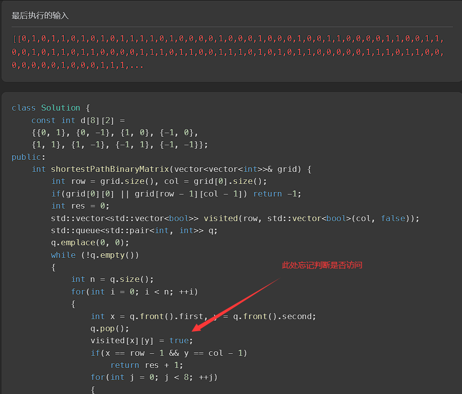
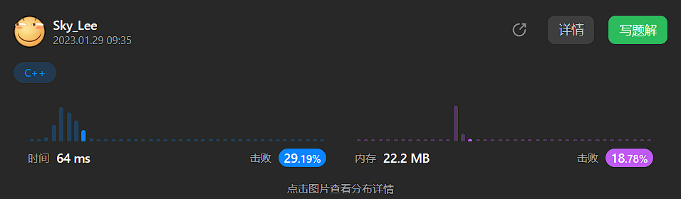

# 对于此题的思考

## DFS 与 BFS 的选择

* DFS 属于一条路走到头，再返回，适合找东西个数（如岛屿问题，计算岛屿的数量）
* BFS 属于一层一层的走，走完一层再走下一层，适合最短路径问题（找到就返回，因为先找到的，对应的路径一定最短；而 DFS 需要找完所有可能的路径，最后比较，效率自然不如 BFS）

## 如何标记已访问过的节点

在 BFS 时，按照习惯，会选取队列中的元素，并将其标记为已访问；在加入后续可能的点时，判断是否已经访问过，以此选择添加还是不添加，就像这样：

~~~C++
while (!q.empty())
{
    int n = q.size();
    for(int i = 0; i < n; ++i)
    {
        int x = q.front().first, y = q.front().second;
        q.pop();
        // 如果要在这里标记
        // 需再次判断是否访问过
        // 否则，会造成死循环
        if(grid[x][y] == 1) continue;
        grid[x][y] = 1; // 标记为已访问 
        if(x == row - 1 && y == col - 1)
            return res + 1;
        for(int j = 0; j < 8; ++j)
        {
            int nextX = x + d[j][0], nextY = y + d[j][1];
            // 判断是否访问过
            if(nextX < 0 || nextY < 0 || nextX >= row || nextY >= col || grid[nextX][nextY] != 0)
                continue;
            q.emplace(nextX, nextY);
        }
    }
    ++res;
}
~~~

然而，对于 [1091. 二进制矩阵中的最短路径](https://leetcode.cn/problems/shortest-path-in-binary-matrix/description/) 这道题来说

每个节点都有 8 种可以选择的方向，在
~~~C++
for(int j = 0; j < 8; ++j)
{
    int nextX = x + d[j][0], nextY = y + d[j][1];
    // 判断是否访问过
    if(nextX < 0 || nextY < 0 || nextX >= row || nextY >= col || grid[nextX][nextY] != 0)
        continue;
    q.emplace(nextX, nextY);
}
~~~

这一步中，如果不加以标记，会造成一个节点多次加入至队列中，造成空间资源的浪费

并且，如果前面忘记了 ```if(grid[x][y] == 1) continue;``` 这句话，就会造成重复访问，死循环



就算加上了，也会浪费很多时间



因此，在加入坐标至队列时，就应该将其标记为已访问

~~~C++
while (!q.empty())
{
    int n = q.size();
    for(int i = 0; i < n; ++i)
    {
        int x = q.front().first, y = q.front().second;
        q.pop();
        // 如果要在这里标记
        // 需再次判断是否访问过
        // if(grid[x][y] == 1) continue;
        // grid[x][y] = 1; // 标记为已访问 
        if(x == row - 1 && y == col - 1)
            return res + 1;
        for(int j = 0; j < 8; ++j)
        {
            int nextX = x + d[j][0], nextY = y + d[j][1];
            if(nextX < 0 || nextY < 0 || nextX >= row || nextY >= col || grid[nextX][nextY] != 0)
                continue;
            q.emplace(nextX, nextY);
            // 须在这里标记
            // 因为本层还有可能重复遍历到该点
            // 造成重复访问
            grid[nextX][nextY] = 1; // 标记为已访问
        }
    }
    ++res;
}
~~~
